# Spark SQL 教程–通过示例了解 Spark SQL

> 原文：<https://www.edureka.co/blog/spark-sql-tutorial/>

Apache Spark 是一个专为快速计算而设计的快如闪电的集群计算框架。随着大数据生态系统中实时处理框架的出现，公司正在他们的解决方案中严格使用 Apache Spark。Spark SQL 是 Spark 中的一个新模块，它将关系处理与 Spark 的函数式编程 API 集成在一起。它支持通过 SQL 或 Hive 查询语言查询数据。 通过这篇博客，我将向你介绍 Spark SQL 这个令人兴奋的新领域。

以下提供了博客的故事情节:

*   [什么是 Spark SQL？](#sparksql)
*   [为什么要用 Spark SQL？](#whyspark)
*   【Spark SQL 是如何工作的？
*   [Spark SQL 库](#libraries)
*   [Spark SQL 的特性](#features)
*   [使用 Spark SQL 查询](#querying)
*   [向 RDDs 添加模式](#schema)
*   [RDDs 为关系](#rdd)
*   [缓存内存中的表](#caching)

## **什么是 Spark SQL？**

Spark SQL 将关系处理与 Spark 的函数式编程集成在一起。它提供了对各种数据源的支持，并使得用代码转换编织 SQL 查询成为可能，从而产生了一个非常强大的工具。

## **为什么要用 Spark SQL？**

Spark SQL 起源于 Apache Hive，运行在 Spark 之上，现在与 Spark 堆栈集成在一起。Apache Hive 有一些限制，如下所述。Spark SQL 的建立就是为了克服这些缺点，取代 Apache Hive。

### **Spark SQL 比 Hive 快吗？**

说到处理速度，Spark SQL 比 Hive 快。下面我列出了 Hive over Spark SQL 的一些限制。

#### **局限性同蜂巢:**

*   为了执行特殊查询，Hive 在内部启动 MapReduce 作业。 在分析中型数据集(10 到 200 GB)时，MapReduce 的性能落后。
*   Hive 没有恢复功能。这意味着，如果处理在工作流中终止，您将无法从它停滞的地方恢复。
*   当启用回收站时，Hive 无法级联删除加密的数据库，从而导致执行错误。为了克服这一点，用户必须使用清除选项来跳过垃圾，而不是丢弃。

这些缺点让位于 Spark SQL 的诞生。 但是我们大多数人心中仍然存在的问题是，

## **Spark SQL 是数据库吗？**

Spark SQL 不是一个数据库，而是一个用于结构化数据处理的模块。它主要处理数据帧，这些数据帧是编程抽象，通常充当分布式 SQL 查询引擎。

## 【Spark SQL 是如何工作的？

让我们探索一下，SQL 能提供什么样的火花。Spark SQL 模糊了 RDD 和关系表之间的界限。通过与 Spark 代码集成的声明性数据框架 API，它在关系处理和过程处理之间提供了更紧密的集成。它还提供了更高的优化。DataFrame API 和 Datasets API 是与 Spark SQL 交互的方式。

有了 Spark SQL，Apache Spark 可供更多用户使用，并改善了对现有用户的优化。 Spark SQL 提供 DataFrame APIs，对外部数据源和 Spark 内置的分布式集合执行关系操作。它引入了一个名为 Catalyst 的可扩展优化器，因为它有助于支持大数据中的各种数据源和算法。

Spark 在 Windows 和类 UNIX 系统(如 Linux、微软、Mac OS)上都可以运行。在一台机器上本地运行很容易——你所需要的就是在你的系统上安装javaPATH、 或者指向 JAVA 安装的 JAVA_HOME 环境变量。


**图:**Spark SQL 的架构*。*

## **Spark SQL 库**

Spark SQL 有以下四个库，用于与关系和过程处理交互:

### **1。数据源 API(应用编程接口):**

这是一个加载和存储结构化数据的通用 API。

*   它内置了对 Hive、Avro、JSON、JDBC、Parquet 等的支持。
*   通过 Spark 包支持第三方集成
*   支持智能源。
*   它是一种适用于结构化和半结构化数据的数据抽象和领域特定语言(DSL)。
*   DataFrame API 是一个分布式的数据集合，以命名的列和行的形式存在。
*   它像 Apache Spark 转换一样被延迟评估，并且可以通过 SQL 上下文和 Hive 上下文访问。
*   处理单节点集群到多节点集群上千字节到千兆字节大小的数据。
*   支持不同的数据格式(Avro、CSV、[弹性搜索](https://www.edureka.co/blog/elasticsearch-tutorial/)、Cassandra)和存储系统( [HDFS](https://www.edureka.co/blog/hdfs-tutorial) 、蜂巢表、 [MySQL](https://www.edureka.co/blog/mysql-tutorial/) 等。).
*   可通过 Spark-Core 轻松集成所有大数据工具和框架。
*   为 [Python](https://www.edureka.co/blog/learn-python/) 、 [Java](https://www.edureka.co/blog/what-is-java/) 、 [Scala](https://www.edureka.co/blog/what-is-scala/) 、 [R 编程](https://www.edureka.co/blog/what-is-r-programming/)提供 API。

### **2。DataFrame API:**

数据帧是组织成命名列的数据的分布式集合。 It 相当于 SQL 中的一个关系表，用于将数据存入表中。

### **3。SQL 解释器和优化器:**

SQL 解释器和优化器基于 Scala 中构造的函数式编程。

*   它是 SparkSQL 最新的、技术上最先进的组件。
*   它提供了一个转换树的通用框架，用于执行分析/评估、优化、规划和运行时代码生成。
*   这支持基于成本的优化(运行时间和资源利用率称为成本)和基于规则的优化，使查询运行速度比 RDD(弹性分布式数据集)快得多。

Catalyst 是一个模块化的库，是一个基于规则的系统。框架中的每条规则都侧重于不同的优化。

### **4。SQL 服务:**

SQL 服务是 Spark 中处理结构化数据的入口点。它允许创建[数据框架](https://www.edureka.co/blog/dataframes-in-spark/)对象以及执行 SQL 查询。

## **Spark SQL 的特性**

以下是 Spark SQL 的特性:

1.  ### **与星火融合**

    Spark SQL 查询与 Spark 程序集成。Spark SQL 允许我们使用 SQL 或可在 Java、Scala、Python 和 r 中使用的 DataFrame API 来查询 Spark 程序中的结构化数据。要运行流计算，开发人员只需针对 DataFrame / Dataset API 编写一个批处理计算，Spark 就会自动增加计算，以流方式运行它。这种强大的设计意味着开发人员不必手动管理状态、故障或保持应用程序与批处理作业同步。相反，流式作业总是对相同的数据给出与批处理作业相同的答案。

2.  ### **统一数据访问**

    DataFrames 和 SQL 支持访问各种数据源的通用方式，如 Hive、Avro、Parquet、ORC、JSON 和 JDBC。这将连接这些来源的数据。这对于将所有现有用户纳入 Spark SQL 非常有帮助。

3.  ### **蜂巢兼容性**

    Spark SQL 在当前数据上运行未修改的 Hive 查询。它重写了配置单元前端和元存储，允许与当前配置单元数据、查询和 UDF 完全兼容。

4.  ### **标准连接**

    连接是通过 JDBC 或 ODBC 进行的。 [JDBC](https://www.edureka.co/blog/connect-mysql-database-in-java) 和 ODBC 是商业智能工具连接的行业规范。

5.  ### **性能和可扩展性**

    Spark SQL 整合了基于成本的优化器、代码生成和列存储，使查询更加灵活，同时使用 Spark 引擎计算数千个节点，提供了完整的中间查询容错。Spark SQL 提供的接口为 Spark 提供了更多关于数据结构和正在执行的计算的信息。在内部，Spark SQL 使用这些额外的信息来执行额外的优化。Spark SQL 可以直接从多个源读取(文件、HDFS、JSON/Parquet 文件、现有 rdd、Hive 等。).它确保现有配置单元查询的快速执行。下图描绘了 Spark SQL 与 Hadoop 相比的性能。Spark SQL 的执行速度比 Hadoop 快 100 倍。

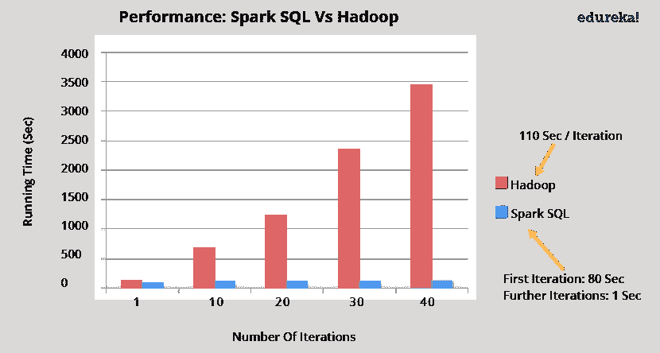 **图:***Spark SQL vs Hadoop 的运行时。Spark SQL 更快 * **来源:***[cloud era Apache Spark 博客](http://blog.cloudera.com/blog/2014/03/apache-spark-a-delight-for-developers) * 

1.  ### **自定义函数**Spark SQL 拥有语言集成的自定义函数(UDF)。UDF 是 Spark SQL 的一个特性，它定义了新的基于列的函数，扩展了 Spark SQL 用于转换数据集的 DSL 词汇。UDF 在执行时是黑盒。

    下面的例子定义了一个将给定文本转换成大写字母的 UDF。

    **代号解释:** 1。创建数据集【hello world】2。定义一个将字符串转换成大写字母的函数“upper”。 3。我们现在将“udf”包导入 Spark。 4。定义我们的 UDF，“upperUDF”并导入我们的函数“upper”。 5。在新列“upper”中显示用户定义函数的结果。

    ```
    val dataset = Seq((0, "hello"),(1, "world")).toDF("id","text")
    val upper: String =&amp;amp;amp;amp;gt; String =_.toUpperCase
    import org.apache.spark.sql.functions.udf
    val upperUDF = udf(upper)
    dataset.withColumn("upper", upperUDF('text)).show

    ```

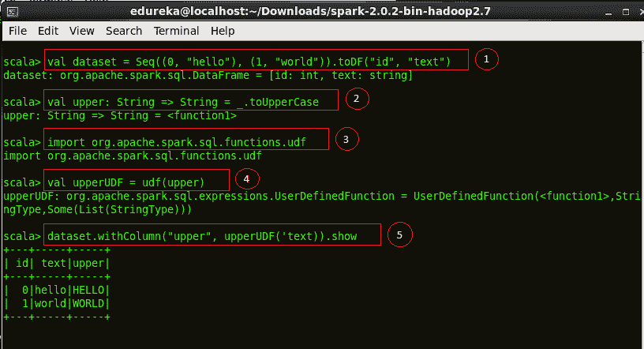 **图:** *演示用户自定义功能，upperUDF * 

**代码解释:** 1。我们现在将我们的函数注册为‘my upper’2。在其他功能中编目我们的 UDF。

```
spark.udf.register("myUpper", (input:String) =&amp;amp;amp;amp;gt; input.toUpperCase)
spark.catalog.listFunctions.filter('name like "%upper%").show(false)

```

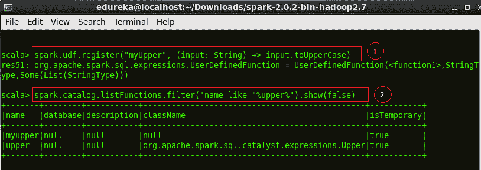 **图:** *用户自定义函数的结果，upperUDF * 

## **使用 Spark SQL 查询**

我们现在将开始使用 Spark SQL 进行查询。注意，实际的 SQL 查询类似于流行的 SQL 客户机中使用的查询。

启动火花外壳。转到 Spark 目录并执行。将终端中的/bin/spark-shell 设置为 Spark Shell。

对于博客中显示的查询示例，我们将使用两个文件，“employee.txt”和“employee.json”。下图显示了这两个文件的内容。这两个文件都存储在包含 spark 安装的文件夹(~/Downloads/Spark-2 . 0 . 2-bin-Hadoop 2.7)内的“examples/src/main/Scala/org/Apache/Spark/examples/SQL/sparksqlexample . Scala”中。所以，所有执行查询的人，把它们放在这个目录中，或者在下面的代码行中设置文件的路径。


**图:***employee . txt 内容*


**图:** *内容*

**代码解释:** 1。我们首先将 Spark 会话导入 Apache Spark。 2。使用“builder()”函数创建 spark 会话“Spark”。 3。将 Implicts 类导入我们的“spark”会话。 4。我们现在创建一个数据框架‘df’并从‘employee . JSON’文件导入数据。 5。显示数据帧“df”。结果是来自我们的“employee.json”文件的 5 行年龄和姓名的表格。

```
import org.apache.spark.sql.SparkSession
val spark = SparkSession.builder().appName("Spark SQL basic example").config("spark.some.config.option", "some-value").getOrCreate()
import spark.implicits._
val df = spark.read.json("examples/src/main/resources/employee.json")
df.show()

```

 **图:** *启动 Spark 会话并显示 employee.json 的数据帧* 

**代码解释:** 1。将 Implicts 类导入我们的“spark”会话。 2。打印我们的“df”数据帧的模式。 3。显示“df”数据帧中所有记录的名称。

```
import spark.implicits._
df.printSchema()
df.select("name").show()

```

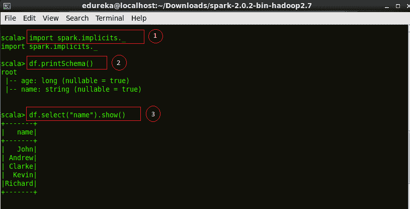 **图:** *数据帧的模式* 

**代码解释:** 1。在每个人的年龄增加两岁后显示数据帧。 2。我们筛选所有 30 岁以上的雇员并显示结果。

```
df.select($"name", $"age" + 2).show()
df.filter($"age" &amp;amp;amp;amp;gt; 30).show()

```

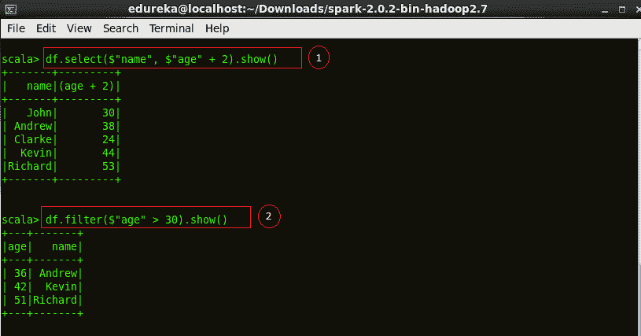 **图:** *对 employee.json 的基本 SQL 操作* 

**代码解释:** 1。计算年龄相同的人的数量。同样，我们使用“分组”函数。 2。为我们的“df”数据框架创建临时视图“employee”。 3。在我们的“雇员”视图上执行“选择”操作，将表显示到“sqlDF”中。 4。显示“sqlDF”的结果。

```
df.groupBy("age").count().show()
df.createOrReplaceTempView("employee")
val sqlDF = spark.sql("SELECT * FROM employee")
sqlDF.show()

```

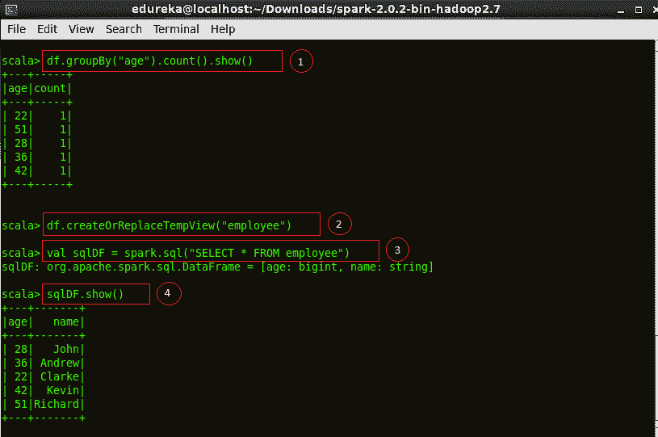 **图:** *对 employee.json 的 SQL 操作* 

### **创建数据集**

理解了数据帧之后，现在让我们继续讨论数据集 API。以下代码在 SparkSQL 中创建了一个数据集类。

**代号解释:** 1。创建一个“Employee”类来存储雇员的姓名和年龄。 2。分配数据集“caseClassDS”来存储 Andrew 的记录。 3。显示数据集“caseClassDS”。 4。创建一个原始数据集来演示数据帧到数据集的映射。 5。将上述序列赋给一个数组。

```
case class Employee(name: String, age: Long)
val caseClassDS = Seq(Employee("Andrew", 55)).toDS()
caseClassDS.show()
val primitiveDS = Seq(1, 2, 3).toDS
()primitiveDS.map(_ + 1).collect()

```

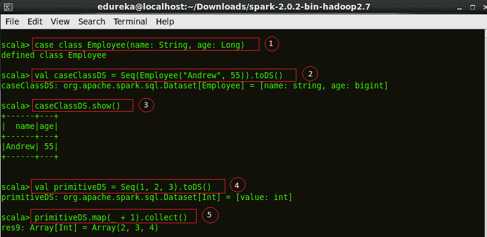 **图:** *创建数据集* 

**代码解释:** 1。设置 JSON 文件“employee.json”的路径。 2。从文件创建数据集。 3。显示“employeeDS”数据集的内容。

```
val path = "examples/src/main/resources/employee.json"
val employeeDS = spark.read.json(path).as[Employee]
employeeDS.show()

```

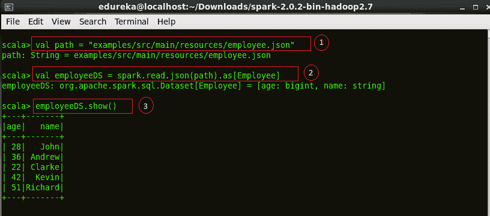 **图:** *从 JSON 文件创建数据集* 

## **向 RDDs 添加模式**

Spark 引入了 RDD(弹性分布式数据集)的概念，这是一种不可变的容错分布式对象集合，可以并行操作。RDD 可包含任何类型的对象，通过加载外部数据集或从驱动程序分发集合来创建。

模式 RDD 是一个 RDD，你可以在上面运行 SQL。它不仅仅是 SQL。它是结构化数据的统一接口。

**代号解释:** 1。正在为 rdd 导入表达式编码器。rdd 类似于数据集，但是使用编码器进行序列化。 2。将编码器库导入外壳。 3。将 Implicts 类导入我们的“spark”会话。 4。从“employee.txt”创建“employeeDF”数据帧，并将基于分隔符逗号“，”的列映射到临时视图“employee”中。 5。正在创建临时视图“员工”。⑥。定义一个数据框架“youngstersDF ”,它将包含年龄在 18 到 30 岁之间的所有雇员。 7。将 RDD 中的姓名映射到“youngstersDF”中，以显示年轻人的姓名。

```
import org.apache.spark.sql.catalyst.encoders.ExpressionEncoder
import org.apache.spark.sql.Encoder
import spark.implicits._
val employeeDF = spark.sparkContext.textFile("examples/src/main/resources/employee.txt").map(_.split(",")).map(attributes =&amp;amp;amp;amp;gt; Employee(attributes(0), attributes(1).trim.toInt)).toDF()
employeeDF.createOrReplaceTempView("employee")
val youngstersDF = spark.sql("SELECT name, age FROM employee WHERE age BETWEEN 18 AND 30")
youngstersDF.map(youngster =&amp;amp;amp;amp;gt; "Name: " + youngster(0)).show()

```

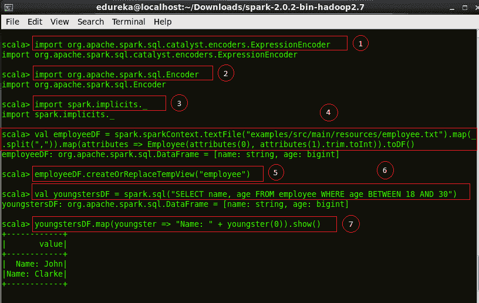 **图:** *创建用于变换的数据帧* 

**代码解释:** 1。将映射的名称转换为用于转换的字符串。 2。使用 Implicits 类中的 mapEncoder 将姓名映射到年龄。 3。将名字映射到我们的“youngstersDF”数据框架的年龄。结果是一个数组，其名称映射到各自的年龄。

```
youngstersDF.map(youngster =&amp;amp;amp;amp;gt; "Name: " + youngster.getAs[String]("name")).show()
implicit val mapEncoder = org.apache.spark.sql.Encoders.kryo[Map[String, Any]]
youngstersDF.map(youngster =&amp;amp;amp;amp;gt; youngster.getValuesMap[Any](List("name", "age"))).collect()

```

  **图:** *使用 DataFrames * 制图

rdd 支持两种类型的操作:

*   变换:这些是对 RDD 执行的操作(如映射、过滤、连接、联合等),产生包含结果的新 RDD。
*   动作:这些是在 RDD 上运行计算后返回值的操作(如 reduce、count、first 等)。

Spark 中的转换是“懒惰”的，这意味着它们不会立即计算出结果。相反，它们只是“记住”要执行的操作和要对其执行操作的数据集(例如，文件)。仅当调用动作时才计算转换，并且结果被返回到驱动程序并存储为有向非循环图(DAG)。这种设计使得 Spark 的运行效率更高。例如，如果一个大文件以各种方式转换并传递给 first action，Spark 将只处理并返回第一行的结果，而不是处理整个文件。

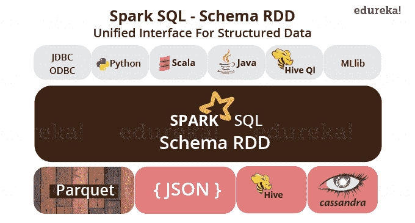  **图:** *星火 SQL 中的生态系统模式 RDD*

默认情况下，每次对每个变换的 RDD 执行动作时，都会重新计算它。但是，您也可以使用 persist 或 cache 方法将 RDD 持久化到内存中，在这种情况下，Spark 会将元素保留在集群中，以便下次查询时可以更快地访问。

## **RDDs 为关系**

弹性分布式数据集(rdd)是分布式内存抽象，它允许程序员以容错方式在大型集群上执行内存计算。rdd 可以从任何数据源创建。例如:Scala 集合，本地文件系统，Hadoop，亚马逊 S3，HBase 表等。

### **指定模式**

**代码解释:** 1。将“类型”类导入 Spark Shell。 2。将“Row”类导入 Spark Shell。行用于映射 RDD 方案。 3。从文本文件“employee.txt”创建 RDD“employeeRDD”。 4。将模式定义为“名称年龄”。这用于绘制 RDD 的列。 5。定义“字段”RDD，它将是将“employeeRDD”映射到架构“schemaString”后的输出。 6。正在将“字段”的类型 RDD 获取到“架构”中。

```
import org.apache.spark.sql.types._
import org.apache.spark.sql.Row
val employeeRDD = spark.sparkContext.textFile("examples/src/main/resources/employee.txt")
val schemaString = "name age"
val fields = schemaString.split(" ").map(fieldName =&amp;amp;amp;amp;gt; StructField(fieldName, StringType, nullable = true))
val schema = StructType(fields)

```

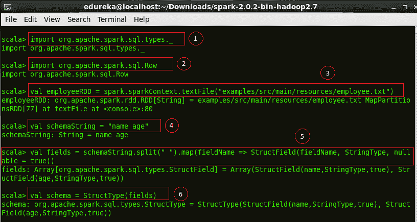 **图:** *为 RDD 变换指定模式* 

**代码解释:** 1。我们现在创建一个名为“rowRDD”的 RDD，并使用“map”函数将“employeeRDD”转换为“rowRDD”。 2。我们定义了一个数据帧‘employeeDF ’,并将 RDD 模式存储在其中。 3。将“employeeDF”的临时视图创建为“employee”。 4。对“雇员”执行 SQL 操作以显示雇员的内容。 5。从“员工”视图显示上一道工序的名称。

```
val rowRDD = employeeRDD.map(_.split(",")).map(attributes =&amp;amp;amp;amp;gt; Row(attributes(0), attributes(1).trim))
val employeeDF = spark.createDataFrame(rowRDD, schema)
employeeDF.createOrReplaceTempView("employee")
val results = spark.sql("SELECT name FROM employee")
results.map(attributes =&amp;amp;amp;amp;gt; "Name: " + attributes(0)).show()

```

 **图:***RDD 变换的结果* 

即使定义了 rdd，它们也不包含任何数据。 在 RDD 中创建数据的计算只有在数据被引用时才完成。例如，缓存结果或写出 RDD 。

## **缓存内存中的表**

Spark SQL 使用内存中的列格式缓存表:

1.  只扫描需要的列
2.  更少的分配对象
3.  自动选择最佳比较

### **程序化地加载数据**

下面的代码将读取 employee.json 文件并创建一个 DataFrame。然后，我们将使用它来创建一个拼花文件。

**代号解释:** 1。将隐式类导入外壳。 2。从我们的“employee.json”文件创建“employeeDF”数据框架。

```
import spark.implicits._
val employeeDF = spark.read.json("examples/src/main/resources/employee.json")

```

 **图:** *加载一个 JSON 文件到 DataFrame * 

**代码解释:** 1。为我们的数据帧创建一个“parquetFile”临时视图。 2。从我们的拼花文件中选择年龄在 18 到 30 岁之间的人的名字。 3。显示 Spark SQL 操作的结果。

```
employeeDF.write.parquet("employee.parquet")
val parquetFileDF = spark.read.parquet("employee.parquet")
parquetFileDF.createOrReplaceTempView("parquetFile")
val namesDF = spark.sql("SELECT name FROM parquetFile WHERE age BETWEEN 18 AND 30")
namesDF.map(attributes =&amp;amp;amp;amp;gt; "Name: " + attributes(0)).show()

```

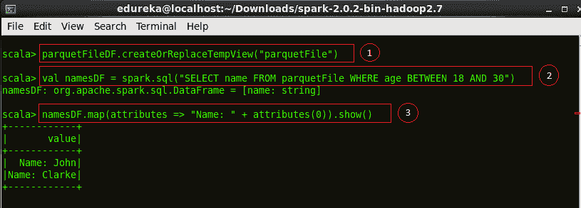  **图:** *显示拼花数据帧* 的结果

### **JSON 数据集**

我们现在将处理 JSON 数据。由于 Spark SQL 支持 JSON 数据集，我们创建了 employee.json 的数据帧。然后，我们定义一个年轻人数据框架，并添加所有年龄在 18 到 30 岁之间的员工。

**代号解释:** 1。将设置为“employee.json”文件的路径。 2。从我们的 JSON 文件创建一个 DataFrame 'employeeDF'。 3。正在打印“employeeDF”的架构。 4。将数据框架的临时视图创建为“employee”。 5。定义一个数据帧“youngsterNamesDF ”,它存储“employee”中所有年龄在 18 到 30 岁之间的雇员的姓名。⑥。显示数据框的内容。

```
val path = "examples/src/main/resources/employee.json"
val employeeDF = spark.read.json(path)
employeeDF.printSchema()
employeeDF.createOrReplaceTempView("employee")
val youngsterNamesDF = spark.sql("SELECT name FROM employee WHERE age BETWEEN 18 AND 30")
youngsterNamesDF.show()

```

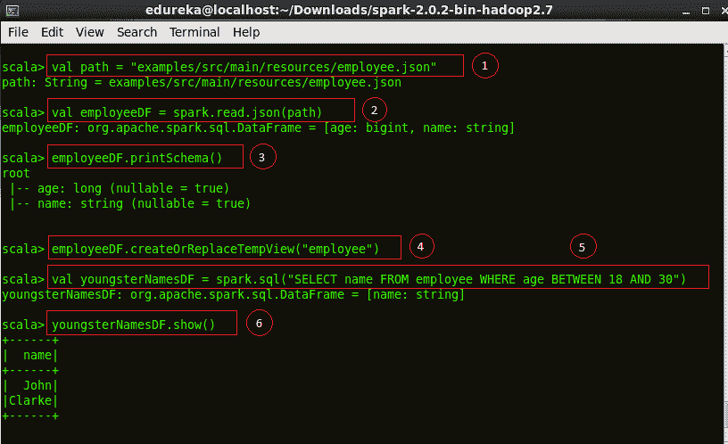 **图:** *对 JSON 数据集的操作* 

**代码解释:** 1。创建一个 RDD“otherEmployeeRDD ”,它将存储来自新德里的雇员 George 的内容。 2。将“otherEmployeeRDD”的内容分配给“otherEmployee”。 3。显示“其他员工”的内容。

```
val otherEmployeeRDD = spark.sparkContext.makeRDD("""{"name":"George","address":{"city":"New Delhi","state":"Delhi"}}""" :: Nil)
val otherEmployee = spark.read.json(otherEmployeeRDD)
otherEmployee.show()

```

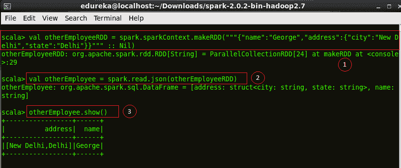 **图:***JSON 数据集上的 RDD 变换* 

### **蜂巢表**

我们使用 Hive 表执行了一个 Spark 示例。

**代号解释:** 1。将“Row”类导入 Spark Shell。行用于映射 RDD 方案。 2。将 Spark 会话导入 shell。 3。创建属性为 Int 和 String 的类“Record”。 4。将“仓库位置”的位置设置为 Spark warehouse。 5。我们现在构建一个 Spark 会话‘Spark’来演示 Spark SQL 中的 Hive 示例。⑥。将隐式类导入外壳。 7。将 SQL 库导入 Spark Shell。 8。创建包含存储键和值的列的表“src”。

```
import org.apache.spark.sql.Row
import org.apache.spark.sql.SparkSession
case class Record(key: Int, value: String)
val warehouseLocation = "spark-warehouse"
val spark = SparkSession.builder().appName("Spark Hive Example").config("spark.sql.warehouse.dir", warehouseLocation).enableHiveSupport().getOrCreate()
import spark.implicits._
import spark.sql
sql("CREATE TABLE IF NOT EXISTS src (key INT, value STRING)")

```

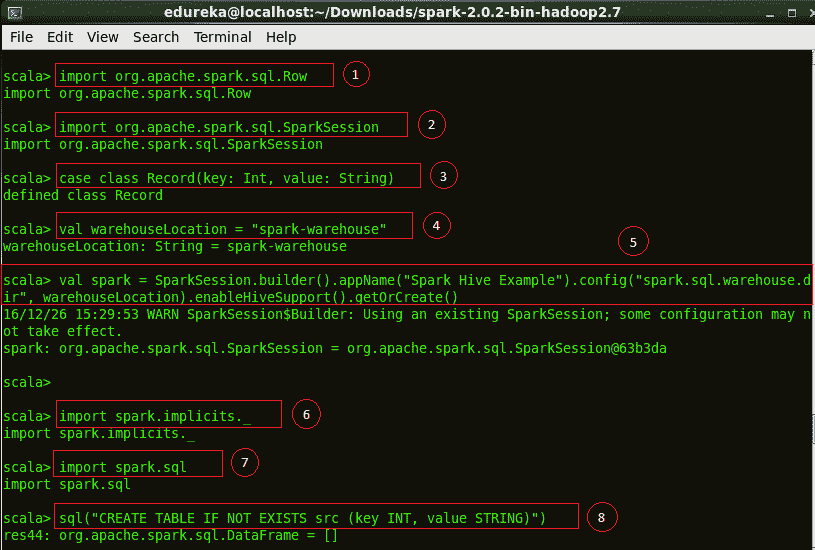 **图:** *为蜂巢建造一个会话* 

**代码解释:** 1。现在，我们将 Spark 目录中的示例数据加载到我们的表“src”中。 2。“src”的内容显示如下。

```
sql("LOAD DATA LOCAL INPATH 'examples/src/main/resources/kv1.txt' INTO TABLE src")
sql("SELECT * FROM src").show()

```

 **图:** *选择使用蜂巢表* 

**代码解释:** 1。我们执行“计数”操作来选择“src”表中的键的数量。 2。我们现在选择“key”值小于 10 的所有记录，并将其存储在“sqlDF”数据帧中。 3。正在从“sqlDF”创建数据集“stringDS”。 4。显示“stringDS”数据集的内容。

```
sql("SELECT COUNT(*) FROM src").show()
val sqlDF = sql("SELECT key, value FROM src WHERE key &amp;amp;amp;amp;lt; 10 ORDER BY key") val stringsDS = sqlDF.map {case Row(key: Int, value: String) =&amp;amp;amp;amp;gt; s"Key: $key, Value: $value"}
stringsDS.show()

```

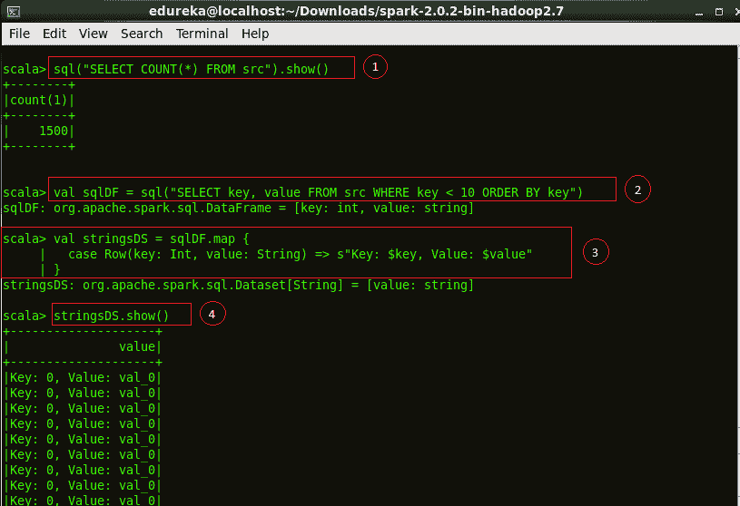

***图:**从配置单元表中创建数据帧*

**代码解释:** 1。我们创建一个数据帧“recordsDF ”,存储键值为 1 到 100 的所有记录。 2。创建“记录定义”数据帧的临时视图“记录”。 3。显示以“key”作为主键的表“records”和“src”的连接内容。

```
val recordsDF = spark.createDataFrame((1 to 100).map(i =&amp;amp;amp;amp;gt; Record(i, s"val_$i")))
recordsDF.createOrReplaceTempView("records")
sql("SELECT * FROM records r JOIN src s ON r.key = s.key").show()

```

 **图:** *记录蜂巢操作的结果* 

我们的博客到此结束。我希望你喜欢阅读这个博客，并发现它的信息量。到目前为止，您一定已经很好地理解了什么是 Spark SQL。实践示例将为您在 Spark SQL 中遇到的任何未来项目提供所需的信心。实践是掌握任何主题的关键，我希望这篇博客已经引起了您足够的兴趣来进一步探索 Spark SQL 的学习。

*有问题吗？请在评论区提到它，我们会尽快回复您。*

*如果您希望学习 Spark 并在 Spark 领域建立职业生涯，并积累使用 RDD、Spark Streaming、SparkSQL、MLlib、GraphX 和 Scala 执行大规模数据处理的专业知识，请查看我们的交互式在线直播* *[Apache Spark 认证培训](https://www.edureka.co/apache-spark-scala-training)此处、* *，它将提供全天候支持，在您的整个学习期间为您提供指导。*