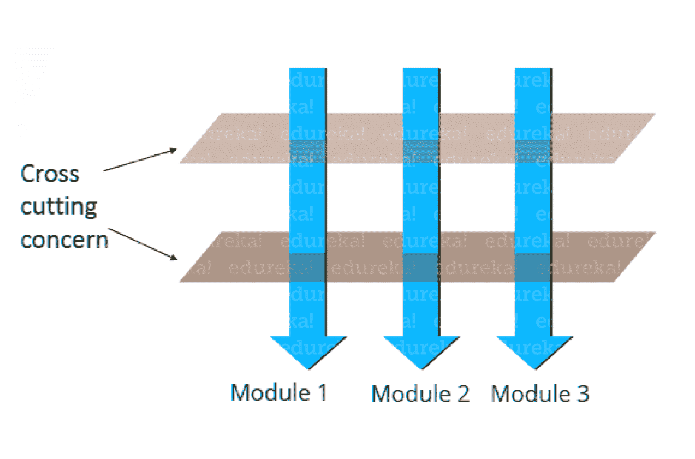
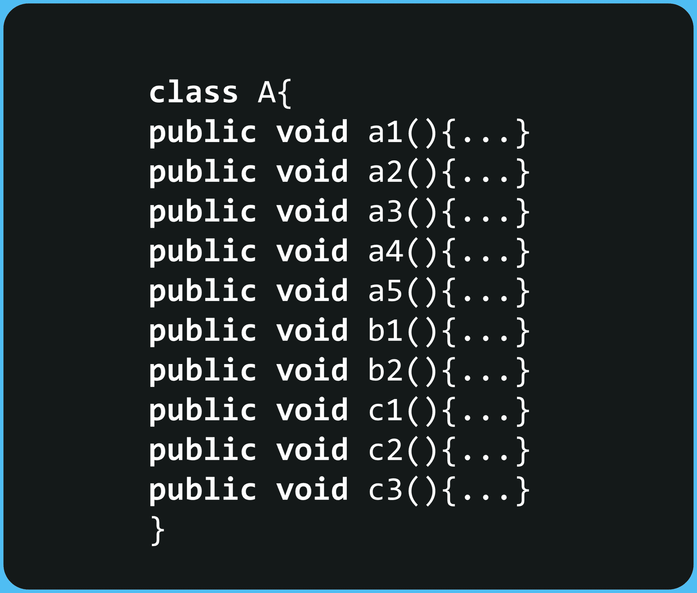
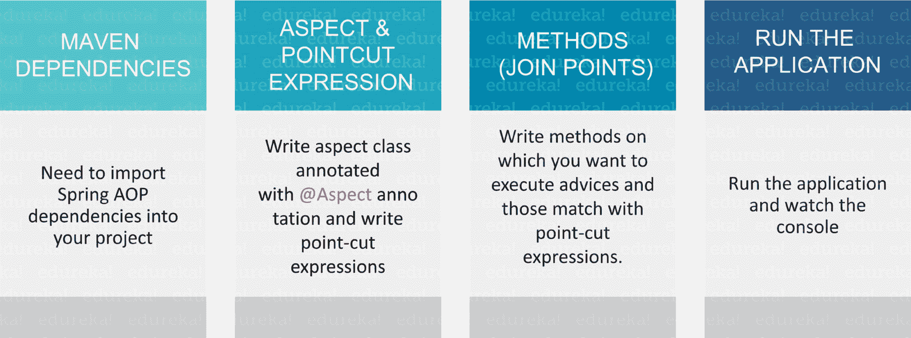
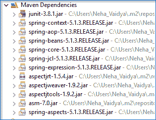

# Spring AOP 教程——带示例的面向初学者的 AOP

> 原文：<https://www.edureka.co/blog/spring-aop-tutorial/>

在之前的 Spring 博客中，您了解了 Spring 框架以及如何开发一个简单的应用程序。但是，为了增加 Spring 应用程序的模块化，开发了一种叫做 AOP(面向方面编程)的新技术。在这个*春季 AOP 教程中，*你将学习面向方面编程以及如何使用它。

下面是春季 AOP 教程中将要涉及的主题。

*   [AOP 简介](#Introduction)
*   [为什么是 AOP？](#WhyAOP)
*   [核心 AOP 概念](#CoreAOPConcepts)
*   [如何构建一个 AOP 实例？](#StepstocreateAOP)
*   [建议类型](#Advicetypes)
*   [AspectJ 概念](#AspectJ)


## **什么是 Spring AOP？| Spring AOP(面向方面编程)教程**


[//www.youtube.com/embed/mnE6QrmTtpg?rel=0&showinfo=0](//www.youtube.com/embed/mnE6QrmTtpg?rel=0&showinfo=0)

你也可以浏览一下 Spring AOP 教程概念的录音，你可以通过例子详细地理解这些主题。

## **AOP 简介**

**面向方面编程** (AOP)称赞 OOPs，因为它提供了模块化。但是，这里模块化的关键单元被认为是一个方面，而不是类。这里，AOP 将程序逻辑分成不同的部分(称为关注点)。它用于通过**横切关注点**增加模块化。

**横切关注点**是影响整个应用的横切关注点，应该集中在代码、中的同一个块下，如事务管理、认证、日志、安全等。众所周知，Spring AOP 支持 Spring 应用程序中的面向方面编程。在这里，方面支持关注点的模块化，比如跨越多种类型和对象的事务管理、日志或安全性(通常称为**横切关注点**)。在这种情况下，AOP 提供了一种使用简单的可插拔配置在实际逻辑之前、之后或周围动态添加横切关注点的方法。通过这样做，在现在和将来维护代码都变得很容易。因此，你可以简单地通过改变配置文件来添加/删除 c/concerns，而不需要重新编译完整的源代码(如果你使用 XML 配置来应用方面的话)。

我希望你理解了 AOP 和横切关注点的概念。现在，让我们进一步看看为什么我们需要 AOP。

## **为什么是 AOP？**

最重要的功能是 AOP 提供了一种可插入的方式，在实际逻辑之前、之后或周围动态地添加额外的关注点。假设有 10 种方法，如图:

可以看到从 a 开始有 5 个方法，从 b 开始有 2 个方法，从 c 开始有 3 个方法

*首先我们来了解一下场景——*这里*，*我要维护一个日志，调用 m 开头的方法后发送通知，那么没有 AOP 是什么问题呢？在这里，我们可以从以 a 开始的方法中调用方法(维护日志并发送通知)。在这样的场景中，我们需要在所有 5 个方法中编写代码。但是，万一将来客户说，我不需要发送通知，你需要改变所有的方法。这导致了维护问题。所以用 AOP，我们有下面的解决方案。


*用 AOP 解决*——用 AOP，我们不用从方法中调用方法。我们可以简单地定义额外的关注点，如维护日志、发送通知等。在类的方法中。它的条目在 XML 文件中给出。假设将来，如果一个客户要求删除通知功能，我们只需要在 XML 文件中进行修改。所以，在 AOP 中维护很容易。

这就是为什么我们在 Springs 中需要面向方面编程的全部概念。现在让我们在这个春季 AOP 教程博客中更进一步，理解一些面向方面编程的核心概念。

## **核心 AOP 概念**

Spring AOP 由 7 个核心概念组成，如下图所示:


1.  **方面**:*方面*只不过是一个实现 JEE 应用程序关注点的类，这些关注点贯穿多个类，例如事务管理、安全等。方面可以是通过 Spring XML 配置配置的普通类。它也可以是使用@Aspect 注释的常规类。
2.  **连接点:***连接点*是程序执行中的一个*候选点*，在这里可以插入一个方面。它可能是一个被调用的方法，一个被抛出的异常，甚至是一个被修改的字段。
3.  **建议:** *建议*是针对特定连接点采取的具体行动。基本上，它们是当应用程序中某个连接点遇到匹配的切入点时执行的方法。
4.  **切入点:**一个*切入点*是一个表达式，它与连接点相匹配来决定通知是否需要被执行。
5.  **目标对象:**这些是应用建议的对象。在 Spring AOP 中，运行时会创建一个子类，在这个子类中，目标方法会被覆盖，通知会根据它们的配置被包含进来。
6.  **代理:**是对目标对象应用建议后创建的对象。从客户端的角度来看，对象、目标对象和代理对象是相同的。
7.  **编织:** *编织*是将一个方面与其他应用类型或对象链接起来，创建一个建议对象的过程。

理解了这一点，让我们进一步看看创建一个 AOP 需要哪些步骤

## **创建 AOP 的步骤示例**



*   如上图所示，首先，我们需要 Maven 依赖。实际上，您需要创建一个 maven 项目并添加所有的依赖项。如果你想学习如何配置 Spring 框架，你可以参考这个 [Spring 框架教程](https://www.edureka.co/blog/spring-tutorial/)。
*   为了创建一个 Maven 项目，安装 [Eclipse for JEE 开发者](https://www.eclipse.org/downloads/packages/)并遵循这些步骤。
*   *点击文件- >新建- >其他- > Maven 项目- >下一步- >选择 Maven-原型-快速启动- >指定 GroupID - >工件 ID - >包名然后点击完成。*
*   一旦你创建了一个 maven 项目，接下来你要做的就是在 *pom.xml* 文件中添加 Maven 依赖项。
*   您的 pom.xml 文件应该包含下面提到的面向方面编程的依赖项。

    ```
    <project>
     xmlns:xsi="http://www.w3.org/2001/XMLSchema-instance"
    xsi:schemaLocation="http://maven.apache.org/POM/4.0.0 http://maven.apache.org/xsd/maven-4.0.0.xsd">
    <modelVersion>4.0.0</modelVersion><groupId>com.edureka</groupId>
    <artifactId>AOP</artifactId>
    <version>0.0.1-SNAPSHOT</version>
    <packaging>jar</packaging><name>AOP</name>
    <url>http://maven.apache.org</url><properties>
    <project.build.sourceEncoding>UTF-8</project.build.sourceEncoding>
    </properties><dependencies>
    <dependency>
    <groupId>junit</groupId>
    <artifactId>junit</artifactId>
    <version>3.8.1</version>
    <scope>test</scope>
    </dependency>
    <dependency>
    <groupId>org.springframework</groupId>
    <artifactId>spring-context</artifactId>
    <version>5.1.3.RELEASE</version>
    </dependency>
    <!-- https://mvnrepository.com/artifact/aspectj/aspectjrt -->
    <dependency>
    <groupId>aspectj</groupId>
    <artifactId>aspectjrt</artifactId>
    <version>1.5.4</version>
    </dependency>
    <!-- https://mvnrepository.com/artifact/org.aspectj/aspectjweaver -->
    <dependency>
    <groupId>org.aspectj</groupId>
    <artifactId>aspectjweaver</artifactId>
    <version>1.9.2</version>
    </dependency>
    <!-- https://mvnrepository.com/artifact/org.aspectj/aspectjtools -->
    <dependency>
    <groupId>org.aspectj</groupId>
    <artifactId>aspectjtools</artifactId>
    <version>1.9.2</version>
    </dependency>
    <!-- https://mvnrepository.com/artifact/org.ow2.asm/asm -->
    <dependency>
    <groupId>org.ow2.asm</groupId>
    <artifactId>asm</artifactId>
    <version>7.0</version>
    </dependency>
    <!-- https://mvnrepository.com/artifact/org.springframework/spring-aspects -->
    <dependency>
    <groupId>org.springframework</groupId>
    <artifactId>spring-aspects</artifactId>
    <version>5.1.3.RELEASE</version>
    </dependency></dependencies>
    </project>

    ```

*   在配置了您的 *pom.xml* 文件之后，面向方面编程所需的所有 jar 文件都将被导入。您还可以从 [maven 资源库](https://mvnrepository.com/)中复制并粘贴所需的 jar 文件依赖代码。请看下图，它描述了导入的 jar 文件。
*   接下来，你可以开始为你的项目写代码了。为此，您必须编写方面和切入点表达式。之后，你可以编写方法，例如连接点。最后，您应该编写主类并运行应用程序。

现在让我们用一些打印方法创建一个基本的客户服务类。在下面的代码中，我使用了一些 setters 和 getters 来显示名称和 URL 的结果。

```
package com.edureka.Edureka;
public class CustomerService {
private String name;
private String url;
public void setName(String name) {
this.name = name;
}
public void setUrl(String url) {
this.url = url;
}
public void printName() {
System.out.println("Customer name : " + this.name);
}
public void printURL() {
System.out.println("Customer website : " + this.url);
}
public void printThrowException() {
throw new IllegalArgumentException();
}
}

```

这里，下一步是编写 XML bean 配置文件。在这里，我们将编写一个包含 bean id、类名、值等的 Bean 类。我们来看看如何:

```
<?xmls version="1.0" encoding="UTF-8"?>;
<beans  xmlns:xsi="http://www.w3.org/2001/XMLSchema-instance" xsi:schemaLocation="http://www.springframework.org/schema/beans http://www.springframework.org/schema/beans/spring-beans-2.5.xsd">
<bean id="customerService" class="com.edureka.Edureka.CustomerService">;
<property name="name" value="Edureka" />;
<property name="url" value="http://www.edureka.co" />;
</bean>;
</beans>;

```

Fi 最后，我们将编写主[类](https://www.edureka.co/blog/java-tutorial/#obj)来执行程序，如下面的代码 所示

```
package com.edureka.Edureka;
import org.springframework.context.ApplicationContext;
import org.springframework.context.support.ClassPathXmlApplicationContext;
import com.edureka.Edureka.CustomerService;
public class App {
public static void main(String[] args) {
ApplicationContext appContext = new ClassPathXmlApplicationContext("Customer.xml");
CustomerService cust = (CustomerService) appContext.getBean("customerServiceProxy");
System.out.println("--------------------");
cust.printName();
System.out.println("--------------------");
cust.printURL();
System.out.println("--------------------");
try {
cust.printThrowException();
} catch (Exception e) {
}
}
}

```


这个程序在执行时会在控制台中显示客户名称和网站。所以基本上，这就是你如何配置和编写你的 AOP 程序的 。现在让我们更深入地研究 Spring AOP 教程，了解不同的建议类型。

## **春季 AOP 教程:建议类型**

Spring AOP 中出现的几种类型的通知如下:

*   **Before:** 这里，通知在连接点方法之前执行，使用 ***@Before*** 注释标记进行配置。
*   **返回后:**这些通知类型在连接点方法正常完成执行后执行。它们是使用@AfterReturning 批注标记配置的。
*   **抛出后:**这里，只有当连接点方法通过抛出异常退出时，通知才会执行。它们是使用@AfterThrowing 注释标记配置的。
*   **(最终):**在这种情况下，通知在*连接点*方法执行后执行，不管方法是否退出(正常或异常返回)。它们是在注释标记后使用@配置的。
*   **Around:** 这些通知类型在连接点之前和之后执行，并使用@Around 注释标记进行配置。

现在让我们看一个例子来理解在程序执行之前和之后建议是如何发生的。首先，让我们看看它是如何在[方法](https://www.edureka.co/blog/java-tutorial/#obj)执行之前发生的。让我们创建一个实现 MethodBeforeAdvice 接口的类。

```
package com.edureka.Edureka;
import java.lang.reflect.Method;
import org.springframework.aop.MethodBeforeAdvice;
public class BeforeMethod implements MethodBeforeAdvice
{
	@Override
	public void before(Method method, Object[] args, Object target)
		throws Throwable {
	        System.out.println("BeforeMethod : Before method executed!");
	}
}

```

接下来，在 bean 配置文件(Spring-Customer.xml)中，我们为 **BeforeMethod** 类创建一个 bean，并新建一个名为“**customerServiceProxy**的代理对象。

```

<?xmls version="1.0" encoding="UTF-8"?>
<beans  xmlns:xsi="http://www.w3.org/2001/XMLSchema-instance" xsi:schemaLocation="http://www.springframework.org/schema/beans http://www.springframework.org/schema/beans/spring-beans-2.5.xsd">
<bean id="customerService" class="com.edureka.Edureka.CustomerService">
<property name="name" value="Edureka" />
<property name="url" value="http://www.edureka.co" />
</bean>
<bean id="BeforeMethodBean" class="com.edureka.Edureka.BeforeMethod" />
<bean id="customerServiceProxy" class="org.springframework.aop.framework.ProxyFactoryBean">
<property name="target" ref="customerService" />
<property name="interceptorNames">
<list>
<value>beforeMethodBean</value>
</list>
</property>
</bean>
</beans>

```

最后，让我们创建一个主类并执行程序。

```
package com.edureka.Edureka;
import org.springframework.context.ApplicationContext;
import org.springframework.context.support.ClassPathXmlApplicationContext;
import com.edureka.Edureka.CustomerService;
public class App {
public static void main(String[] args) {
ApplicationContext appContext = new ClassPathXmlApplicationContext("Customer.xml");
CustomerService cust = (CustomerService) appContext.getBean("customerServiceProxy");
System.out.println("--------------------");
cust.printName();
System.out.println("--------------------");
cust.printURL();
System.out.println("--------------------");
try {
cust.printThrowException();
} catch (Exception e) {
}
}
}

```

当您执行时，它将在每个 customerService 的方法被执行之前，执行 **BeforeMethod 的 before()** 方法。

现在，让我们借助下面的例子来看看返回建议后()是如何发生的。

```
package com.edureka.Edureka; 
import java.lang.reflect.Method;
import org.springframework.aop.AfterReturningAdvice;
public class AfterMethod implements AfterReturningAdvice {
@Override
public void afterReturning(Object returnValue, Method method, Object[] args, Object target) throws Throwable { System.out.println("AfterMethod : After method Executed!");
}
}

```

现在让我们配置 bean xml 配置文件

```
<?xmls version="1.0" encoding="UTF-8"?>
<beans  xmlns:xsi="http://www.w3.org/2001/XMLSchema-instance" xsi:schemaLocation="http://www.springframework.org/schema/beans http://www.springframework.org/schema/beans/spring-beans-2.5.xsd">
<bean id="customerService" class="com.edureka.Edureka.CustomerService">
<property name="name" value="Edureka" />
<property name="url" value="http://www.edureka.co" />
</bean>
<bean id="afterreturningMethodBean" class="com.edureka.Edureka.afterreturningMethod" />
<bean id="customerServiceProxy" class="org.springframework.aop.framework.ProxyFactoryBean">
<property name="target" ref="customerService" />
<property name="interceptorNames">
<list>
<value>afterreturningMethodBean</value>
</list>
</property>
</bean>
</beans>

```

最后，我们将编写主类并执行代码。

```
package com.edureka.Edureka;
import org.springframework.context.ApplicationContext;
import org.springframework.context.support.ClassPathXmlApplicationContext;
import com.edureka.Edureka.CustomerService;

public class App {
	public static void main(String[] args) {
		ApplicationContext appContext = new ClassPathXmlApplicationContext(new String[] { "Spring-Customer.xml" });
		CustomerService cust = (CustomerService) appContext.getBean("customerServiceProxy");
		System.out.println("------------------------");
		cust.printName();
		System.out.println("------------------------");
		cust.printURL();
		System.out.println("------------------------");
		try {
			cust.printThrowException();
		} catch (Exception e) {

		}
}
}

```


在这里，它将在返回结果的每个 customerService 的方法之后运行 **AfterMethod 的 afterReturning()** 方法。这就是所有不同类型的建议。现在让我们跳到 Spring AOP 教程文章的最后一个主题，理解 AspectJ 注释。

## **AspectJ 概念**

[Spring](https://www.edureka.co/blog/what-is-spring-framework/)的重要方面是面向方面编程(AOP)框架。众所周知， [OOP(面向对象编程)](https://www.edureka.co/blog/object-oriented-programming/)中模块化的关键单位是类，同样，AOP 中模块化的单位是方面。方面支持关注点的模块化，比如跨越多种类型和对象的事务管理。为了实现这些关注点，AspectJ 出现了。AspectJ 是 Java 编程语言的兼容扩展，是 AOP 的一种实现。它已经发展成为一个完整的、流行的 AOP 框架。由于越来越多的 AOP 框架支持 AspectJ 注释，AspectJ 风格的方面更有可能在其他支持 AspectJ 的 AOP 框架中重用。

现在，让我们跳到这个 Spring AOP 教程的最后一部分，写一个关于 Spring AspectJ 注释的例子。众所周知，建议需要被执行，因此为了明确建议，切入点是必要的。所以，在我们写方面之前，让我们理解什么是切入点。

### **切入点**

切入点是 Spring AOP 的一种表达式语言。 **@Pointcut** 注释定义了切入点。这里，我们也可以通过名字引用切入点表达式。让我们看一个简单的例子。

```
@Pointcut("execution(*Operation.*(..))")
private void dotask() {}

```

从这里可以看到，切入点表达式的名称是 dotask()。它将应用于 Operation 类的所有方法，而不考虑返回类型。

现在让我们看看在方法执行之前如何应用和执行注释。

在通知之前的 AspectJ *在实际业务逻辑方法之前应用。您可以在这里执行任何操作，如转换、认证等。*

现在，让我们创建一个包含实际业务逻辑的类。

*文件:Operation.java*

```
package com.edureka;
public class Operation{
public void msg(){System.out.println("msg method invoked");}
public int a(){System.out.println("a method invoked");return 2;}
public int b(){System.out.println("b method invoked");return3;}
}

```

现在，创建包含 before advice 的方面类。

*文件:TrackOp.java*

```
package com.edureka;
import org.aspectj.lang.JoinPoint;
import org.aspectj.lang.annotation.Aspect;
import org.aspectj.lang.annotation.Before;
import org.aspectj.lang.annotation.Pointcut;
@Aspect
public class TrackOp{
@Pointcut(“execution(* Operation.*(..))")
public void k(){}
@Before(“k()”)//applying pointcut on before advice
public void myadvice(JoinPoint jp){
System.out.println(“additional concern”);
}
}

```

现在创建定义 beans 的 applicationContext.xml 文件。

*文件:application context . XML*

```
<?xml version="1.0" encoding="UTF-8"?>
<beans 
xmlns:xsi="http://www.w3.org/2001/XMLSchema-instance"
xmlns:aop="http://www.springframework.org/schema/aop"
xsi:schemaLocation="http://www.springframework.org/schema/beans
http:<span class="comment">//www.springframework.org/schema/beans/spring-beans.xsd
http://www.springframework.org/schema/aop
http:<span class="comment">//www.springframework.org/schema/aop/spring-aop.xsd">
<bean id="opBean"class="com.edureka.Operation"></bean>
<bean id="trackMyBean" class"com.edureka.TrackOp"></bean>
<bean class="org.springframework.aop.aspectj.annotation.AnnotationAwareAspectJAutoProxyCreator">
</beans>

```

现在，让我们调用实际的方法。

*文件:Test.java*

```
package com.edureka;
import org.springframework.context.ApplicationContext;
import</span>&nbsp;org.springframework.context.support.ClassPathXmlApplicationContext;
public class Test{
public static void main(String[] args){
ApplicationContext context= new ClassPathXmlApplicationContext"applicationContext.xml");
Operation e=(Operation)context.getBean("opBean");
System.out.println("calling msg...");
e.msg();
System.out.println("calling a..."):
e.a();
System.out.println(calling b...");
e.b();
}
}

```

#### 输出

```
calling msg...
additional concern
msg()method invoked
calling a...
additional concern
a() method invoked
calling b...
additional concern
b() method invoked

```

如您所见，在 msg()、a()和 b()方法被调用之前，额外的关注点被打印出来。

现在，如果你改变切入点表达式，如下所示:

```

@Pointcut("execution(*Operation.a*(..))")

```

现在，将对操作类中以“ *a* 开始的方法进行额外的关注。输出如下:

```
calling msg...
additional concern
msg() method invoked
calling a...
additional concern
a()method invoked
calling b..
b() method invoked

```

现在你可以看到在 b()方法被调用之前，额外的关注点没有被打印出来。其他类型的建议也是如此。这就是为 aspectJ 注释配置代码的方式。 这就把我们带到了 Spring AOP 教程博客的结尾。我尽最大努力保持概念简洁明了。希望它能帮助您理解 Spring AOP 及其各种特性。

*既然您已经完成了 Spring AOP 教程，那么就来看看 Edureka 的 [**Spring** **课程**](https://www.edureka.co/spring-certification-course) ，edu reka 是一家值得信赖的在线学习公司，拥有遍布全球的 250，000 多名满意的学习者。*

*有问题吗？请在 Spring AOP 教程博客的评论部分提到它，我们会给你回复。*