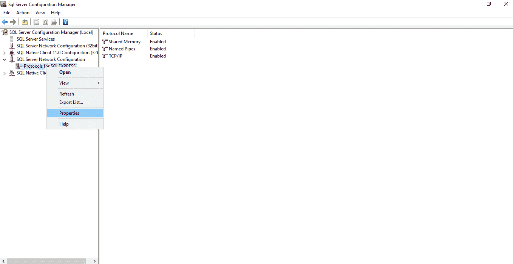
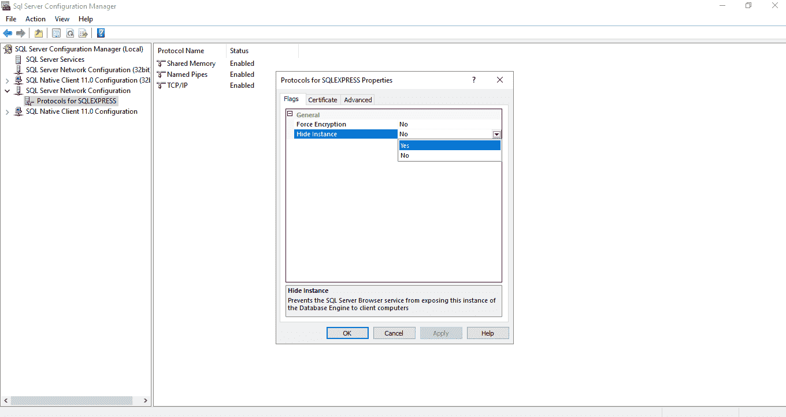

# 2023 年你必须准备的 50 个 SQL Server 面试问题

> 原文：<https://www.edureka.co/blog/interview-questions/sql-server-interview-questions/>

在每天都会产生海量数据的时代，数据在商业运营的 [决策](https://www.edureka.co/blog/what-is-data-analytics/) 中扮演着至关重要的角色。因此，为了处理数据，我们需要数据库，这使我们需要了解数据库管理系统。在各种数据库管理系统中，MS SQL Server 是最流行的关系数据库管理系统之一。这种类型的 DBMS 使用一种结构，该结构允许用户识别和访问与数据库中的另一段数据 相关的数据 *。因此，了解 MS SQL Server 为您成为数据库管理员打开了大门。我相信您已经意识到了这些事实，这也促使您阅读了这篇 MS SQL Server 面试问题文章。*

在这篇关于微软 SQL Server 面试问题的文章中，我将讨论在你的面试中被问到的与微软 SQL Server 相关的热门问题。这些问题是在咨询了在该领域拥有优秀[](https://www.edureka.co/mysql-dba)技能的人后收集的。

让我们开始吧！

## **Q1。提及 SQL Server 和 MySQL 的区别。**

| **SQL 服务器** | **MySQL** 的实现 |
| 由微软开发 | 由甲骨文公司开发 |
| 授权软件 | 开源软件 |
| 支持 c#[Java](https://www.edureka.co/blog/what-is-java/)c++、 PHP、Visual Basic、Perl、 [Python](https://www.edureka.co/blog/python-tutorial/) 、Ruby 等 | 支持 [PHP](https://www.edureka.co/blog/php-tutorial-for-beginners/) ，Perl，Python， [Ruby](https://www.edureka.co/blog/ruby-on-rails-tutorial/) 等 |
| 运行时不允许任何类型的数据库文件操作 | 允许在运行时操作数据库文件。 |
| 允许中途取消查询 | 不允许中途取消查询。 |
| 备份数据时，不会阻塞数据库 | 备份数据时，阻塞数据库 |
| 占用大量操作存储空间。 | 占用更少的操作存储空间。 |
| 可在快速和定制模式下使用。 | 在 [MySQL 社区版](https://www.edureka.co/blog/install-mysql/)和 MySQL 企业版中可用 |

## **Q2。** **你所理解的 SQL Server 代理是什么？**

SQL Server 代理是一种用于调度和执行作业的 Windows 服务。这里，每个作业包含一个或多个步骤，每个步骤包含一个任务。因此，服务器代理使用 SQL Server 来存储作业信息并按计划运行作业。

SQL Server 代理的主要组件是作业、计划、操作符和警报。

### **举例:**

如果一家企业希望在每周五晚上 9:00 备份公司服务器，那么您可以很好地自动执行该任务，让该计划自动执行。在一种情况下，备份遇到错误，SQL Server 代理记录该事件并通知相应的团队。

## **Q3。提及 SQL Server 中不同的身份验证模式。**

在我告诉你 SQL Server 中不同的身份验证模式之前，让我告诉你身份验证模式用于在 SQL Server 中对用户进行身份验证。设置数据库引擎时选择了身份验证模式。所以，如果你想知道如何设置微软 SQL Server，可以 [参考我的文章](https://www.edureka.co/blog/automation-anywhere-installation#microsoftsqlserversetup) 。

SQL SERVER 提供的不同身份验证模式如下:

*   **Windows 认证模式:**该模式用于通过 Windows 账户连接服务器。在这里，服务器接受计算机的用户名和密码进行身份验证。此外，在此模式下，SQL server 身份验证模式被禁用。
*   **混合模式:**混合模式用于使用 SQL Server 身份验证或 Windows 身份验证连接 SQL Server 实例。在这种模式下，用户为数据库设置用户名和密码。

## **Q4。提及本地临时表和全局临时表的区别。**

| **本地临时表** | **全局临时表** |
| 这些表格仅在连接期间或该语句期间存在。 | 这些表永久存在于数据库中，当连接关闭时，只有行被删除。 |
| **语法:** 创建表# <表名> | **语法:** 创建表# <表名> |

## **Q5。如何检查 SQL Server 的版本？**

要检查 SQL Server 的版本，可以使用以下命令:

```
SELECT @@version

```

@ @版本将输出作为一个 nvarchar 字符串。

## **Q6。什么是单用户模式，在单用户模式下启动 SQL Server 应该遵循什么步骤？**

您可能经常希望以单用户模式启动 SQL Server 实例。当您想要从其他数据库系统恢复数据或者想要更改服务器配置时，您可以这样做。

当您以单用户模式启动 SQL Server 时，计算机本地管理员组的任何成员都会以 sysadmin 身份连接到 SQL Server 实例。

在单用户模式下启动数据库时会发生以下事件:

*   单个用户连接到服务器。
*   不执行**检查点**进程，因为它默认在启动时执行。

另外，请注意，在单用户模式下连接到 SQL Server 实例之前，您必须停止 SQL Server 代理服务。

*   要以单用户模式启动 SQL Server，请使用命令: `sqlcmd –m`
*   在 Manageme 中通过查询编辑器连接 nt Studio 使用: `-m"Microsoft SQL Server Management Studio - Query".`

## **Q7。什么是 SQL Server 事件探查器？**

Microsoft SQL Server Profiler 是一个用于创建和管理跟踪的界面。它还 分析并重放跟踪结果。 在这里，事件被保存在一个跟踪文件中，以后可以对其进行分析或用于在调试问题时重放一系列特定的步骤。

您可以使用 SQL Server 事件探查器进行如下活动:

1.  找到问题的根本原因
2.  监控 SQL Server 处理工作负载的性能。
3.  诊断缓慢的查询
4.  捕获一系列导致问题的 SQL 语句，在测试服务器上进一步复制问题，同时调试问题。
5.  它还有助于轻松地将性能计数器与调试问题关联起来。

## **Q8。SQL Server 运行的 TCP/IP 端口是什么？**

SQL Server 运行的 TCP/IP 端口是 1433。

## **Q9。SQL server 中的子查询是什么？解释它的属性。**

子查询是另一个查询中的一个查询，该查询被定义为从数据库中检索数据或信息。在子查询中，外部查询称为主查询，而内部查询称为子查询。子查询总是首先执行，子查询的结果传递给主查询。它可以嵌套在 SELECT、UPDATE 或任何其他查询中。子查询还可以使用任何比较运算符，如>、<或=。

子查询的属性如下:

*   必须用括号括起来，因为它必须在主查询之前首先执行
*   可以包含多个查询。
*   子查询不应包含 ORDER BY 子句，但可以包含 WHERE、GROUP BY 和 HAVING 子句
*   子查询必须位于主查询的比较运算符的右侧
*   子查询必须包括 SELECT 子句和 FROM 子句。

## **Q10。如何在集群** **安装中启动单用户模式？**

在集群安装中，SQL Server 使用 DLL 可用连接，从而阻止任何其他到服务器的连接。

在这种状态下，如果您尝试使 SQL Server 代理资源联机，那么它可能会将 SQL 资源故障转移到另一个节点，因为它可能被配置到一个组中。因此，要在集群安装中启动单一用户模式，您可以遵循以下步骤:

1.  进入**高级属性**和**移除-m 启动参数。**
2.  现在，让 SQL Server 资源脱机。
3.  在命令提示符下发出以下命令，并确保您处于该组的当前所有者节点: `net start MSSQLSERVER /m.`
4.  接下来，您必须从集群管理员或故障转移集群管理控制台验证 SQL Server 资源是否仍处于离线状态。
5.  然后，使用以下命令连接到 SQL Server 并执行所需的操作:`SQLCMD -E -S<servername>.`
6.  一旦操作完成，您必须关闭命令提示符，然后通过集群管理器将 SQL 和其他资源恢复在线。

## **Q11。你所理解的 SQL Server 中的复制是什么？提及 SQL Server 中不同类型的复制。**

Microsoft SQL Server 中的复制是跨多台服务器同步数据的过程。这通常由副本集来完成，这些副本集在不同的服务器上提供多个具有冗余和高可用性的数据副本。

不仅如此，复制还提供了一种从故障中恢复的机制。它还消除了对单个服务器的依赖性，以防止单个服务器的数据丢失。

以下是 SQL Server 中的三种复制类型:

1.  **合并复制:** 这种复制将来自不同来源的数据分组到一个单一的集中式数据库中，并在从服务器到客户端的环境中使用。
2.  **事务复制:** 这种复制是从发布者到订阅者分发数据的过程，用于服务器到服务器的环境中。
3.  **快照复制:** 这种复制完全按照数据在特定时刻出现的样子来分发数据，并用于复制数据，这些数据很少改变。

## **Q12。MS SQL Server & Oracle 有什么区别？**

| **MS SQL Server** | **甲骨文** |
| 提供简单易用的语法。 | 由复杂且相对更有效的语法组成。 |
| 使用 transact SQL 或 T-SQL。 | 使用 PL/SQL |
| 不支持查询优化。 | 采用星型查询优化。 |
| 交易过程中不允许回滚。 | 交易过程中允许回滚。 |
| 允许增量、部分和完整备份 | 允许增量、完整、文件级和差异备份。 |
| 不支持聚类。 | 支持集群配置。 |
| 插入、更新、删除等语句是连续执行的。 | 插入、更新、删除、合并等语句并行执行。 |
| 通过 SQL Server 代理调度作业 | 通过 Oracle 调度程序或 OEM 调度作业 |

## **Q13。意向锁是什么意思？**

每当读取数据或数据中的某些内容发生变化时，Microsoft SQL Server 都会使用锁层次结构。每当读取一行时，SQL Server 都会获取一个共享锁。同样，只要我们更改一行，SQL Server 就会获得一个排他锁。这些锁互不相容。因此，意向锁用于在更高层次上指示在锁层次结构中应用了哪些锁。意向锁主要有三种:

1.  **意向共享锁(IS):** 在行级别有共享锁时使用此锁。
2.  **意向更新锁(IU):** 当在行级别有更新锁时，使用意向更新锁。
3.  **Intext 独占锁(IX):** 在行级别有独占锁时使用该锁。

## **Q14。隐藏 SQL Server 实例必须遵循哪些步骤？**

隐藏 SQL Server 实例必须遵循的步骤如下:

*   打开 **SQL Server 配置管理器** ，展开 **SQL Server 网络配置。**
*   然后到 **协议** 和 **选择 SQL Server 的实例** 。
*   稍后，右击实例并选择 **属性**



*   接下来， **中的 隐藏实例框** ，转到 **上的 标志页签** ，并 选择 **是** 。
*   最后，点击 **确定，** 并关闭对话框。

****

## **Q15。您对 SQL Server 中的数据质量服务有什么理解？**

SQL Server 中的数据质量服务是一种知识驱动的数据质量产品。SQL Server Data Quality Services(DQS)使用户能够构建知识库，然后使用它来执行数据纠正、重复数据删除、丰富和标准化等任务。

除此之外，DQS 还提供概要分析，使您能够借助 [基于云的数据服务](https://www.edureka.co/blog/rds-aws-tutorial/) 来执行数据清理。

DQS 由两部分组成:

*   **数据质量服务器:** 它是一个 SQL Server 实例特性，由三个具有数据质量功能和存储的 SQL Server 目录组成
*   **数据质量客户端:** 它是 SQL Server 的一项功能，用户可以使用它来执行计算机辅助的数据质量分析，并以交互方式管理他们的数据质量。

## **Q16。解释 SQL server 中的魔表**

魔表是在 SQL Server 中自动创建的表，用于内部存储为 [DML 操作](https://www.edureka.co/blog/sql-commands#DML)如(选择、删除、插入、更新等)插入、更新的值。

## **Q17。你所理解的** **变化数据捕捉** **？**

变更数据捕获或最俗称的 CDC 用于记录[插入](https://www.edureka.co/blog/insert-query-sql/)，更新，删除应用于表上的活动。 所以，顾名思义， 变化数据捕获是用来捕获最近发生变化的数据。为修改的行捕获将更改应用到目标环境所需的列信息和元数据，并最终存储在更改表中。这些变更表是原始列结构的镜像。

## **Q18。你对触发器的理解是什么，并提到它的不同类型？**

每当对一个表执行 INSERT、DELETE 或 UPDATE 命令时，触发器被用来执行 SQL 代码的批处理。因此，基本上，每当基于数据操作操作修改数据时，都会自动执行触发器。

不同类型的触发器如下:

1.  插入
2.  更新
3.  删除
4.  而不是

## **Q19。你对递归存储过程的理解是什么？**

递归存储过程是一种解决问题的方法，通过它你可以一次又一次地找到答案。

## **Q20。** **解释日志传送并提及其优势。**

将数据库从一台独立服务器恢复到另一台独立备用服务器的自动化备份过程称为日志传送。您也可以将日志传送理解为灾难恢复解决方案之一，因为它确保即使一个服务器出现故障,备用服务器也将拥有与服务器本身相同的数据。

日志传送的优势如下:

*   需要较少的维护，并且易于设置
*   创建的辅助数据库用于只读目的。
*   您可以创建多个二级备用服务器
*   当辅助服务器恢复(应用)日志备份时，允许用户指定主服务器备份主数据库日志之间的延迟时间。

## **Q21。什么是跟踪标志，** **举几个 SQL Server 常用的跟踪标志？**

这些标志用于改变服务器行为或设置服务器特征。SQL Server 使用的几个常见跟踪标志如下

*   **1204，1205，1222—**这些标志用于死锁信息。
*   **174—**在 64 位系统上，此跟踪标志将 SQL Server 数据库引擎计划缓存桶计数从 40，009 增加到 160，001。
*   **1118—**强制统一区分配而不是混合页分配—(SQL 2005 和 2008)以减少临时数据库争用。
*   **652**–此跟踪标志禁用页面预取扫描。
*   **2566**–用于运行没有数据纯度检查的 DBCC CHECKDB 命令，除非指定了 DATA_PURITY 选项。

## **Q22。提及 SQL Server 中 SUBSTR 和 CHARINDEX 的区别。**

| **SUBSTR** | **查索引** |
| 用于返回给定字符串中字符串的特定部分 | 用于返回给定的指定字符串中的字符位置 |
| **举例:**SUBSTRING(‘Edureka’,1,4)**输出:**爱德华 | **举例:**CHARINDEX('r '，' Edureka '，1)**输出:**4 |

## **Q23。您对 SQL Server 中的分析服务有什么理解？**

Microsoft SQL Server 中的 Analysis Services 是一种用于业务分析和决策支持的分析数据引擎。该服务为客户端应用程序和报告(如 Power BI、Microsoft Excel 和其他可视化工具)提供企业级语义模型。

分析服务在以下平台中可用:

1.  [蔚蓝](https://www.edureka.co/blog/what-is-azure/)分析服务
2.  [动力匕](https://www.edureka.co/blog/what-is-power-bi/)溢价
3.  SQL Server Analysis Services

## **Q24。你对镜像有什么理解，并提到镜像的优势？**

SQL Server 中的镜像旨在维护一个热备用服务器，该服务器在事务方面与主服务器保持一致。此外，事务日志记录从主体服务器发送到辅助服务器。

以下是镜像的优势:

1.  由自动故障转移机制组成。
2.  比日志传送更高效，也更可靠。
3.  主服务器与辅助服务器实时同步

## **Q25。** **你认为开发人员什么时候应该使用基于 SQL Server 的游标？**

当您希望在任何时间处理记录，而不是批量获取表中的所有数据时，可以使用基于 SQL Server 的游标。但是，当存在大量数据时，最好不要使用游标，因为这会影响性能。在无法避免游标的情况下，可以尝试通过使用临时表来减少要处理的记录数，然后最终以此为基础构建游标。

## **Q26。数据库设计在基于 SQL Server 的应用程序的性能中起着什么作用？**

物理和逻辑设计对基于 SQL Server 的应用程序的性能起着重要的作用。我们需要确保在适当的表中捕获正确的数据，数据项之间有适当的关系，并减少数据冗余。我还建议，当你在设计一个数据库的时候，确保它是一个迭代的过程，以实现所有需要的系统目标，并且处于持续的观察之下。一旦确定了数据库设计，就很难根据需求改变设计。您只能添加新的关系和数据项。

**Q27。您对 SQL Server 中的用户自定义函数有什么理解，并解释在 SQL Server 中创建和执行用户自定义函数的步骤？**

自定义函数是根据用户的需要，通过实现逻辑而编写的函数。在这些类型的功能中，用户不限于预定义的功能，并且通过编写简单的代码来简化预定义功能的复杂代码。该函数返回一个标量值或一个表。

要创建自定义函数，请参考以下示例:

```
CREATE FUNCTION samplefunc(@num INT)
RETURNS TABLE
AS
RETURN SELECT * FROM customers WHERE CustId=@num

```

要执行上面创建的功能，请参考以下命令:

```
SELECT * FROM samplefunc(10)

```

## **Q28。您如何确保基于数据库和 SQL Server 的应用程序运行良好？**

开发人员必须检查存储的信息类型、 **数据量以及将要访问的** 数据。

在升级现有系统的场景中，您应该分析现有数据、现有数据量，并检查访问数据的方法，以帮助您了解设计中的问题领域。

在使用新系统的情况下，您必须保留关于将捕获哪些数据、数据的组成部分以及数据项之间的关系的信息。

## **Q29。** **什么是关系，并提及 DBMS 中不同类型的关系**

DBMS 中的关系是两个实体相互关联的场景。在这种情况下，由外键组成的表引用另一个表的主键。

数据库管理系统中不同类型的关系如下:

*   **一对一关系**–当表 A 中的一行与表 b 中的一行相关时使用。
*   **一对多关系**–当表 A 中的一行与表 b 中的多行相关时使用。
*   **多对多关系**–当表 A 中的多行可以与表 b 中的多行相关时使用。
*   **自引用关系**–当表 A 中的记录与同一个表中的记录相关时使用。

## **Q30。** **什么是 SQL 中的连接，连接有哪些不同的类型？**

一个[连接子句](https://www.edureka.co/blog/sql-joins-types)用于根据两个或多个表之间的相关列来组合它们中的行。它用于合并两个表或从中检索数据。SQL 中有 4 个连接，即:

*   内部连接
*   右连接
*   左连接
*   完全加入

## **Q31。DBCC CHECKDB 命令是用来做什么的？**

命令 DBCC 检查数据库用于检查上述数据库中所有对象的物理和逻辑完整性。为此，它执行以下操作:

*   在提到的数据库上运行 **DBCC CHECKALLOC** 。
*   对数据库中的每个表和视图，执行 **DBCC 检查表** 命令。
*   运行数据库上的**DBCC**检查目录。
*   然后，它验证数据库中每个索引视图的内容。
*   在使用 FILESTREAM 将 varbinary(max)数据存储在文件系统中时，它还验证文件系统目录和表元数据之间的链接级一致性。
*   最后，它验证数据库中的 Service Broker 数据。

因此，您只需执行 DBCC CHECKDB 命令，DBCC CHECKALLOC、DBCC CHECKTABLE 或 DBCC CHECKCATALOG 命令就会自动执行。

另外，请注意，包含内存优化表的数据库支持 DBCC，但不提供修复选项。这意味着您必须定期备份数据库并测试这些备份。

## **Q32。** **你所理解的 SQL Server 中的 CHECK 约束是什么？**

SQL Server 中的 CHECK 约束用于 限制一列中存储的数据的值或类型。一旦对单个列应用了 CHECK 约束，就可以继续对该特定列应用 特定值。

### **举例:**

```
CREATE TABLE Customer (&nbsp;&nbsp;
&nbsp;&nbsp;&nbsp;&nbsp;Cust_ID int NOT NULL,&nbsp;&nbsp;
&nbsp;&nbsp;&nbsp;&nbsp;FirstName varchar(255),&nbsp;&nbsp;
&nbsp;&nbsp;&nbsp;&nbsp;Age int,&nbsp;&nbsp;
&nbsp;&nbsp;&nbsp;&nbsp;City varchar(255),&nbsp;&nbsp;
&nbsp;&nbsp;&nbsp;&nbsp;CONSTRAINT CHK_Customer CHECK (Age>20 AND City= 'Hyderabad')&nbsp;&nbsp;
);&nbsp;&nbsp;

```

## **Q33。****SQL Server 中的 COALESCE 你懂什么？**

此函数用于返回自变量中的第一个非空表达式。COALESCE 命令用于从参数中的多个列返回非空值。

### **举例:**

```
SELECT COALESCE(CustID, CustName, Amount) from Customers;

```

## **Q34。解释 SQL Server 中 FLOOR 函数的用法。**

FLOOR 函数用于将非整数值向上舍入到前一个最小整数值。该函数在对数字进行舍入后返回一个唯一的值。

**语法:**

```
FLOOR(expression)

```

**举例:**

```
FLOOR(7.3)

```

## **Q35。** **在微软 SQL Server 中用来检查锁的命令是什么？**

要检查数据库中的锁，可以使用内置存储过程 **sp_lock。**

### **语法**

```
sp_lock [ [ @spid1 = ] 'session ID1' ] [ , [@spid2 = ] 'session ID2' ]
[ ; ]

```

### **举例:**

要列出数据库引擎实例中当前持有的所有锁 ，请使用以下命令:

```
USE SampleDB;  
GO  
EXEC sp_lock;  
GO  

```

## **Q36。提及计算表中记录数量的 3 种方法。**

以下是统计表格中记录数量的三种方式:

```
SELECT * FROM TableName;
SELECT COUNT(*) FROM TableName;
SELECT rows FROM indexes WHERE id = OBJECT_ID(TableName) AND indexid< 2;

```

## **Q37。SIGN 函数的用法是什么？**

该功能用于判断所提到的数字是零、正还是负。所以它要么返回 0，+1，-1。

### **语法:**

```
SIGN(number)

```

### **举例:**

```
SIGN (0)  returns 0
SIGN (21)  returns 1
SIGN (-21)  returns -1

```

## **Q38。编写一个 SQL 查询来查找一个月的第一个星期几？**

要查找一个月的第一周，您可以编写如下查询:

```
SELECT DATENAME(dw, DATEADD(dd, – DATEPART(dd, GETDATE()) + 1, GETDATE())) AS FirstDay;

```

## **Q39。提及用于重命名数据库的命令。**

要重命名数据库，您必须以如下方式使用 sp_renamedb 命令:

```
sp_renamedb 'OldDatabaseName', 'NewDatabaseName';

```

## **Q40。** **编写一个查询，从客户表中查找第 5 个最高支付金额。**

要查找客户表中第五高的已付金额，您可以编写如下查询:

```
SELECT TOP 1 amount FROM (SELECT DISTINCT TOP 5 amount FROM customers ORDER BY amount DESC) ORDER BY amount;

```

## **Q41。如何在 SQL Server 中删除表？**

要删除 SQL Server 中的一个表，使用 **删除命令。**

### **语法:**

```
DELETE TableName

```

### **举例:**

```
DELETE Customers;

```

## **Q42。更新统计数据和** **SCOPE_IDENTITY()函数** **的目的是什么？**

*   **UPDATE _STATISTICS** 用于更新索引所使用的信息，如索引视图或表中一个或多个统计组的键值分布。
*   **SCOPE_IDENTITY** 用于为当前执行范围内的表创建标识值。

## **Q43。** **你对 DBCC CHECKDB 中** **PHYSICAL_ONLY** **选项有什么理解？**

*   PHYSICAL _ ONLY 选项用于限制检查记录头、页的物理结构的完整性，以及数据库的分配一致性。
*   PHYSICAL_ONLY 检查用于对数据库的物理一致性进行少量检查。
*   另外，PHYSICAL_ONLY 选项会缩短大型数据库上 DBCC CHECKDB 的运行时间。因此，通常建议在生产系统中频繁使用。

## **Q44。你能解释一下** **在行级锁定的读操作中，锁在 REPEATABLE_READ 和 SERIALIZABLE 隔离级别内保留多长时间吗？**

使用 REPEATABLE_READ 和 SERIALIZABLE 隔离级别，锁在事务期间被持有。但是，如果您考虑 READ_COMMITTED，那么锁是为隔离级别而持有的。

## **Q45。** **提及 HAVING 和 WHERE 子句的区别。**

| **拥有** | **其中** |
| 仅与 SELECT 语句一起使用 | 用于 GROUP BY 子句中 |
| 在查询中与 GROUP BY 函数一起使用 | 在每一行成为查询中 GROUP BY 函数的一部分之前应用于每一行 |

**注意:**每当不使用 GROUP BY 时，HAVING 的行为类似于 WHERE 子句。

## **Q46。** **你所理解的 SQL Server 中的集成服务是什么？**

Integration services 是微软提供的一个平台，用于构建企业级数据转换解决方案和集成。这些服务通过加载数据仓库、执行数据辩论、复制或下载文件以及管理 SQL Server 对象来解决复杂的业务问题。

此外，integration services 可以从各种来源(如关系数据源、XML 数据文件)中提取和转换数据，并将数据加载到多个数据库中。 所以，基本上，你可以使用集成服务来创建解决方案而无需编码，编码复杂的任务，编程扩展的集成对象模型来创建包。

集成服务包括一组很好的内置任务和转换、用于构建包的图形工具，还包含用于存储、运行和管理包的目录数据库。

## **Q47。** **你所理解的 SQL Server 中的热修复和补丁是什么？**

修补程序是应用于实时系统的单个累积软件包。这包括用于解决软件产品中的问题的一个或多个文件。 补丁是安装在机器上的程序，用来纠正系统中出现的问题，保证系统的安全。 所以，基本上来说，修补程序是微软 SQL Server 提供的一种解决特定问题的补丁。

## **Q48。你能说出 SQL server 中的几种加密机制吗？**

以下是 SQL Server 中对数据库中的数据进行加密的几种加密机制:

1.  透明数据加密
2.  对称密钥
3.  非对称密钥
4.  Transact SQL 函数
5.  证书

## **Q49。** **允许使用乐观模型必须设置哪些选项？**

必须设置 READ _ COMMITED _ SNAPSHOT 选项和 ALLOW_SNAPSHOT_ISOLATION 选项，以允许使用乐观模型。

*   **READ_COMMITTED_SNAPSHOT** 选项用于读提交乐观模型。
*   **ALLOW_SNAPSHOT_ISOLATION** 选项用于快照隔离级别。

## **Q50。SQL Server 中有哪些常见的性能问题？**

SQL Server 中常见的性能问题如下:

*   碎片化
*   输入/输出瓶颈
*   阻塞队列
*   死锁
*   缺失和未使用的索引

SQL Server 面试问题文章到此结束。我希望这组 SQL Server 面试问题能帮助你在求职面试中胜出。祝你面试顺利！

*看看这个* [*MySQL DBA 认证培训*](https://www.edureka.co/mysql-dba) *由 Edureka，一家值得信赖的在线学习公司，拥有网络*o*f 超过 250，000 名满意的学习者遍布全球。* *本课程训练你掌握管理数据和 MySQL 数据库的核心概念&高级工具和技术。它包括对 MySQL 工作台、MySQL 服务器、数据建模、MySQL 连接器、数据库设计、MySQL 命令行、MySQL 函数等概念的实践学习。培训结束后，您将能够创建和管理自己的 MySQL 数据库并管理数据。*

*有问题吗？请在这篇“SQL Server* 面试问题 *”文章的评论区提出来，我们会尽快回复您。*