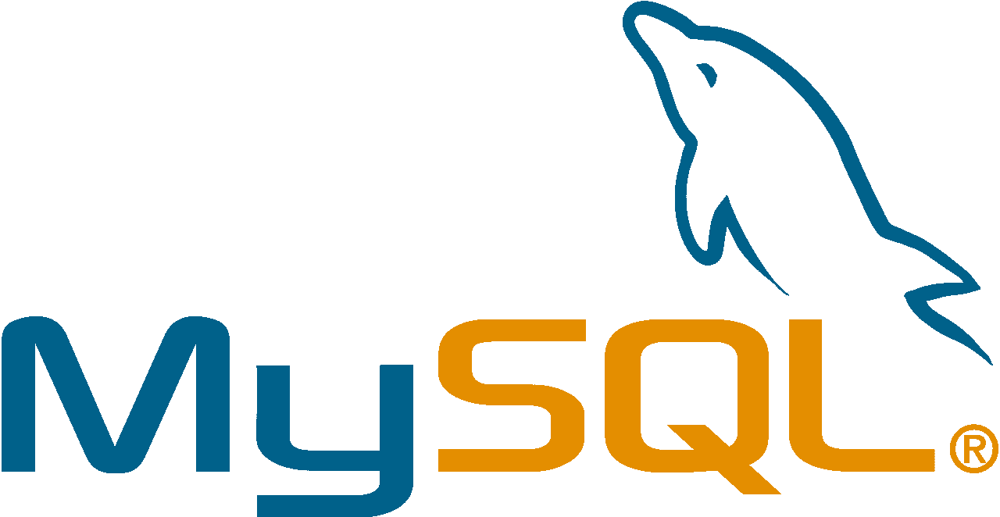
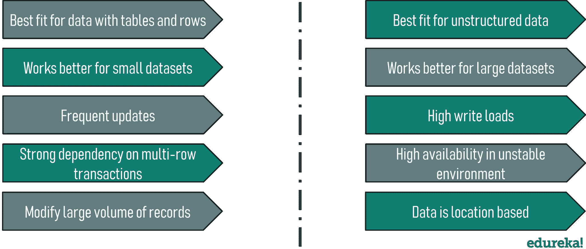

# SQL 和 NoSQL 数据库的区别——MySQL 和 MongoDB 的比较

> 原文：<https://www.edureka.co/blog/sql-vs-nosql-db/>

面对当今世界的数据量，没有合适的数据库来管理数据几乎是不可能的。在今天的市场上，有不同种类的数据库，决定最适合您的业务的数据库是一项艰巨的任务。因此，在这篇关于 [SQL](https://www.edureka.co/blog/sql-commands) vs NoSQL 的文章中，我将比较这两种类型的数据库，以帮助您选择哪种类型的数据库可以帮助您和您的组织。

本文将涵盖以下主题:

所以，让我们开始吧，伙计们！！

## **什么是 SQL？**

SQL 又称结构化查询语言，是关系数据库的核心，用于访问和管理数据库。这种语言用于以表格的形式从结构化数据格式中操作和检索数据，并保存这些表格之间的关系。关系可能如下:


*   一对一关系是指表 A 中的一行与表 b 中的一行相关。
*   一对多关系是指表 A 中的一行与表 b 中的多行相关
*   多对多关系是指表 A 中的许多行可以与表 b 中的许多行相关联
*   自引用关系是指表 A 中的记录与同一个表本身相关。

现在，接下来这篇文章让我们了解什么是 NoSQL？

## **什么是 NoSQL？**

NoSQL，或者最常见的说法是不只 SQL 数据库，提供了一种存储和检索非结构化数据的机制。这种类型的数据库可以处理海量数据，并具有动态模式。因此，NoSQL 数据库没有特定的查询语言，没有或只有很少的关系，但是数据以集合和文档的格式存储。

因此，一个数据库可以有**【n】**个集合，每个集合可以有【m】个文档。考虑下面的例子。


从上图可以看出，有一个雇员数据库，它有两个集合，即雇员和项目集合。 现在这些集合每个都有文档，基本都是数据值。因此，您可以假设*集合是您的表，文档是表*中的字段。

好了，现在你知道了什么是 SQL & NoSQL，让我们看看，这些数据库是如何相互对抗的。

## **SQL vs NoSQL**

因此，在这场对决中，我将基于以下理由对这两个数据库进行比较:

### **数据库类型**

SQL 被称为 ***一种关系数据库*** ，因为它将结构化数据组织成定义的行和列，每个表都与数据库中的其他表相关。

另一方面，NoSQL 被称为 ***作为非关系数据库*** 。这是因为数据是以集合的形式存储的，它们之间没有或很少有关系。

### **图式**

SQL 需要一个 ***预定义模式*** 用于结构化数据。因此，在开始使用 SQL 提取和操作数据之前，您需要确保您的数据结构是以表的形式预定义的。

不过，NoSQL 有一个 ***的动态模式*** 用于非结构化数据。因此，如果您使用的是 NoSQL 数据库，那么就不存在预定义的模式，数据的完整模式完全取决于您希望如何存储数据。即您希望在文档和集合中存储哪些字段。

### **数据库类别**

SQL 数据库是基于 ***t** **能力的数据库*** 。因此，你可以有“n”个相互关联的表格，每个表格都有行和列，在表格的每个单元格中存储数据。

现在，如果我们谈论 NoSQL 数据库，那么 NoSQL 数据库有以下几类数据库:

*   ***文档数据库***——它将每个键与一个称为文档的复杂数据结构配对。它可以包含许多不同的键值对，或者键数组对，甚至嵌套文档
*   ***键值存储***——它们是最简单的 NoSQL 数据库。数据库中的每一项都存储为属性名或键及其值。
*   ***图形存储***——它们用来存储关于网络的信息，比如社会关系。图形库包括 Neo4J 和 HyperGraphDB。
*   ***宽列存储***–宽列存储，如 [Cassandra](https://www.edureka.co/blog/interview-questions/cassandra-interview-questions/) 和 [HBase](https://www.edureka.co/blog/hbase-tutorial) 针对大型数据集的查询进行了优化，将数据的列存储在一起，而不是行。

因此，SQL 数据库以表格的形式存储数据，NoSQL 数据库以键值对、文档、图形数据库或宽列存储的形式存储数据。【T2

### **复杂查询**

SQL 是 ***与 NoSQL 相比，更适合复杂的查询环境*** ，因为 SQL 数据库中的模式是结构化的，数据以表格格式存储。因此，即使您希望在外部查询中应用包含许多子查询的嵌套查询，也可以通过使用适当的表名和列名来轻松实现。

现在， ***NoSQL 数据库不适合复杂查询*** 的原因是因为 NoSQL 数据库不是用 SQL 这样的标准语言查询的。

### **分层数据存储**

嗯，当我们在这个因素上比较数据库时， ***NoSQL 比 SQL 数据库更适合分层存储*** 。

这是因为随着表格数量的增加，维护它们之间关系的复杂度也在不断增加。因此，在这种情况下，您无法将大量包含许多列的表相互关联起来。但是，当您考虑 NoSQL 数据库时，这种数据库更适合分层数据存储，因为它遵循类似于 JSON 数据的键-值对存储数据的方式。T3

### **扩展性**

SQL 数据库有 ***垂直伸缩*** 。您可以通过优化硬件(如增加 CPU、RAM、SSD 等)来平衡数据服务器的负载。

另一方面，NoSQL 的数据库是横向可伸缩的。您可以通过向群集中添加更多服务器来处理大量流量，从而执行负载平衡。

### **语言**

***SQL 数据库有一个特定的语言，*** ，它不会因数据库而异。这种数据库使用 SQL(结构化查询语言)来检索和操作数据。

***NoSQL 数据库没有特定的语言*** 用于查询，并且因数据库而异。在 NoSQL 数据库中，查询主要集中在文档集合上，语言被称为 UnQL(非结构化查询语言)。

### **在线处理**

对比 SQL 和 NoSQL，基于这个因素， SQL 数据库用于 ***重型事务型应用。*** 嗯，这是因为 SQL 提供了数据的原子性、完整性和稳定性。此外，您可以将 NoSQL 用于事务目的，但是，对于高负载和复杂的事务性应用程序，它仍然不够稳定。 所以，你可以理解 SQL 主要用于 OLTP(在线事务处理)，NoSQL 主要用于 OLAP(在线分析处理)。

### **基地属性**

SQL 数据库基于(原子性、一致性、隔离性和持久性)，而 NoSQL 数据库基于 ***Brewers CAP 定理*** (一致性、可用性和分区容差)。

我先给你解释一下酸的性质:

*   **原子性**:原子性指的是完全完成或失败的事务，其中事务指的是数据的单个逻辑操作。这意味着，如果任何事务的一部分失败，整个事务都会失败，并且数据库状态保持不变。
*   **一致性**:一致性保证数据必须符合所有的验证规则。简而言之，您可以说您的事务在没有完成其状态之前不会离开数据库。
*   **隔离**:隔离的主要目标是并发控制。
*   :持久性是指如果一个事务被提交，它将会发生任何可能发生的事情，比如断电、崩溃或任何种类的错误。

来帽定理，

Brewers CAP 定理指出，数据库 c 最多只能实现三个保证中的两个:一致性、可用性和分区容差。这里

*   **一致性:**所有节点同时看到相同的数据。
*   **可用性:**保证每一个失败的请求是否成功。
*   **分区容忍度:** G **保证系统在消息丢失或部分系统故障的情况下仍能继续运行。**

NoSQL 无法同时提供一致性和高可用性。

### **外部支持**

自从 SQL 问世 40 多年以来，所有的 SQL 供应商都提供了出色的支持。然而，f 或一些 NoSQL 数据库，只有有限的专家可用，您仍然必须依靠社区支持来部署您的大规模 NoSQL 部署。这是因为 NoSQL 在 2000 年代后期才出现，人们还没有对它进行太多的探索。

因此，如果我必须在这篇关于 SQL 与 NoSQL 的文章中总结 SQL 和 NoSQL 的区别，您可以参考下表。

| **重点地区** | **SQL** | NoSQL |
| ***数据库类型*** | 关系数据库 | 非关系数据库 |
| ***图式*** | 预定义模式 | 动态模式 |
| ***数据库类别*** | 基于表格的数据库 | 基于文档的数据库、键值存储、图形存储、宽列存储 |
| ***复杂查询*** | 适合复杂查询 | 不太适合复杂的查询 |
| ***分层数据存储*** | 不是最合适的 | 比 SQL 更适合 |
| ***扩展性*** | 垂直可伸缩 | 水平可伸缩 |
| ***语言*** | 结构化查询语言 | 非结构化查询语言 |
| ***在线处理*** | 用于 OLTP | 用于 OLAP |
| ***基地属性*** | 基于酸性 | 基于上限定理 |
| ***外部支持*** | 所有 SQL 供应商都提供了出色的支持 | 依靠社区支持。 |

**表 1:**SQL 和 NoSQL 的区别——SQL vs NoSQL

所以，伙计们，SQL 和 NoSQL 之间的对抗到此结束。 现在，我们已经讨论了这么多关于 SQL 和 NoSQL，让我给你看一些相同的例子。

## **SQL 和 NoSQL 的例子**

SQL 和 NoSQL 的例子如下:


现在，来自 SQL 和 NoSQL 最流行的数据库是 ***MySQL*** 和 ***MongoDB*** 。

因此，在这篇关于 SQL 与 NoSQL 的文章中，我们将比较 MySQL 和 MongoDB。但是，在此之前，您还可以浏览一下 SQL 与 NoSQL 的视频。

## **SQL vs NoSQL–差异 B/W SQL & NoSQL 数据库|爱德华卡**


[https://www.youtube.com/embed/QwevGzVu_zk?rel=0&showinfo=0](https://www.youtube.com/embed/QwevGzVu_zk?rel=0&showinfo=0)

这段关于 SQL 与 NoSQL 的 Edureka 视频将讨论 SQL 与 NoSQL 的区别。它还讨论了 MySQL 和 MongoDB 之间的差异。

## **什么是 MySQL？**

MySQL 是一个开源的关系数据库管理系统，可以在很多平台上运行。它提供多用户访问以支持许多存储引擎，并由 Oracle 提供支持。因此，您可以从 Oracle 购买商业许可版本，以获得高级支持服务。

以下是 MySQL 的特性:


*   ***易于管理***–该软件非常容易下载，并使用事件调度程序自动安排任务。
*   ***健壮的事务支持***——拥有 ACID(原子性、一致性、隔离性、持久性)属性，还允许分布式多版本支持。
*   ***综合应用开发***–[MySQL](https://www.edureka.co/blog/mysql-tutorial/)拥有插件库，可将数据库嵌入任何应用。它还支持应用程序开发的存储过程、触发器、函数、视图等等。可以参考 [RDS 教程](https://www.edureka.co/blog/rds-aws-tutorial/) ，了解亚马逊的 RDBMS。
*   ***高性能***–通过独特的内存缓存和表索引分区提供快速加载实用程序。
*   ***总拥有成本低***—这降低了许可成本和硬件支出。
*   ***开源& 24 * 7 支持***——这款 RDBMS 可以在任何平台上使用，并为开源和企业版提供 24 * 7 支持。
*   ***安全数据保护***–MySQL 支持强大的机制，确保只有授权用户才能访问数据库。
*   ***高可用性***–MySQL 可以运行高速主/从复制配置，并提供集群服务器。
*   ***可扩展性&灵活性***——使用 MySQL，您可以运行深度嵌入的应用程序，并创建容纳海量数据的数据仓库。

## ****

接下来，在这篇文章中让我们了解一下什么是 MongoDB？

## **什么是 MongoDB？**

[MongoDB](https://www.edureka.co/blog/mongodb-interview-questions-for-beginners-and-professionals) 是一个非关系数据库，将数据存储在文档中。这种类型的数据库将相关信息存储在一起，以便快速查询处理。

MongoDB 的特点如下:

*   **索引:**创建 It 索引是为了提高搜索性能。
*   **复制:** MongoDB 将数据分布在不同的机器上。
*   **特别查询:**它通过使用独特的查询语言索引 BSON 文档&来支持特别查询。
*   **无模式:**它非常灵活，因为它的无模式数据库是用 C++编写的。
*   **分片:** MongoDB 使用分片来支持具有非常大的数据集和高吞吐量操作的部署。

好了，现在你知道了什么是 MySQL & MongoDB，让我们看看，这些数据库是如何相互对抗的。

## **MySQL vs MongoDB**

因此，在这场对决中，我将基于以下理由对这两个数据库进行比较:

### **查询语言**

***MySQL 采用结构化查询语言*** 。这种语言很简单，主要由 DDL、DML、DCL & TCL 命令组成，用于检索和操作数据。 MongoDB 则相反， ***使用的是非结构化查询语言*** 。所以，查询语言基本上是 MongoDB 查询语言。参考下图。

###   **图式的灵活性** 

***MySQL 对于结构化数据有很好的模式灵活性*** 只需要明确定义表和列。现在， MongoDB 相反， ***对模式设计*** 没有限制。您可以直接提到集合中的几个文档，而这些文档之间没有任何关系。但是，MongoDB 的唯一问题是，您需要根据您希望如何访问数据 来优化您的模式。

### **关系**

基于这个因素对比 MySQL 和 MongoDB， ***[MySQL 借助 JOIN 语句](https://www.edureka.co/blog/sql-joins-types)*** 支持关系，但是 ***MongoDB 不支持 JOIN 语句*** 。但是，它支持将一个文档放入另一个文档(也称为文档嵌入)和多维数据类型，如数组。

### **安全**

MySQL 基本上使用了一个 ***基于权限的安全模型*** 。这种安全模型对用户进行身份验证，并促进用户在特定数据库上的特权。

另一方面，MongoDB 使用基于角色的访问控制，具有一组灵活的特权，提供安全特性，如授权和认证。

### **表现**

关于 MySQL 和 MongoDB 在这个参数上的比较，让我告诉你 ***当考虑大型数据库时，MySQL 与 MongoDB*** 相比相当慢。这主要是因为 MySQL 不能用于大量的非结构化数据。

不过，MongoDB 有处理大型非结构化数据的能力。因此，它比 MySQL 更快，因为它允许用户以降低服务器负载的方式进行查询。

*NOTE: There is as such no hard and fast rule that MongoDB will be faster for your data all the time, It completely depends on your data and infrastructure.*

### ****支持****

**嗯， ***两者都为安全修复、维护发布、bug 修复、补丁和更新提供 24*7*** 的出色支持。 所以，基于这个参数，两者之间没有区别。**

### ****关键特性****

**MySQL 和 MongoDB 的关键特性可以参考下图:**

### ****复制**** 

*****MySQL 支持主从复制*** 和主从复制。 另一方面，***MongoDB 支持内置复制、分片和自动选举。*** 因此，借助 MongoDB 中的自动选举，您可以设置另一个或辅助数据库，以便在主数据库出现故障时自动接管。**

### ****用法****

**可以参考下图了解在哪里使用 MySQL 和 MongoDB:**

### **** 

### ****活跃社区****

**基于这个因素比较 MySQL 和 MongoDB， ***MySQL 数据库提供了一个比 MongoDB*** 更好的社区，因为它由甲骨文公司拥有、和维护。**

**所以，如果非要我总结 MySQL 和 MongoDB 的区别，可以参考下表。**

| **重点地区** | **MySQL** | **【蒙戈布】** |
| ***查询语言*** | 使用结构化查询语言(SQL) | 使用 MongoDB 查询语言 |
| ***图式的灵活性*** | 预定义模式设计 | 对模式设计没有限制 |
| ***人际关系*** | 支持 JOIN 语句 | 不支持 JOIN 语句 |
|  | 使用基于特权安全的模型 | 使用基于角色的访问控制 |
| ***表现*** | 比 MongoDB 慢 | 比 MySQL 快 |
| ***支持*** | 提供全天候出色支持 | 提供全天候出色支持 |
| ***关键特性*** | 

*   Trigger & SSL supports
*   Provide text search and index
*   Query cache
*   Integrated replication support
*   Different storage engines and various

 | 

*   automatic slicing
*   Comprehensive secondary index
*   Memory speed
*   Native copy
*   Embedded data model supports

 |
| ***复制*** | 支持主从复制 | 支持内置复制、分片和自动选择。 |
| ***用法*** | 

*   is best for data containing tables and rows
*   is more suitable for small data sets
*   frequently update
*   Strong dependence on multi-line transactions
*   Modify a large number of records

 | 

*   Best for unstructured data
*   is more suitable for large data sets
*   High write load
*   High availability in unstable environment
*   Data is based on location

 |
| ***活跃社区*** | 拥有良好活跃的社区。 | MySQL 的社区比 MongoDB 好很多。 |

****表 2:**MySQL 和 MongoDB 的区别——SQL vs NoSQL**

**所以，朋友们，我们结束了 MySQL 和 MongoDB 之间的对抗。 现在，了解了这么多关于 MySQL 和 MongoDB 的知识，你可能会想到一个问题，即 ***企业应该选择 MySQL 还是 MongoDB？*****

**他们两人之间没有明显的赢家。数据库的选择完全取决于数据库的模式以及您希望如何访问它。然而，当你有一个固定的模式，高事务，低维护，有限预算的数据安全和 MongoDB 时，你可以使用 MySQL，而当你有一个不稳定的模式，高可用性，云计算，内置分片。**

**因此，对于哪一个是最好的，不会有最终的定论，因为每一个都是根据你的要求而定的。**

**现在，你已经知道了 MySQL 和 MongoDB 之间的区别，接下来在这篇关于 SQL 和 NoSQL 的文章中，我将向你展示如何分别在 MySQL Workbench 和 MongoDB Compass 中向表和集合中插入数据。**

## ****演示:将数据插入表和集合****

**让我们从使用 MySQL Workbench 向表中插入数据开始。**

### ****使用 MySQL Workbench** 将数据插入表格**

**要使用 MySQL Workbench 向表中插入数据，您可以遵循以下步骤:**

****第一步:**打开 MySQL Workbench，创建连接。要知道如何创建连接，你可以参考 [MySQL Workbench 教程](https://www.edureka.co/blog/mysql-workbench-tutorial)。**

****第二步:**现在，一旦您的连接被创建，打开您的连接，然后您将被重定向到以下仪表板。**

****第三步:**现在创建一个数据库和一个表，按照下面的查询:**

```
 **//Create Database
CREATE DATABASE Employee_Info;
//Use Database
USE Employee_Info;
//Create Table
CREATE TABLE Employee
(EmpID int,
EmpFname varchar(255),
EmpLname varchar(255),
Age int,
EmailID varchar(255),
PhoneNo int8,
Address varchar(255));** 
```

****步骤 4:** 现在，一旦创建了表，要将值插入表中，请使用如下的 INSERT INTO 语法:**

```
 **//Insert Data into a Table
INSERT INTO Employee(EmpID, EmpFname, EmpLname,Age, EmailID, PhoneNo, Address)
VALUES ('1', 'Vardhan','Kumar', '22', 'vardy@abc.com', '9876543210', 'Delhi');** 
```

****第五步:**当你查看你的表时，你会输出如下图。**

**现在，在这篇关于 SQL 与 NoSQL 的文章中，让我们看看如何在 MongoDB Compass 中创建数据库和集合。**

### ****使用 MongoDB Compass** 将数据插入集合**

**要使用 MongoDB Compass 将数据插入到表中，您可以遵循以下步骤:**

****第一步:**打开 **MongoDB 罗盘****创建主机**。一旦你的主机创建完成，点击**连接。**参考下文。**

****第二步:**现在，一旦您的主机被连接，要创建一个数据库，点击**创建数据库**选项并提及**数据库和集合名称。****

****第三步:**现在，打开你的数据库，选择收藏。这里我选择了样本集合。要将文档添加到集合中，选择**插入文档**选项和**提及参数**。这里我提到了 EmpID 和 EmpName。**

****

**至此，我们结束了对 **SQL 和 NoSQL** 的比较。我希望你们喜欢这篇文章，并理解所有的差异。因此，如果您已经阅读了本文，您可能会清楚地知道哪个数据库适合您的需求。**

***既然你已经了解了 SQL & NoSQL 之间的比较，那就来看看 Edureka 的 [MySQL DBA 认证培训](https://www.edureka.co/mysql-dba) & [MongoDB 认证培训](https://www.edureka.co/mongodb)，edu reka 是一家值得信赖的在线学习公司，拥有遍布全球的 250，000 多名满意的学习者。***

***有问题吗？请在“SQL 与 NoSQL”的评论部分提到它，我们会回复您。***