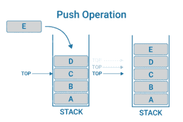
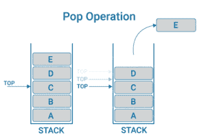

# Python 中的堆栈:如何、为什么和在哪里？

> 原文：<https://www.edureka.co/blog/stack-in-python/>

嘿，你可能已经登陆到这里，在 [Python](https://www.edureka.co/blog/python-tutorial/) 中搜索堆栈，好吧，我们已经为你整理好了。在这篇博客中，我们将深入分析如何、为什么以及在哪里使用 Python 中的**栈。**

博客由以下主题组成:

*   [什么是数据结构中的栈？](#StackinDataStructures)
*   [我们为什么以及什么时候使用栈？](#usestacks)
*   [如何在 Python 中实现堆栈？](#implementstackinPython)
*   [一个简单的程序，用来说明 Python 中的堆栈。](#illustrateStackinPython)
*   [更多关于 Python 及相关程序中栈的用法](#usageofStacksinPythonandrelatedprograms)
*   [列表 内置](#ThelistBuilt-in)
*   [collections . dequeClass](#collections.dequeClass)
*   [队列。LIFO queueT3 级](#Thequeue.LifoQueueClass)

## ****什么是数据结构中的栈？****

数据结构是组织计算机存储的关键，这样我们就可以有效地访问和编辑数据。 *栈* 是计算机科学中最早定义的数据结构之一。 简单来说，Stack 就是一个线性的条目集合。It 是一个[对象](https://www.edureka.co/blog/java-object/)的集合，支持快速后进先出(LIFO)的插入和删除语义。它是现代计算机编程和 CPU 架构中使用的函数调用和参数的数组或列表结构。类似于餐馆里的一堆盘子，一堆盘子中的元素以“后进先出”的顺序从一堆盘子的顶部添加或移除。与列表或[数组](https://www.edureka.co/blog/arrays-in-python/)不同，堆栈中包含的对象不允许随机访问。

堆栈中有两种类型的操作-

*   **按下**–将数据加入堆栈。
*   **弹出**–从堆栈中删除数据。

堆栈简单易学，易于实现，它们被广泛集成到许多软件中，用于执行各种任务。它们 可以用数组或者 链表 来实现。这里我们将依托 列表 数据结构。

我们为什么以及何时使用堆栈？

堆栈是简单的数据结构，它允许我们按顺序存储和检索数据。

说到性能，一个合适的堆栈实现预计需要花费*【O(1)*的时间来进行插入和删除操作。

要理解一层的 Stack，想象一下一堆书。你把一本书放在书库的顶部，所以第一本被拿起的书将是最后一本被放入书库的书。

堆栈有许多真实的使用案例，理解它们可以让我们以简单有效的方式解决许多数据存储问题。

假设你是一名开发人员，正在开发一款全新的文字处理器。您需要创建一个撤销特性——允许用户回溯他们的操作，直到会话开始。堆栈非常适合这种情况。我们可以通过将用户的每一个动作推送到堆栈来记录它。当用户想要撤销一个动作时，他们可以从堆栈中弹出。

## ****如何在 Python 中实现堆栈？****

在 python 中，我们可以通过:实现 Python 栈

1.  使用内置列表数据结构。 Python 内置的 列表 数据结构自带了模拟 *堆栈* 和 *队列* 操作的方法。
2.  使用在一个对象中有效提供堆栈和队列操作的队列库。
3.  使用 队列。LifoQueue 类。

如前所述，我们可以使用操作向堆栈添加项目，使用【POP】操作移除项目。

**推送操作**

Push–在栈顶添加一个元素。更多理解请参考下图:



**弹出操作**

弹出–从堆栈顶部移除一个元素。



**这里有一个简单的程序来说明 Python 中的堆栈-**

```
class Stack
def_init_(self):
self.items=[]
def is_empty(self):
		return self.items==[]
	def push(self, data):
		self.items.append(data)
	def pop(self):
		return self.items.pop()
s= Stack()
while True:
	print(‘push<value>’)
	print(‘pop’)
	print(‘quit’)
do= input(‘What would you like to do?’).split()
operation= do[0].strip().lower()
if operation== ‘push’:
s.push(int(do[1]))
elif operation== ‘pop’:
	if s.is_empty():
		print(‘Stack is empty’)
	else:
		print(‘Popped value:’, s.pop())
elif operation==’quit’:
break

```

## ****更多关于 Python 和相关程序中栈的用法****

栈在算法中提供了广泛的用途，例如，在语言解析和 运行时内存管理(“调用栈”) 。使用堆栈的一个简短而有用的算法是对树或图数据结构的【DFS】。 Python 使用了几种栈实现，每一种都有略微不同的特征。让我们简单看一下它们:

## ****列表** **内置****

Python 内置的链表类型使得栈数据结构更加体面，因为它支持在分期 *O(1)* 时间内的推送和弹出操作。

Python 的列表在内部实现为动态数组，这意味着每当添加或删除元素时，它们偶尔需要调整存储空间的大小。存储空间被分配得比所需的多，因此不是每个推送或弹出都需要调整大小，并且您得到这些操作的分摊的*【O(1)*时间复杂度。

虽然这使得它们的性能不如由基于链表的实现提供的稳定的*【O(1)*插入和删除一致。另一方面，列表提供了对栈上元素的快速*【O(1)*时间随机访问，这是一个额外的好处。

使用列表作为堆栈时，这里有一个重要的性能警告:

将得到的摊销后的*(1)*业绩进行插入和删除，new 用 append()方法添加到列表的末尾，并用 pop()从末尾删除。基于 [Python](https://www.edureka.co/blog/python-programming-language) 列表的栈向右扩展，向左收缩。

从前面添加和删除需要更多的时间(*【O(n)*时间)，因为现有的元素必须四处移动，以便为要添加的新元素腾出空间。

#使用 Python 列表作为堆栈(LIFO):

```
s = []

s.append('eat')
s.append('sleep')
s.append('code')

>>> s
['eat', 'sleep', 'code']

>>> s.pop()
'code'
>>> s.pop()
'sleep'
>>> s.pop()
'eat'

>>> s.pop()
IndexError: "pop from empty list"

```

## ****收藏. deque** **类****

deque 类实现了一个双端队列，支持在*【O(1)*【时间】内从两端添加和移除元素(非摊销)。

因为 deques 同样支持从两端添加和删除元素，所以它们既可以用作队列，也可以用作堆栈。

Python 的 deque 对象被实现为双向链表，这使它们在插入和删除元素时具有适当和一致的性能，但由于它们随机访问堆栈中间的元素，因此性能很差*【O(n)*。

如果您正在 Python 的标准库中寻找具有链表实现性能特征的堆栈数据结构，collections.deque 是一个不错的选择。

#使用 collections.deque 作为堆栈(LIFO):

```
from collections import deque
q = deque()

q.append('eat')
q.append('sleep')
q.append('code')

>>> q
deque(['eat', 'sleep', 'code'])

>>> q.pop()
'code'
>>> q.pop()
'sleep'
>>> q.pop()
'eat'

>>> q.pop()
IndexError: "pop from an empty deque"

```

## **队列。LifoQueue** **类**

Python 标准库中的这个堆栈实现是同步的，并提供锁定语义来支持多个并发的生产者和消费者。

队列模块 包含其他几个实现多生产者、多消费者队列的类，这对于并行计算非常有用。

根据您的使用情况，锁定语义可能会有所帮助，或者只是招致不必要的开销。在这种情况下，您最好将 list 或 deque 用作通用堆栈。

#使用队列。LifoQueue 作为堆栈:

```
from queue import LifoQueue
s = LifoQueue()

s.put('eat')
s.put('sleep')
s.put('code')

>>> s
<queue.LifoQueue object at 0x108298dd8>

>>> s.get()
'code'
>>> s.get()
'sleep'
>>> s.get()
'eat'

>>> s.get_nowait()
queue.Empty

>>> s.get()
# Blocks / waits forever...

```

如果你已经学了这么多，你现在一定能够使用 Python 中的栈了，我希望这篇博客能帮助你了解 Python 中栈的不同实现方法。

我们的“python 中的堆栈”文章到此结束。我希望你喜欢阅读这个博客，并发现它的信息量。到目前为止，您一定已经很好地理解了什么是 python 堆栈以及如何使用它。现在开始练习所有的例子。

*要深入了解 Python 编程语言及其各种应用，您现在就可以注册参加实时 [Python 课程](https://www.edureka.co/python-programming-certification-training)培训，该课程提供全天候支持和终身访问。*

*有问题吗？请在“Python 中的堆栈”博客的评论部分提到它，我们会尽快回复您。*