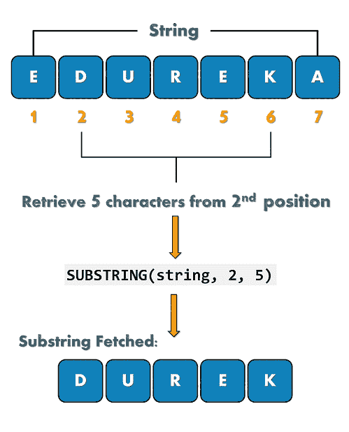

# 如何在 SQL 中使用 SUBSTRING 检索一组字符？

> 原文：<https://www.edureka.co/blog/substring-in-sql/>

[结构化查询语言](https://www.edureka.co/blog/what-is-sql/)旨在让用户能够以他们想要的格式检索数据。在这篇关于 SQL 中的子串的文章中，我将向您展示如何从一个字符串中提取一组字符。 本文将涉及以下主题:

*   [什么是 SQL？](#sql)
*   [SQL 中的子串是什么？](#substringsql)
    1.  [语法:](#syntax)
*   [子串示例:](#example)
    1.  [在文字上使用子串](#substringonliterals)
    2.  [在有条件的表上使用子串](#substringontable)
    3.  [在嵌套查询上使用子串](#substringonnestedqueries)

让我们开始吧！

## **什么是 SQL？**

SQL 或[结构化查询语言](https://www.edureka.co/blog/sql-basics/)由 Donald D.Chamberlin 开发，用于管理、访问和检索数据库中的数据。它由分成 4 类(DDL、DML、DCL 和 TCL)的各种命令组成。 SUBSTRING 就是 SQL 中的一个这样的命令，用来从指定的字符串中检索一组字符。

接下来，在本文中，让我们更深入地了解什么是 SQL 中的 SUBSTRING 以及如何使用它。

## **SQL 中的子串是什么？**

SQL 中的 SUBSTRING 是用来从字符串中检索字符的函数。借助这个函数，您可以从单个字符串中检索任意数量的子字符串。

### **语法:**

```
SUBSTRING(string, starting_value, length)

```

这里，

*   **String**–代表需要从中提取一组字符的字符串。
*   **起始值**–表示字符串的起始位置。字符串中的第一个字符被赋予值 1。
*   **Length**–代表您希望提取的字符数。

SQL 中子串的图示见下图。

****

**注:**

*   如果长度参数为负，SUBSTRING 函数将抛出错误。
*   字符的长度可以超过原始字符串的最大长度。在这种情况下，将从提到的起始位置提取整个字符串。
*   在此功能中，所有三个字段都是强制性的
*   如果起始位置大于字符串中的最大字符数，则不返回任何内容。

既然您已经理解了在 SQL 中使用子串的语法和规则，现在让我们来讨论使用它的各种方法。

## **子串示例:**

为了让您更好地理解，我将示例分成了以下几个部分:

让我们逐一了解一下。

### **在文字上使用子串**

当您在 SQL 中使用 SUBSTRING for literals 时，它从指定的字符串中提取一个子字符串，其长度和起始于用户提到的初始值。

#### **例 1**

编写一个查询，从字符串“Edureka”中提取一个子字符串，从第 2 个<sup>和第 2 个</sup>字符开始，必须包含 4 个字符。

```

SELECT SUBSTRING(‘Edureka’, 2, 4);

```

#### **输出**

```
dure

```

#### **例 2**

编写一个查询，从字符串“Edureka”的第 2 个<sup>和第 2 个</sup>字符开始提取 8 个字符的子字符串。在这里，如果你观察，我们需要提取一个长度大于表达式最大长度的子串。

```
SELECT SUBSTRING(‘Edureka’, 2, 8);

```

#### **输出**

```
dureka

```

### **用条件**在表上使用子串

考虑下表中表名为 **的客户。**

| **CustID** | **客户名称** | **CustEmail** |
| 1 | Anuj | anuj@abc.com |
| 2 | 阿卡什 | akash@xyz.com |
| 3 | 奖牌 | mitali@pqr.com |
| 4 | Sonali | sonali@abc.com |
| 5 | 桑杰 | sanjay@xyz.com |

如果你想知道如何创建一个表并在其中插入值，你可以参考关于 [CREATE](https://www.edureka.co/blog/create-table-in-sql/) 和 [INSERT](https://www.edureka.co/blog/insert-query-sql/) 语句的文章。

#### **例 1**

编写一个查询来提取一个由 3 个字符组成的子串，从第 1 个 <sup>开始，第 1 个</sup> 字符为 CustName“Akash”。

```
SELECT SUBSTRING(CustName, 1, 3)
FROM Customers
WHERE CustName = ‘Akash’;

```

#### **输出**

```
Aka

```

#### **例 2**

编写一个查询来提取一个子字符串，直到字符串结束，从 cust name“Akash”中的第 2 个 <sup>和第 2 个</sup> 字符开始。

```
SELECT SUBSTRING(CustName, 2)
FROM Customers
WHERE CustName = ‘Akash’;

```

#### **输出**

```
kash

```

#### **例 3**

编写一个查询来提取 3 个字符的子字符串，从 CustName 的第 2 个 <sup>和第 2 个</sup> 字符开始，并根据 CustName 对其进行排序。

```
SELECT CustName
FROM Customers
ORDER BY SUBSTRING(CustName, 2, 3);

```

#### **输出:**

```
anj
ita
kas
nuj
ona

```

### **在嵌套查询中使用子串**

在本文关于 SQL 中的子串的这一节中，让我们了解如何在嵌套查询中使用 substring 函数。 为了理解同样的情况，让我们考虑一下 Customers 表，上面我们已经考虑过了。

#### **举例:**

编写一个查询，从 Customers 表的 CustEmail 列中提取所有 d 域。

```
SELECT
    CustEmail,
    SUBSTRING(
        CustEmail,
        CHARINDEX('@', CustEmail)+1,
        LEN(CustEmail)-CHARINDEX('@', CustEmail)
    ) Domain
FROM
   Customers
ORDER BY
    CustEmail;

```

#### **输出**T2:T4

| **CustEmail** | **域** |
| anuj@abc.com | abc.com |
| akash@xyz.com | xyz.com |
| mitali@pqr.com | pqr.com |
| sonali@abc.com | abc.com |
| sanjay@xyz.com | xyz.com |

由于域在@字符之后开始，我们使用 CHARINDEX()函数在 CustEmail 列中搜索@字符。然后，使用该函数的结果来确定要提取的子字符串的起始位置和长度。

伙计们，这就是如何在 SQL 中使用 SUBSTRING 函数来检索数据。 至此，我们结束了这篇关于 SQL 中的子串的文章。我希望你发现这篇文章信息丰富。

*如果您希望了解有关*[*MySQL*](https://www.edureka.co/blog/what-is-mysql/)*的更多信息，并了解这款开源关系数据库，请查看我们的*[*MySQL DBA 认证培训*](https://www.edureka.co/mysql-dba) *，它附带有讲师指导的现场培训和真实项目体验。本培训将帮助您深入了解 MySQL，并帮助您掌握这门学科。*

*有问题吗？请在这篇文章的评论部分提到它，我会回复你。*