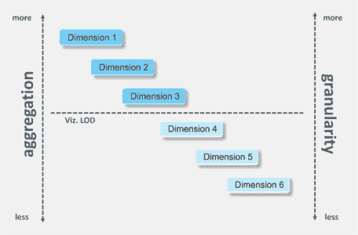
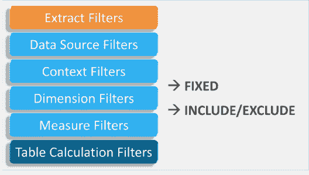
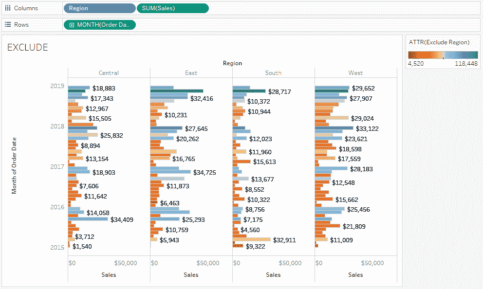
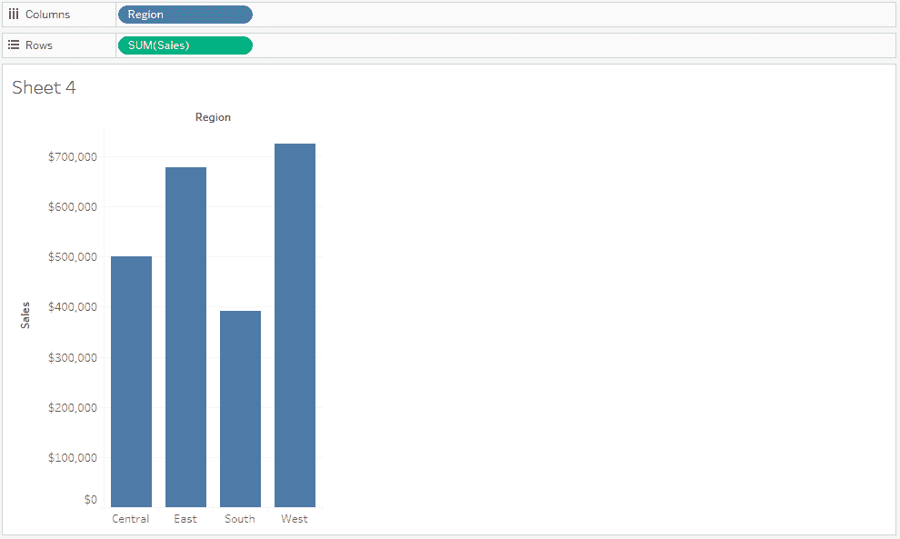
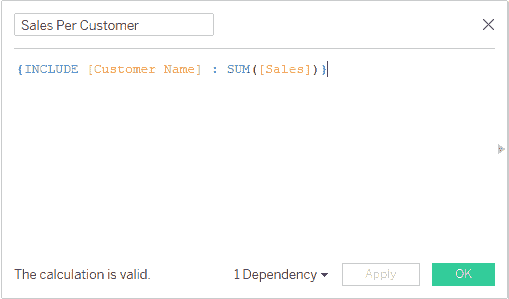

# LOD 表达式如何在 Tableau 中工作？

> 原文：<https://www.edureka.co/blog/tableau-lod/>

任何 BI 工具的目的都是为了给 ***数据分析*** 一个更好的流程。如果一个人，作为一个专业人士，在解决一个问题时面临使用工具的困难，流动的状态就被打破了。这个问题的一个常见原因是需要处理已经在 Tableau (LOD) 中聚合到不同 ***细节级别的数据。***

在 Gartner 的魔力象限中，Tableau 连续第六次位居榜首，这无疑说明了它在市场中的需求。这大概是 [Tableau 认证课程](https://www.edureka.co/tableau-certification-training)最好的时机。

本博客将帮助您理解 LOD 表达式并讨论以下主题:

*   [**为什么 Tableau 中需要层次细节？**](#Why_do_you_need_Level_of_Detail_in_Tableau)
*   [**Tableau 中的细节层次是什么？**T3](#What_is_Level_of_Detail_in_Tableau)
*   [**行级&视图级表情**](#Row_Level_and_View_Level_Expressions)
*   [**LOD 表达式的类型**](#Types_of_LOD_Expressions)
*   [**聚合和 LOD 表达式**](#Aggregation_and_LOD_Expressions)
*   [**滤镜和 LOD 表达式**](#Filters_and_LOD_Expressions)
*   [**创建 LOD 表达式**](#Creating_LOD_Expressions)

*   [**数据源支持 Tableau 中的细节层次**](#Data_Sources_supporting_Level_Of_Detail_in_Tableau)
*   [**表格计算 vs Tableau 中的详细程度**](#Table_Calculations_vs_LOD)
*   [**Tableau 中细节层次的限制**](#Limitations_of_Level_Of_Detail_in_Tableau)

## **Tableau LOD:为什么需要 LOD？**

在分析数据时，经常会遇到一些问题。这些问题通常问起来简单，但很难回答。它们通常听起来像这样:

 为了解决这些类型的问题，Tableau 9.0 中引入了一种叫做**细节层次**的新语法。这种新的语法简化并扩展了 Tableau 的计算语言，使得直接解决这些问题成为可能。

## **Tableau LOD:****什么是 LOD？** 

LOD 表达式代表了一种优雅而强大的方式来回答涉及单个可视化中多个粒度级别的问题。

Tableau 或 LOD 表达式中的细节级别允许您计算数据源级别和可视化级别的值。然而，LOD 表达式为您提供了对想要计算的粒度级别的更多控制。它们可以在*更细粒度的*级别(包括计算)、一个*更细粒度的*级别(不包括计算)或一个*完全独立的级别* l(固定计算)上执行。

## **Tableau LOD:****行级&视图级表情**

### **行级别**

在 Tableau 中，为基础表中的每一行计算引用  **未聚合** 数据源列的表达式。在这种情况下，表达式的维数为  *行级别*。行级表达式的一个示例是:

`[Sales] / [Profit]`

该计算将在数据库的每一行中进行评估。每行中的销售值将除以该行中的利润值，产生一个新列，其中包含相乘的结果(利润率)。

如果使用此定义创建一个计算，将其保存为[ ProfitRatio ]，然后将其从  数据窗格拖到一个架子上，Tableau 通常会聚合视图的计算字段:

`SUM[ProfitRatio]`

### **查看级别**

相比之下，引用  **聚合** 数据源列的表达式是在由视图中的维度定义的维度上计算的。在这种情况下，表达式的维度是视图级别。视图级表达式的一个示例是:

`SUM(Sales) / SUM(Profit)`

如果您将该计算拖到一个架子上(或者作为特别计算直接在架子上键入)，Tableau 会将它包含在一个 **AGG 函数**中:

`AGG(SUM(Sales) / SUM(Profit))`

这就是所谓的**聚合计算**。

## **Tableau LOD:****聚合和 LOD 表达式**

### **LOD 表达式比视图细节层次** 更粗糙

当表达式引用视图中尺寸的**子集时，它比视图具有更粗糙的细节层次。**

例如，对于包含维[类别和[段]的视图，您可以在 Tableau 中创建一个仅使用其中一个维的详细级别:

`{FIXED [Segment] : SUM([Sales])}`

在这种情况下，表达式的细节层次比视图粗糙。它的值基于一个维度([ 段)，而视图基于两个维度([ 段和[ 类别)。

结果是，在视图中使用细节层次表达式会导致某些值被复制，也就是说，**会出现多次**。

### **LOD 表达比视图细节层次更精细**

当表达式引用视图中维度的**超集时，它比视图具有更精细的细节层次。**

当您在视图中使用这样的表达式时，Tableau 会将结果聚合到视图级别。例如，Tableau 中的以下详细级别引用了两个维度:

`{FIXED [Segment], [Category] : SUM([Sales])}`

当该表达式用于只有[Segment]作为其细节级别的视图时，值  *必须聚合*。如果将该表达式拖到架子上，您将看到以下内容:

`AVG([{FIXED [Segment]], [Category]] : SUM([Sales]])}])`

Tableau 会自动分配一个**聚合**(在本例中为平均值)。您可以根据需要更改聚合。

### **给视图添加 LOD 表达式**

Tableau 表达式中的细节级别是在视图中聚合还是复制由**表达式类型**和**粒度**决定。

*   包含表达式将具有与视图相同的细节级别，或者比视图更精细的细节级别。因此，价值观永远不会被复制。
*   固定表达式可以具有比视图更精细的细节级别、更粗糙的细节级别或相同的细节级别。是否需要聚合固定细节级别的结果取决于视图中的维度。
*   排除表达式总是导致复制的值出现在视图中。当包含排除细节级别表达式的计算被搁置时，Tableau 默认使用 **ATTR 聚合**而不是求和或 AVG，以表明表达式实际上没有被聚合，并且更改聚合不会对视图产生影响。

将详细等级表达式添加到视图中的工具架时，除非它们被用作尺寸，否则它们总是自动包裹在集合中。

[https://www.youtube.com/embed/JVN-hilDYxM](https://www.youtube.com/embed/JVN-hilDYxM)

## **Tableau LOD:****滤镜和 LOD 表达式**

此处的图像描述了从上到下执行过滤器的顺序。右边的文本显示了 LOD 表达式在这个序列中的求值位置。

提取过滤器(橙色)仅适用于从数据源创建 Tableau 提取。表格计算过滤器(深蓝色)在计算执行后应用，因此隐藏标记而不过滤出计算中使用的基础数据。

固定计算在维度过滤器之前应用，因此除非您提升过滤器架上的字段以使用上下文过滤器<u>、</u>提高视图性能，否则它们将被忽略。

## **Tableau LOD:****LOD 表达式类型**

### **包括计算**

除了视图中的维度之外，INCLUDE 还使用指定的维度计算值。当包含不在视图中的尺寸时，这种详细程度的表达式最有用。

**例如:** `{ INCLUDE [Customer Name] : SUM([Sales]) }`

### **排除计算**

“排除”( EXCLUDE)从表达式中显式删除尺寸，即从视图详细程度中减去尺寸。Tableau 中的这种细节级别对于消除视图中的尺寸非常有用。

**例如:** `{EXCLUDE [Region]: SUM([Sales])}`

### **固定计算**

固定使用指定的尺寸计算值，而不参考视图详细程度，即不参考视图中的任何其他尺寸。此详细程度表达式还会忽略视图中除上下文过滤器、数据源过滤器和提取过滤器之外的所有过滤器。

**例如:** `{ FIXED [Region] : SUM([Sales]) }`

**** 

## **Tableau LOD:****创建 LOD 表达式**

### **LOD 表达式的语法**

详细等级表达式具有以下结构:

`{[FIXED | INCLUDE | EXCLUDE] <*dimension declaration* > **:** <*aggregate expression*>}`

### 第一步:设置可视化

1.  打开 Tableau 桌面，连接到**Sample-super store**保存的数据源。
2.  导航到新工作表。
3.  从窗格中，在维度下，拖动  区域 到  列 架子上。
4.  从窗格中，在度量下，拖动到  行 货架。将出现一个条形图，显示每个地区的销售总额。

### 第二步:创建 LOD 表达式

您可能还想查看每个地区每个客户的平均销售额，而不是每个地区所有销售额的总和。您可以使用 LOD 表达式来做到这一点。

1.  选择  分析 T5>创建计算字段。
2.  在打开的计算编辑器中，执行以下操作:
    *   命名计算，每个客户的销售额。
    *   Enter the following LOD expression:

        `{ INCLUDE [Customer Name] : SUM([Sales]) }`

        

3.  完成后，点击  确定。新创建的 LOD 表达式将添加到“数据”窗格中的“测量”下。

### 步骤 3:在可视化中使用 LOD 表达式

1.  从  **数据** 窗格中，在 Measures 下，将每个客户的销售额拖动到  行 货架上，并将其放置在 SUM(Sales)的左侧。
2.  在行货架上，右键单击  每客户销售额 ，选择Measure(Sum)>Average。现在，您可以看到每个地区所有销售额的总和以及每个客户的平均销售额。例如，您可以看到，在中部地区，销售总额约为 **500，000 美元**，每个客户的平均销售额约为 **800 美元**。

## ****

## **Tableau LOD:****数据源支持 LOD 表达式**

| **数据来源** | **支持/不支持** |
| 向量方向活动 | 不支持。 |
| 亚马逊 EMR Hadoop 配置单元 | 支持 Hive 0.13 以上版本。 |
| 亚马逊红移 | 支持。 |
| 改变数据库 | 支持 4.5 以上版本。 |
| Cloudera Hadoop | 支持 Hive 0.13 以上版本。 |
| Cloudera Impala | 支持 Impala 1.2.2 以上版本。 |
| 多维数据集(多维数据源) | 不支持。 |
| 数据税务企业 | 不支持。 |
| EXASOL | 支持。 |
| 火鸟 | 支持 2.0 以上版本。 |
| 通用 ODBC | 有限。取决于数据源。 |
| 谷歌大查询 | 支持标准 SQL，不支持传统 SQL。 |
| IBM DB2 | 支持 8.1 以上版本。 |
| MarkLogic | 支持 7.0 以上版本。 |
| SAP HANA | 支持。 |
| SAP Sybase ASE | 支持。 |
| SAP Sybase IQ | 支持 15.1 以上版本。 |
| Spark SQL | 支持。 |
| Splunk | 不支持。 |
| Tableau 数据提取 | 支持。 |
| Teradata | 支持。 |
| 垂直的 | 支持 6.1 以上版本。 |
| Microsoft Access | 不支持。 |
| 基于 Microsoft Jet 的连接 | 不支持。 |
| Hortonworks Hadoop 配置单元 | Supported Hive 0.13 onwards.在 HIVE 1.1 版本中，产生交叉连接的 LOD 表达式是不可靠的。 |
| IBM BigInsights | 支持。 |
| Microsoft SQL Server | 支持 SQL Server 2005 及更高版本。 |
| 关系型数据库 | 支持。 |
| IBM PDA (Netezza) | 支持 7.0 以上版本。 |
| 神谕 | 支持版本 9i 以上。 |
| 锕系矩阵 | 支持 3.1 及以上版本。 |
| Pivotal Greenplum | 支持 3.1 及以上版本。 |
| 一种数据库系统 | 支持 7.0 以上版本。 |
| 进度 OpenEdge | 支持。 |

## **Tableau LOD:****表格计算 vs LOD**

LOD 表达式不是表格计算的新形式。虽然它们可以取代许多表格计算，但它们的主要目的是开辟新的可能性。 LOD 表达式和表格计算操作不同。

| **表格计算** | **LOD 表达式** |
| 表格计算由**查询结果**生成。 | LOD 表达式是作为对底层数据源的查询的一部分而生成的。它们被表示为嵌套的 select，因此，取决于 DBMS 的性能。 |
| 表格计算只能产生等于或小于 LOD 的结果。 | LOD 可以产生独立于所述 LOD 的结果**。** |
| 控制表操作的维度与计算语法是分开的。 | 控制 LOD 表达式操作的尺寸**嵌入在表达式**本身中。 |
| 表计算用作**聚合度量**。 | LOD 表达式可用于其他构造中。 |
| 表格计算上的过滤器充当**隐藏**。 | LOD 上的过滤器充当**排除**。 |

## **Tableau LOD:****LOD 的局限性**

以下是适用于 LOD 表达式的约束。

*   引用浮点度量值的 LOD 表达式在需要比较表达式中的值的视图中使用时，往往表现得不可靠。
*   LOD 不会显示在数据源页面上。
*   在维度声明中引用参数时，请始终使用参数名，而不是参数值。
*   使用数据混合时，主数据源中的链接字段必须位于视图中，然后才能使用辅助数据源中的详细程度表达式。

此外，一些数据源有复杂性限制。Tableau 不会禁用这些数据库的计算，但是如果计算变得太复杂，就有可能出现查询错误。