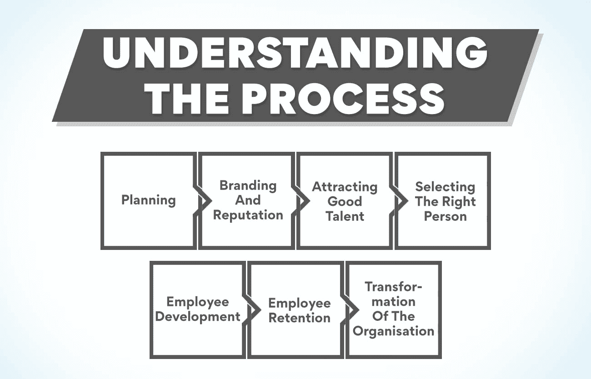

# 理解人才管理及其重要性

> 原文：<https://www.edureka.co/blog/talent-management/>

雇佣能够完成所需任务的人已经不够了。公司必须雇佣既能满足今天需求，又有潜力在未来承担更高责任的人。市场竞争越来越激烈，变化非常快。客户需求瞬息万变，要求公司做好准备来满足不断变化的需求。公司必须确保员工能够奋起迎接新的挑战。人才管理是帮助公司吸引、发展、激励和留住优秀员工的过程。

**什么是人才管理？**

作为有抱负的人力资源专业人士，你必须很好地理解人才管理，并详细了解它。该流程从确定当前和未来的人才缺口开始。人力资源部门必须找到合适的人才，并将他们吸引到公司。他们必须了解市场情况，并提供让优秀候选人难以拒绝的优惠。雇用某人时，人力资源团队必须评估此人的未来潜力。

市场环境在不断变化，这需要员工掌握保持竞争力所需的最新技能。公司必须实施必要的计划，将这些能力传授给员工。人力资源部门还必须确保公司的员工能够充分发挥他们的潜力。公司必须给予他们适当的奖励，以保持他们对公司的忠诚。人才管理是一个全程陪伴员工的过程，确保组织和员工都能从这种关系中受益。

人才管理不同于人才获取。后者处理的是招聘和入职人才，而前者则是发掘员工的最佳潜能。它还支持公司员工的成长，帮助他们建立有益的职业道路。你可以通过参加我们提供的[人力资源管理研究生证书课程了解更多。你可以在我们的网站上查看课程详情。](https://www.edureka.co/highered/human-resourse-management-course-iim-shillong)

**人才管理战略**

在开始这个过程之前，你必须有一个清晰的人才管理策略。在制定政策时，重要的是要搞清楚一些问题。首先，公司必须知道有助于衡量成功的目标。它还必须知道公司及其员工有什么愿望。照顾一个组织的明星员工很重要，因为没有他们，公司就无法实现目标。下一件重要的事情是了解该公司希望如何在人力资源管理[和](https://www.edureka.co/blog/role-of-human-resource-management-in-an-organization/)的背景下为人所知。

并不是所有的企业都想实现类似的目标。一些公司可能希望被认为是好雇主。成为这样一个组织需要人力资源经理付出很多努力。但这种形象将有助于吸引各地的人才。这也会导致不同背景的人都想在公司工作。一些公司可能只想雇佣一个领域的人。在这种情况下，努力更好地引导[获得工具](https://www.edureka.co/blog/hr-tools/)，帮助这些员工做好他们的工作。人才管理模式有助于专注于公司的具体目标。

雇佣优秀人才存在竞争。一个好的人才管理计划将帮助一个公司击败其他公司。创造一个好的品牌形象，获得一个好雇主的名声，留住员工都是吸引优秀人才到公司的方法。这种员工管理所需的技能与常规人力资源活动不同。你需要特殊的技能来向未来的员工推销公司。人事部门的专业人士还必须知道如何利用数据分析等现代技术，充分利用现有员工。

**了解流程**

现在我们已经了解了[如何制定战略](https://www.edureka.co/blog/strategic-human-resource-management)，让我们看看人才管理流程中的不同步骤。正确遵循这些步骤将有助于成功实施该计划。

1.  **策划**

这里需要两种类型的规划。首先，公司的商业计划必须到位。它想要实现什么应该是清楚的。一旦设定了[目标](https://www.edureka.co/blog/objectives-of-human-resource-management/)，那么就必须制定劳动力计划。必须确定劳动力需求。人力资源经理必须与各业务负责人协商，决定需要获得哪些技能，以及需要多少具备这些技能的人。为了演习的成功，这个计划必须非常精确地完成。

2.  **品牌和声誉**

如果一个公司想要吸引优秀的人才，那么它必须创造一个好雇主的形象。未来的员工必须确信加入公司对他们的职业和未来有好处。申请工作时，人们不仅仅会考虑公司的规模或营业额。他们还考虑工作文化、员工福利和发展机会。建立员工友好的声誉是一项长期的努力。这也是人才管理流程的一部分。

3.  **吸引优秀人才**

如果公司必须实现他们的目标，他们必须填补劳动力[的空缺](https://www.edureka.co/blog/strategic-workforce-planning)。这可以通过从外部来源或从公司内部选择人员来实现。人力资源团队必须有一个良好的候选人流动，以选择最合适的人。在这里，像公司品牌和创造一个好雇主的形象这样的人才管理策略很有帮助。这样的声誉将有助于吸引市场上最优秀的人才。他们会去公司找工作，而不是机构去找候选人。

**另外，请阅读[人力资源审计:了解其目标、重要性&局限性](https://www.edureka.co/blog/hr-audit/)**

4.  **选择合适的人**

仅仅吸引大量求职者是不够的。公司必须能够从中挑选出最合适的。影响选拔的不仅仅是资质和技能。其他各种各样的事情，比如这个人的社会背景，也很重要。新员工必须能够融入公司环境，迅速适应公司文化。人力资源团队将进行各种测试来评估候选人。他们可以利用人工智能解决方案来挑选合适的人。

5.  **员工发展**

现代趋势是根据员工的态度而不仅仅是他们的技能来选择他们。公司认为态度正确的人可以学到任何技能。此外，在这种情况下，公司可以为员工配备工作所需的精确技能。新员工也可以接受未来职责的培训。这将提高员工的忠诚度，并提高保留率。人才管理就是为员工提供学习新技能的机会。越来越多的公司也相信轮换工作可以使他们有能力处理不同的情况。

6.  **员工保留率**

大多数公司人力资源部门的一个重要职能是留住员工。让员工对公司保持忠诚并不容易。有技能和能力的人有很多机会。留住他们并让他们开心是人才管理的重要组成部分。企业可以通过各种方式留住优秀员工。及时升职、加薪、提供发展机会并让他们参与重要决策都是留住员工的方法。人力资源部门必须不断寻找员工不满的迹象。

7.  **组织的转变**

任何发展计划的最终目标都是将公司自身转变成一个更好的实体。只有当个体成员转变为更好的员工时，这种情况才会发生。为了实现这一点，人力资源经理应该鼓励员工作为一个团队来工作。必须让员工感到他们是更大实体的一部分，他们的贡献对公司的发展至关重要。为了一路顺风，人力资源官员必须制定出色的继任计划。

以上只是对人才管理流程的简单描述。我们[的人力资源管理研究生证书课程](https://www.edureka.co/highered/human-resourse-management-course-iim-shillong)详细涵盖了这一点。查看我们的网站，了解课程详情。

**为什么人才管理很重要？**

人才管理不仅仅是人力资源实践中的一个新名词。这对公司的成长非常重要。这是一种帮助组织留住最优秀人才的战略，同时也帮助他们成长和发展。这里有几个原因可以说明为什么每个公司都必须实施这一战略来实现增长。

**吸引最优秀的人才**

所有公司都想从市场上雇佣最优秀的员工。这将有助于提高工作效率，从而提高组织的盈利能力。但是并不是所有的公司都能找到最好的人才。这是因为它们没有实施任何吸引高技能候选人的系统方案。人才管理使公司能够制定策略，鼓励最优秀的人才申请那里的工作。这会给公司一个好雇主的形象。该公司的品牌形象也将大幅提升。

**激励员工**

好的人才管理策略有助于保持员工的积极性。研究证明，让员工长期留在公司的不仅仅是钱。他们必须有动力努力工作，为组织的进步做出贡献。奖励他们的出色工作是保持他们积极性的一个很好的方法。定期培训让员工为未来的挑战做好准备，让他们觉得公司对他们的个人成长感兴趣。让他们参与重要决策也有助于保持员工对工作的热情。

**资源的可用性**

对于人力资源经理来说，拥有合适的人力资源来满足公司不断变化的需求是一项艰巨的任务。市场竞争越来越激烈，这给公司带来了寻找新方法吸引客户的压力。为了实现这一目标，公司必须拥有能熟练提供创新产品和功能的员工。每当需要一项新技能时，从外部寻找新人是很困难的。这就是为什么公司必须实施人才管理，向员工提供持续培训以获得新技能。

**也可阅读:[雇主品牌:它是什么，怎么做？](https://www.edureka.co/blog/employer-branding/)**

**继任计划**

尽管尽了最大努力，公司还是不断流失优秀员工。有些人到了退休年龄就离开了。公司一定要为这些人找到合适的替代者。这在领导和关键职位的情况下非常重要。多技能人才的流失会导致成本增加，因为相同的工作必须分配给多个员工。在这种时候，一个好的人才管理计划会有所帮助，因为它涉及多种技能的持续培训和工作轮换。公司会有能立即担任重要职务的人。

**提高客户满意度**

人才管理不仅仅带来忠诚的员工和不断发展的公司。这种策略的结果是更好的客户满意度。当一家公司的工人更熟练时，产品会更好。当一个员工具备多种技能时，这个人就可以处理客户的不同需求。这导致客户只需与更少的人打交道就能满足他们的需求。当组织拥有更多满意的顾客时，它会自动带来更高的收入和更好的利润。反过来，这也有助于公司保持员工的快乐。

实施这个策略有很多好处，每个人力资源专业人士都必须详细了解它。在人力资源管理的[研究生证书课程中，你可以学到关于人才管理的一切。](https://www.edureka.co/highered/human-resourse-management-course-iim-shillong)请访问网站了解该计划的详情。

**最佳人才管理策略**

**培训和发展工具**

无论是什么行业，每个公司都需要给员工提供充分的培训，帮助他们发展，并为公司做出最大的贡献。但是用老的训练方法是不够的。作为你 [人才管理](https://www.edureka.co/blog/strategies-of-talent-management/) 战略的一部分，人力资源经理必须使用现代化工具进行培训。这些工具包括微学习平台、视频培训软件、学习管理系统以及创建和部署学习内容的工具。这些工具还可以帮助您确定员工的需求以及他们发现困难的地方。它们比面对面的培训花费更少。

许多在线培训平台帮助开发材料，并将其部署到员工的电脑或手机上。这些用户友好的工具允许您公司的学科专家创建可定制的内容和测验计划。定期的在线测验计划有助于学习者了解他们的进度，也有助于管理者跟踪进度。培训师可以使用这些工具教授包容性多样性、危机管理、医疗保健、安全或员工需要学习的任何主题。这些[工具通过为员工提供引人入胜的学习体验，使](https://www.edureka.co/blog/talent-management-models/) 人才管理变得简单。

**标准化候选人评估和招聘流程**

员工是任何组织最有价值的资产。公司必须选择最合适的人来填补现有的空缺和未来的需求。除非公司有标准化的方法来评估候选人并雇用他们，否则很难雇用优秀的人才。无论是对于一家初创企业还是一家大公司，都有必要制定一套标准的招聘流程，帮助公司招聘到最优秀的人才。开始这一过程的理想方式之一是拥有一份优秀的职位描述模板。

人才管理通过标准化职位描述模板，专业人士受益匪浅，因为这将帮助他们给申请人一个清晰的概念。这将会为这项工作找到合适的人选。如果入职流程也是标准化的，这也将非常有帮助。这将向所有员工传达关于公司的相同信息，他们将清楚地理解公司的使命和愿景。有了每个职位的责任清单，接手该职位的员工将很容易过渡到新职位。

**测量性能**

所有员工都想在职业生涯中向前发展。这将要求他们定期获得晋升。只有定期评估员工，公司才能提升他们。为此，组织必须首先有一套衡量员工绩效的标准。人才管理高管必须根据所有员工在公司的职位为他们设定目标和关键绩效指标。这将极大地有助于跟踪该人过去和现在的表现，做必要的事情来改善他们，并帮助他们实现自己的目标。

[跟踪 KPI](https://www.edureka.co/blog/hr-audit/)有助于公司了解知识差距，并采取必要措施弥补这些差距。经理们将能够找出员工的弱点，并帮助他们克服薄弱环节。小测验是评估一个人知识和技能的绝佳方式。各种工具可以帮助您开发测验并定期部署它们。这些工具允许您设置部署测验的时间间隔。易于使用的仪表板也使人才管理团队能够跟踪员工的进展。

**另请阅读:[什么是利益相关者参与？](https://www.edureka.co/blog/stakeholder-engagement)的重要性、规划和实施**

**提供反馈并奖励绩效**

所有公司都定期进行绩效评估。这种情况一年发生一次到四次，取决于公司和被评估的员工。这些评估通常用于决定升职、加薪，有时还会终止工作。这个练习允许人才管理团队向员工提供反馈，并给出过去表现的例子。这也是一个很好的机会来讨论他们的弱点，并找到提高他们能力的方法。在这些互动中，你还可以衡量他们的动机和投入程度。这也提供了一个了解他们需要什么样的培训的机会。

仅仅回顾他们的表现是不够的。员工的工作是有报酬的。但是当他们表现出色时，他们也期望得到奖励。对[良好表现的奖励应该是每个公司的](https://www.edureka.co/blog/11-essential-skills-for-people-management-personnel/) 人才管理战略的一部分。研究发现，人们离开公司的主要原因之一是缺乏认可或奖励。公司必须采取审慎的措施来表彰和奖励优秀员工。奖励的价值并不重要。这是激励员工的一种方式。

**提高员工积极性**

公司不可能一直给所有员工奖励来保持他们的积极性。但员工有时也会对工作失去兴趣，表现不尽人意。这个时候，让他们保持动力是至关重要的。公司的人才管理战略应该包括激励员工的活动。有各种方法可以做到这一点。公司外的团体活动是激励员工的一个好方法。给他们时间放松是另一个非常有效的方法。鼓励员工去度假也能很好地激励他们。

**制定职业发展路径**

没有人想在同一个职位上呆很久。所有的工人都想往上爬，在工作中获得更好的职位。这是人们在加入一家新公司时会考虑的事情。他们必须确信在公司有好的职业前景，并且他们将能够实现他们的职业和个人目标。如果没有成长机会或技能发展，员工可能会很快离开公司。

作为 [人才管理](https://www.edureka.co/blog/why-is-talent-management-important/) 战略的一部分，公司必须为其招聘的每一名员工提供清晰的职业发展路径。拥有这样的计划对公司也有很多好处。它确保员工在公司呆很长时间。通过发展他们的技能，组织证明了它对员工的兴趣，这反过来赢得了他们的忠诚。当工作人员期望在工作中获得更好的地位时，他们也会尽最大努力工作，从而帮助企业实现其目标。

有一个强有力的战略是好的，但你必须有每个人的支持才能实施它。你必须让公司的高层管理人员和其他人相信，你计划帮助公司及其员工实现他们的目标。那么，你是怎么做的呢？

如何让他们相信你的人才管理战略？

**了解每位经理的目标**

不同的部门和团队经理有不同的目标。他们都需要人力资源部门的支持来实现这些目标。人才管理负责人需要了解 这些需求，并确保它们得到满足。人力资源主管必须与每个部门主管互动，并了解他们的人员配置要求。还必须了解他们的工作人员是否需要培训。一些团队可能需要新员工来填补技能缺口。理解他们的需求并满足他们是让他们相信你的策略的最好方法。

**也可阅读:[21 大人力资源面试问答&如何回答](https://www.edureka.co/blog/human-resource-interview-questions/)**

**雇佣高绩效员工**

树立你作为一名优秀人才经理的信誉的理想方法之一，就是在需要新员工的时候聘用表现出色的人。要做到这一点，你必须有一个可靠的招聘程序，确保你不断地从市场上招聘最好的人手。在这个竞争激烈的市场中，这并不容易。但是有很多方法可以达到这个目的。人才管理团队必须想办法从市场上吸引最优秀的人才。改善[雇主的品牌](https://www.edureka.co/blog/employer-branding/)形象是实现这一目标的方法之一。

**打造更好的员工体验**

让人们相信你的人才管理战略的方法之一是确保你的员工更加投入工作。确保这一点的理想方法是为他们提供在公司的良好体验。喜欢在组织中工作的人更有可能为公司的盈利做出更大的贡献。创造更好的体验没有放之四海而皆准的解决方案。实现这一目标的有效方法是了解每个员工的需求，并努力满足他们的需求。你可以通过积极倾听来理解他们的要求。

**制定强有力的继任规划战略**

让管理层相信你的人才管理战略的最佳方式是什么？它是通过让一个人准备好接受一个由于退休而变得空缺的职位。有一个强有力的继任计划可以确保填补空缺职位没有延误，这是每个管理层对其人力资源团队的期望。这一过程有助于组织领导人知道谁有能力填补空缺职位。管理层也很高兴，因为这一过程减少了员工流动，从而节省了招聘成本。

**总结**

我们知道留住员工对于公司的成长和发展有多重要。当工作变得无聊和没有挑战性时，工作人员就会离职。人才管理为员工提供新技能，让他们做好面对新挑战的准备。它有助于公司开展新项目并获得更好的利润。员工也享受职业发展，不会考虑离开公司。

## 更多信息:

[成为更好的 HR 的 10 本人力资源管理书籍](https://www.edureka.co/blog/10-human-resource-management-books/)

[什么是人力资源业务伙伴:终极指南](https://www.edureka.co/blog/hr-business-partner)

[什么是人力资源管理系统？](https://www.edureka.co/blog/human-resource-management-system/)

[人力资源管理的关键基础](https://www.edureka.co/blog/fundamentals-of-human-resource-management/)