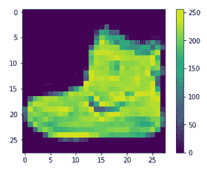
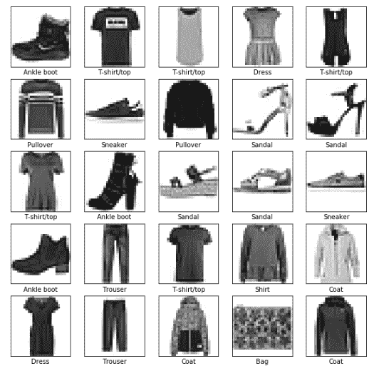
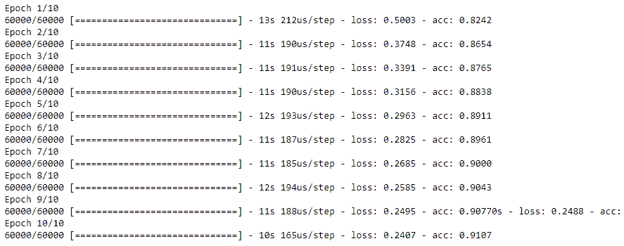
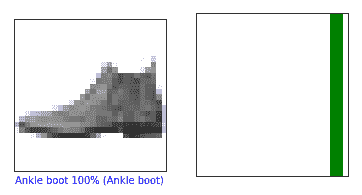
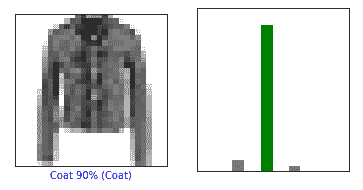
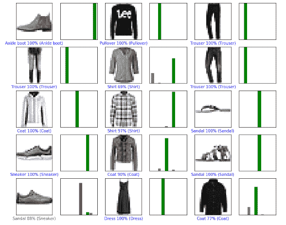
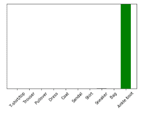
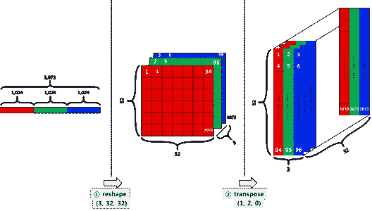

# 张量流图像分类:关于构建分类器你需要知道的一切

> 原文：<https://www.edureka.co/blog/tensorflow-image-classification>

图像分类是一项甚至婴儿都可以在几秒钟内完成的任务，但对于机器来说，这一直是一项艰巨的任务，直到最近在[人工智能](https://www.edureka.co/blog/artificial-intelligence-tutorial/)和[深度学习](https://www.edureka.co/blog/what-is-deep-learning)方面的进展。无人驾驶汽车可以实时检测物体并采取所需的行动，这一切之所以成为可能，是因为 **[TensorFlow](https://edureka.co/ai-deep-learning-with-tensorflow)** 图像分类。在本文中，我将引导您了解以下主题:

*   [什么是张量流？](#what-is-tf)
*   [什么是图像分类？](#what-is-image-classification)
*   [TensorFlow 图像分类:时尚 MNIST](#fashion-mnist)
*   美国有线电视新闻网

## What is TensorFlow?

[TensorFlow](https://www.edureka.co/blog/tensorflow-tutorial/) 是谷歌的开源机器学习框架，用于跨一系列任务的数据流编程。图中的节点表示数学运算，而图边表示它们之间通信的多维数据数组。

 张量只是多维数组，是二维表向更高维数据的扩展。Tensorflow 有许多功能，这使它适合深度学习，它的核心开源库可以帮助您开发和训练 ML 模型。

## 什么是图像分类？

图像分类的目的是将数字图像中的所有像素归类到几个**土地覆盖** **类别**或**主题**中的一个。然后，这种分类数据可用于制作图像中出现的土地覆盖的主题图。


现在，根据分类期间分析师和计算机之间的交互，有两种类型的分类:

*   监督&
*   无人监督的

因此，不浪费任何时间，让我们进入张量流图像分类。我有两个例子:简单和困难。让我们从简单的开始。

## TensorFlow 图像分类:时尚 MNIST


**时尚 MNIST 数据集**

这里我们将使用时尚 MNIST 数据集，它包含 10 个类别的 70，000 幅灰度图像。我们将把 60000 英镑用于培训，其余 10000 英镑用于测试。您可以直接从 TensorFlow 访问时尚 MNIST，只需导入和加载数据。

*   **让我们先导入库**

```
from __future__ import absolute_import, division, print_function
# TensorFlow and tf.keras

import tensorflow as tf
from tensorflow import keras

# Helper libraries

import numpy as np
import matplotlib.pyplot as plt

```

*   **让我们加载数据**

```
fashion_mnist = keras.datasets.fashion_mnist

(train_images, train_labels), (test_images, test_labels) = fashion_mnist.load_data()

```

*   **接下来，我们将图像映射到类别中**

```
class_names = ['T-shirt/top', 'Trouser', 'Pullover', 'Dress', 'Coat','Sandal', 'Shirt', 'Sneaker', 'Bag', 'Ankle boot']

```

*   **探索数据**

```
train_images.shape#Each Label is between 0-9
```

```
train_labelstest_images.shape
```

*   **现在，是时候对数据进行预处理了。**

```
plt.figure()
plt.imshow(train_images[0])
plt.colorbar()
plt.grid(False)
plt.show()#If you inspect the first image in the training set, you will see that the pixel values fall in the range of 0 to 255.
```



*   **我们必须将图像从 0-1 进行缩放，以将其输入神经网络**

```
train_images = train_images / 255.0

test_images = test_images / 255.0
```

*   让我们展示一些图片。

```
plt.figure(figsize=(10,10))
for i in range(25):
    plt.subplot(5,5,i+1)
    plt.xticks([])
    plt.yticks([])
    plt.grid(False)
    plt.imshow(train_images[i], cmap=plt.cm.binary)
    plt.xlabel(class_names[train_labels[i]])
plt.show()
```



*   **设置图层**

```
model = keras.Sequential([
    keras.layers.Flatten(input_shape=(28, 28)),
    keras.layers.Dense(128, activation=tf.nn.relu),
    keras.layers.Dense(10, activation=tf.nn.softmax)
])
```

*   **编译模型**

```
model.compile(optimizer='adam',
              loss='sparse_categorical_crossentropy',
              metrics=['accuracy'])
```

*   **模特培训**

```
model.fit(train_images, train_labels, epochs=10)
```



*   **评估准确度**

```
test_loss,  test_acc  =  model.evaluate(test_images,  test_labels)  print('Test accuracy:',  test_acc)
```


*   **做出预测**

```
predictions = model.predict(test_images) 
```

```
predictions[0]
```


预测是由 10 个数字组成的数组。这些描述了模型的“置信度”,即图像对应于 10 件不同衣服中的每一件。我们可以看到哪个标签的置信度值最高。

```
np.argmax(predictions[0]) #Model is most confident that it's an ankle boot. Let's see if it's correct
```

**输出:9 个**

```
test_labels[0]
```

**输出:9 个**

*   **现在，是时候看看全套 10 个频道了**

```
def plot_image(i, predictions_array, true_label, img):
  predictions_array, true_label, img = predictions_array[i], true_label[i], img[i]
  plt.grid(False)
  plt.xticks([])
  plt.yticks([])

  plt.imshow(img, cmap=plt.cm.binary)

  predicted_label = np.argmax(predictions_array)
  if predicted_label == true_label:
    color = 'green'
  else:
    color = 'red'

  plt.xlabel("{}  {:2.0f}% ({})".format(class_names[predicted_label],
                                100*np.max(predictions_array),
                                class_names[true_label]),
                                color=color)

def plot_value_array(i, predictions_array, true_label):
  predictions_array, true_label = predictions_array[i], true_label[i]
  plt.grid(False)
  plt.xticks([])
  plt.yticks([])
  thisplot = plt.bar(range(10), predictions_array, color="#777777")
  plt.ylim([0, 1])
  predicted_label = np.argmax(predictions_array)

  thisplot[predicted_label].set_color('red')
  thisplot[true_label].set_color('green')
```

*   **先来看第 0 张和第 10 张图片**

```
i = 0
plt.figure(figsize=(6,3))
plt.subplot(1,2,1)
plot_image(i, predictions, test_labels, test_images)
plt.subplot(1,2,2)
plot_value_array(i, predictions,  test_labels)
plt.show()
```



```
i = 10
plt.figure(figsize=(6,3))
plt.subplot(1,2,1)
plot_image(i, predictions, test_labels, test_images)
plt.subplot(1,2,2)
plot_value_array(i, predictions,  test_labels)
plt.show()
```



*   现在，让我们绘制几幅图像和它们的预测。正确的是绿色的，不正确的是红色的。

```
num_rows = 5
num_cols = 3
num_images = num_rows*num_cols
plt.figure(figsize=(2*2*num_cols, 2*num_rows))
for i in range(num_images):
  plt.subplot(num_rows, 2*num_cols, 2*i+1)
  plot_image(i, predictions, test_labels, test_images)
  plt.subplot(num_rows, 2*num_cols, 2*i+2)
  plot_value_array(i, predictions, test_labels)
plt.show()
```



*   最后，我们将使用训练好的模型对单个图像进行预测。

```
# Grab an image from the test dataset
img = test_images[0]

print(img.shape) 
```

```
# Add the image to a batch where it's the only member.
img = (np.expand_dims(img,0))

print(img.shape)
```

```
predictions_single  =  model.predict(img)  print(predictions_single)
```


```
plot_value_array(0, predictions_single, test_labels)
plt.xticks(range(10), class_names, rotation=45)
plt.show()
```



*   **正如你所看到的，我们唯一的批量图像的预测。**

```
prediction_result = np.argmax(predictions_single[0])
```

**输出:9 个**

## 美国有线电视新闻网


CIFAR-10 数据集由飞机、狗、猫和其他对象组成。您将对图像进行预处理，然后对所有样本训练一个卷积神经网络。图像需要被标准化，标签需要被一次性编码。这个用例一定会消除你对 TensorFlow 图像分类的疑虑。

*   **下载数据**

```
from urllib.request import urlretrieve
from os.path import isfile, isdir
from tqdm import tqdm 
import tarfile

cifar10_dataset_folder_path = 'cifar-10-batches-py'

class DownloadProgress(tqdm):
    last_block = 0

    def hook(self, block_num=1, block_size=1, total_size=None):
        self.total = total_size
        self.update((block_num - self.last_block) * block_size)
        self.last_block = block_num

""" 
 check if the data (zip) file is already downloaded
 if not, download it from "https://www.cs.toronto.edu/~kriz/cifar-10-python.tar.gz" and save as cifar-10-python.tar.gz
"""
if not isfile('cifar-10-python.tar.gz'):
    with DownloadProgress(unit='B', unit_scale=True, miniters=1, desc='CIFAR-10 Dataset') as pbar:
        urlretrieve(
            'https://www.cs.toronto.edu/~kriz/cifar-10-python.tar.gz',
            'cifar-10-python.tar.gz',
            pbar.hook)

if not isdir(cifar10_dataset_folder_path):
    with tarfile.open('cifar-10-python.tar.gz') as tar:
        tar.extractall()
        tar.close()
```

*   **导入必要的库**

```
import pickle
import numpy as np
import matplotlib.pyplot as plt
```

*   **了解数据**

原始的一批数据是用 numpy 数组表示的 10000×3072 个张量，其中 10000 是样本数据的个数。图像是彩色的，大小为 32×32。可以以(宽度 x 高度 x 数量 _ 通道)或(数量 _ 通道 x 宽度 x 高度)的格式进行馈送。让我们定义标签。

```
def load_label_names():
    return ['airplane', 'automobile', 'bird', 'cat', 'deer', 'dog', 'frog', 'horse', 'ship', 'truck']
```

*   **重塑数据**

我们将分两个阶段重塑数据

首先，将行向量(3072)分成 3 块。每一块对应一个通道。这导致了张量的(3×1024)维。然后将上一步得到的张量除以 32。这里的 32 表示图像的宽度。这产生了(3x32x32)。

其次，我们必须将数据从(数量通道，宽度，高度)转置到(宽度，高度，数量通道)。为此，我们将使用转置函数。



```
def load_cfar10_batch(cifar10_dataset_folder_path, batch_id):
    with open(cifar10_dataset_folder_path + '/data_batch_' + str(batch_id), mode='rb') as file:
        # note the encoding type is 'latin1'
        batch = pickle.load(file, encoding='latin1')

    features = batch['data'].reshape((len(batch['data']), 3, 32, 32)).transpose(0, 2, 3, 1)
    labels = batch['labels']

    return features, label
```

*   **探索数据**

```
def display_stats(cifar10_dataset_folder_path, batch_id, sample_id):
    features, labels = load_cfar10_batch(cifar10_dataset_folder_path, batch_id)

    if not (0 <= sample_id < len(features)):
        print('{} samples in batch {}. {} is out of range.'.format(len(features), batch_id, sample_id))
        return None

    print('  Stats of batch #{}:'.format(batch_id))
    print('# of Samples: {}  '.format(len(features)))

    label_names = load_label_names()
    label_counts = dict(zip(*np.unique(labels, return_counts=True)))
    for key, value in label_counts.items():
        print('Label Counts of [{}]({}) : {}'.format(key, label_names[key].upper(), value))

    sample_image = features[sample_id]
    sample_label = labels[sample_id]

    print('  Example of Image {}:'.format(sample_id))
    print('Image - Min Value: {} Max Value: {}'.format(sample_image.min(), sample_image.max()))
    print('Image - Shape: {}'.format(sample_image.shape))
    print('Label - Label Id: {} Name: {}'.format(sample_label, label_names[sample_label]))

    plt.imshow(sample_image)
```

```
%matplotlib inline
%config InlineBackend.figure_format = 'retina'

import numpy as np

# Explore the dataset
batch_id = 3
sample_id = 7000
display_stats(cifar10_dataset_folder_path, batch_id, sample_id)
```


*   **实现预处理功能**

我们将通过最小-最大归一化来归一化数据。这只是使所有 x 值的范围在 0 和 1 之间。y = (x-min) / (max-min)

```
def normalize(x):
    """
 argument
 - x: input image data in numpy array [32, 32, 3]
 return
 - normalized x 
 """
    min_val = np.min(x)
    max_val = np.max(x)
    x = (x-min_val) / (max_val-min_val)
    return x
```

*   **一键编码**

```
def one_hot_encode(x):
    """
 argument
 - x: a list of labels
 return
 - one hot encoding matrix (number of labels, number of class)
 """
    encoded = np.zeros((len(x), 10))

    for idx, val in enumerate(x):
        encoded[idx][val] = 1

    return encoded
```

*   **预处理并保存数据**

```
def _preprocess_and_save(normalize, one_hot_encode, features, labels, filename):
    features = normalize(features)
    labels = one_hot_encode(labels)

    pickle.dump((features, labels), open(filename, 'wb'))

def preprocess_and_save_data(cifar10_dataset_folder_path, normalize, one_hot_encode):
    n_batches = 5
    valid_features = []
    valid_labels = []

    for batch_i in range(1, n_batches + 1):
        features, labels = load_cfar10_batch(cifar10_dataset_folder_path, batch_i)

        # find index to be the point as validation data in the whole dataset of the batch (10%)
        index_of_validation = int(len(features) * 0.1)

        # preprocess the 90% of the whole dataset of the batch
        # - normalize the features
        # - one_hot_encode the lables
        # - save in a new file named, "preprocess_batch_" + batch_number
        # - each file for each batch
        _preprocess_and_save(normalize, one_hot_encode,
                             features[:-index_of_validation], labels[:-index_of_validation], 
                             'preprocess_batch_' + str(batch_i) + '.p')

        # unlike the training dataset, validation dataset will be added through all batch dataset
        # - take 10% of the whold dataset of the batch
        # - add them into a list of
        #   - valid_features
        #   - valid_labels
        valid_features.extend(features[-index_of_validation:])
        valid_labels.extend(labels[-index_of_validation:])

    # preprocess the all stacked validation dataset
    _preprocess_and_save(normalize, one_hot_encode,
                         np.array(valid_features), np.array(valid_labels),
                         'preprocess_validation.p')

    # load the test dataset
    with open(cifar10_dataset_folder_path + '/test_batch', mode='rb') as file:
        batch = pickle.load(file, encoding='latin1')

    # preprocess the testing data
    test_features = batch['data'].reshape((len(batch['data']), 3, 32, 32)).transpose(0, 2, 3, 1)
    test_labels = batch['labels']

    # Preprocess and Save all testing data
    _preprocess_and_save(normalize, one_hot_encode,
                         np.array(test_features), np.array(test_labels),
                         'preprocess_training.p')
```

```
preprocess_and_save_data(cifar10_dataset_folder_path, normalize, one_hot_encode)
```

*   **检查点**

```
import pickle

valid_features, valid_labels = pickle.load(open('preprocess_validation.p', mode='rb'))
```

*   **构建网络**

整个模型总共由 14 层组成。


```
import tensorflow as tf

def conv_net(x, keep_prob):
    conv1_filter = tf.Variable(tf.truncated_normal(shape=[3, 3, 3, 64], mean=0, stddev=0.08))
    conv2_filter = tf.Variable(tf.truncated_normal(shape=[3, 3, 64, 128], mean=0, stddev=0.08))
    conv3_filter = tf.Variable(tf.truncated_normal(shape=[5, 5, 128, 256], mean=0, stddev=0.08))
    conv4_filter = tf.Variable(tf.truncated_normal(shape=[5, 5, 256, 512], mean=0, stddev=0.08))

    # 1, 2
    conv1 = tf.nn.conv2d(x, conv1_filter, strides=[1,1,1,1], padding='SAME')
    conv1 = tf.nn.relu(conv1)
    conv1_pool = tf.nn.max_pool(conv1, ksize=[1,2,2,1], strides=[1,2,2,1], padding='SAME')
    conv1_bn = tf.layers.batch_normalization(conv1_pool)

    # 3, 4
    conv2 = tf.nn.conv2d(conv1_bn, conv2_filter, strides=[1,1,1,1], padding='SAME')
    conv2 = tf.nn.relu(conv2)
    conv2_pool = tf.nn.max_pool(conv2, ksize=[1,2,2,1], strides=[1,2,2,1], padding='SAME')    
    conv2_bn = tf.layers.batch_normalization(conv2_pool)

    # 5, 6
    conv3 = tf.nn.conv2d(conv2_bn, conv3_filter, strides=[1,1,1,1], padding='SAME')
    conv3 = tf.nn.relu(conv3)
    conv3_pool = tf.nn.max_pool(conv3, ksize=[1,2,2,1], strides=[1,2,2,1], padding='SAME')  
    conv3_bn = tf.layers.batch_normalization(conv3_pool)

    # 7, 8
    conv4 = tf.nn.conv2d(conv3_bn, conv4_filter, strides=[1,1,1,1], padding='SAME')
    conv4 = tf.nn.relu(conv4)
    conv4_pool = tf.nn.max_pool(conv4, ksize=[1,2,2,1], strides=[1,2,2,1], padding='SAME')
    conv4_bn = tf.layers.batch_normalization(conv4_pool)

    # 9
    flat = tf.contrib.layers.flatten(conv4_bn)  

    # 10
    full1 = tf.contrib.layers.fully_connected(inputs=flat, num_outputs=128, activation_fn=tf.nn.relu)
    full1 = tf.nn.dropout(full1, keep_prob)
    full1 = tf.layers.batch_normalization(full1)

    # 11
    full2 = tf.contrib.layers.fully_connected(inputs=full1, num_outputs=256, activation_fn=tf.nn.relu)
    full2 = tf.nn.dropout(full2, keep_prob)
    full2 = tf.layers.batch_normalization(full2)

    # 12
    full3 = tf.contrib.layers.fully_connected(inputs=full2, num_outputs=512, activation_fn=tf.nn.relu)
    full3 = tf.nn.dropout(full3, keep_prob)
    full3 = tf.layers.batch_normalization(full3)    

    # 13
    full4 = tf.contrib.layers.fully_connected(inputs=full3, num_outputs=1024, activation_fn=tf.nn.relu)
    full4 = tf.nn.dropout(full4, keep_prob)
    full4 = tf.layers.batch_normalization(full4)        

    # 14
    out = tf.contrib.layers.fully_connected(inputs=full3, num_outputs=10, activation_fn=None)
    return out
```

*   **超参数**

```
epochs = 10
batch_size = 128
keep_probability = 0.7
learning_rate = 0.001
```

```
logits = conv_net(x, keep_prob)
model = tf.identity(logits, name='logits') # Name logits Tensor, so that can be loaded from disk after training

# Loss and Optimizer
cost = tf.reduce_mean(tf.nn.softmax_cross_entropy_with_logits(logits=logits, labels=y))
optimizer = tf.train.AdamOptimizer(learning_rate=learning_rate).minimize(cost)

# Accuracy
correct_pred = tf.equal(tf.argmax(logits, 1), tf.argmax(y, 1))
accuracy = tf.reduce_mean(tf.cast(correct_pred, tf.float32), name='accuracy')
```

*   **训练神经网络**

```
#Single Optimizationdef train_neural_network(session, optimizer, keep_probability, feature_batch, label_batch):
    session.run(optimizer, 
                feed_dict={
                    x: feature_batch,
                    y: label_batch,
                    keep_prob: keep_probability
                })
```

```
#Showing Stats
def print_stats(session, feature_batch, label_batch, cost, accuracy):
    loss = sess.run(cost, 
                    feed_dict={
                        x: feature_batch,
                        y: label_batch,
                        keep_prob: 1.
                    })
    valid_acc = sess.run(accuracy, 
                         feed_dict={
                             x: valid_features,
                             y: valid_labels,
                             keep_prob: 1.
                         })

    print('Loss: {:>10.4f} Validation Accuracy: {:.6f}'.format(loss, valid_acc))
```

*   **充分训练并保存模型**

```
def batch_features_labels(features, labels, batch_size):
    """
 Split features and labels into batches
 """
    for start in range(0, len(features), batch_size):
        end = min(start + batch_size, len(features))
        yield features[start:end], labels[start:end]

def load_preprocess_training_batch(batch_id, batch_size):
    """
 Load the Preprocessed Training data and return them in batches of <batch_size> or less
 """
    filename = 'preprocess_batch_' + str(batch_id) + '.p'
    features, labels = pickle.load(open(filename, mode='rb'))

    # Return the training data in batches of size <batch_size> or less
    return batch_features_labels(features, labels, batch_size)
```

```
#Saving Model and Pathsave_model_path = './image_classification'

print('Training...')
with tf.Session() as sess:
    # Initializing the variables
    sess.run(tf.global_variables_initializer())

    # Training cycle
    for epoch in range(epochs):
        # Loop over all batches
        n_batches = 5
        for batch_i in range(1, n_batches + 1):
            for batch_features, batch_labels in load_preprocess_training_batch(batch_i, batch_size):
                train_neural_network(sess, optimizer, keep_probability, batch_features, batch_labels)

            print('Epoch {:>2}, CIFAR-10 Batch {}:  '.format(epoch + 1, batch_i), end='')
            print_stats(sess, batch_features, batch_labels, cost, accuracy)

    # Save Model
    saver = tf.train.Saver()
    save_path = saver.save(sess, save_model_path)
```


现在，张量流图像分类的重要部分已经完成。现在，是测试模型的时候了。

*   **测试模型**

```
import pickle
import numpy as np
import matplotlib.pyplot as plt
from sklearn.preprocessing import LabelBinarizer

def batch_features_labels(features, labels, batch_size):
    """
 Split features and labels into batches
 """
    for start in range(0, len(features), batch_size):
        end = min(start + batch_size, len(features))
        yield features[start:end], labels[start:end]

def display_image_predictions(features, labels, predictions, top_n_predictions):
    n_classes = 10
    label_names = load_label_names()
    label_binarizer = LabelBinarizer()
    label_binarizer.fit(range(n_classes))
    label_ids = label_binarizer.inverse_transform(np.array(labels))

    fig, axies = plt.subplots(nrows=top_n_predictions, ncols=2, figsize=(20, 10))
    fig.tight_layout()
    fig.suptitle('Softmax Predictions', fontsize=20, y=1.1)

    n_predictions = 3
    margin = 0.05
    ind = np.arange(n_predictions)
    width = (1. - 2. * margin) / n_predictions

    for image_i, (feature, label_id, pred_indicies, pred_values) in enumerate(zip(features, label_ids, predictions.indices, predictions.values)):
        if (image_i < top_n_predictions):
            pred_names = [label_names[pred_i] for pred_i in pred_indicies]
            correct_name = label_names[label_id]

            axies[image_i][0].imshow((feature*255).astype(np.int32, copy=False))
            axies[image_i][0].set_title(correct_name)
            axies[image_i][0].set_axis_off()

            axies[image_i][1].barh(ind + margin, pred_values[:3], width)
            axies[image_i][1].set_yticks(ind + margin)
            axies[image_i][1].set_yticklabels(pred_names[::-1])
            axies[image_i][1].set_xticks([0, 0.5, 1.0])
```

```
%matplotlib inline
%config InlineBackend.figure_format = 'retina'

import tensorflow as tf
import pickle
import random

save_model_path = './image_classification'
batch_size = 64
n_samples = 10
top_n_predictions = 5

def test_model():
    test_features, test_labels = pickle.load(open('preprocess_training.p', mode='rb'))
    loaded_graph = tf.Graph()

    with tf.Session(graph=loaded_graph) as sess:
        # Load model
        loader = tf.train.import_meta_graph(save_model_path + '.meta')
        loader.restore(sess, save_model_path)

        # Get Tensors from loaded model
        loaded_x = loaded_graph.get_tensor_by_name('input_x:0')
        loaded_y = loaded_graph.get_tensor_by_name('output_y:0')
        loaded_keep_prob = loaded_graph.get_tensor_by_name('keep_prob:0')
        loaded_logits = loaded_graph.get_tensor_by_name('logits:0')
        loaded_acc = loaded_graph.get_tensor_by_name('accuracy:0')

        # Get accuracy in batches for memory limitations
        test_batch_acc_total = 0
        test_batch_count = 0

        for train_feature_batch, train_label_batch in batch_features_labels(test_features, test_labels, batch_size):
            test_batch_acc_total += sess.run(
                loaded_acc,
                feed_dict={loaded_x: train_feature_batch, loaded_y: train_label_batch, loaded_keep_prob: 1.0})
            test_batch_count += 1

        print('Testing Accuracy: {}  '.format(test_batch_acc_total/test_batch_count))

        # Print Random Samples
        random_test_features, random_test_labels = tuple(zip(*random.sample(list(zip(test_features, test_labels)), n_samples)))
        random_test_predictions = sess.run(
            tf.nn.top_k(tf.nn.softmax(loaded_logits), top_n_predictions),
            feed_dict={loaded_x: random_test_features, loaded_y: random_test_labels, loaded_keep_prob: 1.0})
        display_image_predictions(random_test_features, random_test_labels, random_test_predictions, top_n_predictions)

test_model()
```

**输出:** **测试精度:0.5882762738853503**


现在，如果你为更多的时期训练你的神经网络或者改变激活函数，你可能会得到一个不同的结果，它可能有更好的准确性。

*就这样，我们结束了这篇 TensorFlow 图像分类的文章。我相信你现在可以用同样的方法对任何类型的图像进行分类，而且你也不是图像分类的初学者。*

*Edureka 的 [**深度学习在 TensorFlow**](https://www.edureka.co/ai-deep-learning-with-tensorflow) 带 Python 认证培训，由行业专业人士根据行业需求&策划。您将掌握 SoftMax 函数、自动编码器神经网络、受限玻尔兹曼机(RBM)、Keras & TFLearn 等概念。该课程由行业专家通过实时案例研究特别策划。*

与瓦朗加尔国家技术学院的 E & ICT 学院合作，提供人工智能和机器学习方面的研究生课程，保持技术领先。这门[人工智能课程](https://www.edureka.co/executive-programs/machine-learning-and-ai)旨在提供最好的结果。