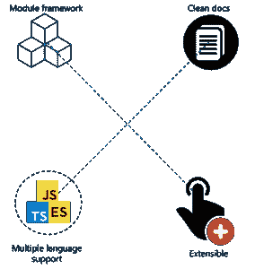
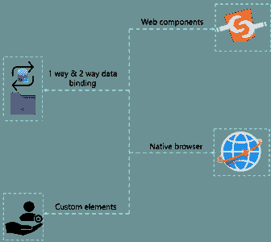
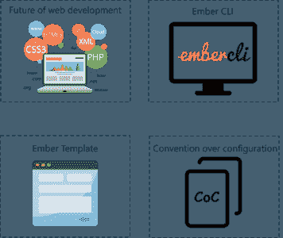
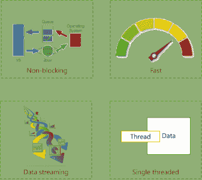

# 十大最流行的 JavaScript 框架

> 原文：<https://www.edureka.co/blog/top-10-javascript-frameworks/>

这些年来，已经发布了许多 JavaScript 框架，从中选择一个可能是一个挑战。如果你很困惑，不知道选择哪一个 或者哪一个适合你，我会帮你搞定。在这篇博客中，我将列出十大 JavaScript 框架，你应该使用它们来构建 web 应用。

以下是我将在这篇博客中讨论的框架列表:

1.  [安圭拉](#ang)
2.  [ReactJS](#re)
3.  [vue js](#vu)
4.  [jQuery](#jq)
5.  骨骸 T3
6.  [【nodejs】](#nod)
7.  人类
8.  流星 T3
9.  [聚合物](#nine)
10.  [奥雷利亚](#ten)

## **10。JavaScript 框架:奥雷利亚**

Aurelia 是一个包含所有开源现代 JavaScript 模块的工具箱，有助于 web 和移动应用程序的发展。它也被称为“下一代框架”。这个框架自推出以来已经获得了很多认可。Fileee、Freska、Ordami 和 BTEK Software 等公司以及 800 多个网站都在使用 Aurelia。

不要忘记，Aurelia 是唯一一个允许开发人员用普通的类型脚本或 JavaScript 构建组件的框架。

*JavaScript 框架——Aurelia 特性*

下面我列出了 Aurelia 的几个主要特征:

*   **多语言支持**:Aurelia 的 API 经过精心设计，可以从当今和未来最有用的 web 编程语言中自然使用。Aurelia 支持 ES5、ES2015、ES2016 和 Typescript，这非常有帮助，给你很高的灵活性
*   **模块框架**:Aurelia 不是采用整体框架的方法，而是由更小的、专注的模块组成。将它们作为一个全功能的框架一起使用，或者选择构建一个定制的解决方案。
*   **干净的文档** : Aurelia 附带了一个描述性很强且非常有用的文档集，可以帮助所有开发人员。它以拥有维护良好的文档而闻名。
*   **可扩展 HTML**:Aurelia 的可扩展 HTML 编译器可以让您创建自定义 HTML 元素，向现有元素添加自定义属性并控制模板生成，所有这些都完全支持动态加载、数据绑定和高性能批量渲染。

## **9。JavaScript 框架:聚合物**

Polymer 是一个由 Google 维护的开源 JavaScript 库，用于使用 web 组件构建 web 应用程序。目前，有超过 3000 个网站在使用 polymer，比如 virustotal.com、rogers.com、zeplin.io 等等。

与其他 JavaScript 框架不同，Polymer 的构建是为了利用 web 中存在的特性，让开发人员构建组件。它是第一个通过使用 web 组件来允许交互式建筑应用的图书馆。

*JavaScript 框架 Polymer JS 特性*

下面我列出了聚合物的一些关键特性:

*   **Web 组件** : 聚合物是建立在思想之上的 Web 组件。Web 组件是一组 w3c 标准，由几种不同的 web 技术组成，包括定制元素。这些组件是浏览器的一部分，所以你不需要任何第三方工具和库，比如 jQuery。
*   **单向和双向数据绑定** : 提供单向和双向数据绑定。Polymer 旨在支持单向和双向的数据流动。
*   **原生浏览器** : Polymer 利用原生浏览器技术，而不是依赖定制的 JavaScript 库。聚合物 DOM 层最接近原生 JavaScript 层。
*   **自定义元素** : 它允许使用 HTML、CSS 和 JavaScript 轻松创建我们自己的自定义元素，为元素添加交互。Polymer.js 提供了创建定制 HTML 元素的最简单方法，因为它的库是建立在 web 标准 API 之上的。

想成为一名认证网页开发者？ [<button>现在报名</button>](https://www.edureka.co/masters-program/full-stack-developer-training)

## **8。JavaScript 框架:流星**

Meteor 是一个使用 NodeJS 编写的免费开源 JavaScript 框架。它允许快速原型化并产生跨平台的代码。它在市场上越来越受欢迎，有超过 13，000 个网站使用 Meteor。像 mtv.com，meteofrance.com 等网站利用流星来建立他们的用户界面。

****

*JavaScript 框架–流星 JS 特性*

下面我列出了流星的几个主要特征:

*   **全栈** : Meteor 为 web 应用的开发和部署提供了全栈解决方案。Meteor 附带了几个内置特性，如反应式模板、自动 CSS 等。
*   **智能包** : 为您的应用程序构建一个登录系统可能会很麻烦。但不是用流星。Meteor 包使得添加用户账号、React 等 JavaScript 库等特性变得很容易。最棒的是，添加这些智能包很容易，只需在终端上敲几下键盘，就可以了。
*   **实时网络应用** : Meteor 是那些寻求构建实时应用的人的完美解决方案。从数据库到模板的所有应用程序层都会自动更新。这意味着不需要刷新页面来查看更新。对文档的任何更改都会立即保存。这使得 Meteor 成为实时协作的完美用例。
*   **单一语言开发** : Meteor 允许在前端和后端使用相同的代码，适用于移动和 web 应用。它防止开发人员要求安装和配置不同的库、模块管理器、API、驱动程序等等。这节省了开发人员的大量生产时间，因为他们不需要在服务器语言和 JavaScript 之间执行上下文切换。

## **7。JavaScript 框架:Ember**

Ember 是一个开源的 JavaScript web 框架，它允许开发者通过将最佳实践整合到框架中来构建可扩展的单网页应用程序。Ember 被评为最佳客户端 JavaScript 框架，将其主要竞争对手 React 和 AngularJS 甩在身后。目前，超过 6000 个网站正在使用 ember。仅举几个例子，nasa.gov、tutorialspoint.com 等。

*JavaScript 框架–Ember JS 特性*

下面我列出了 Ember 的几个关键特性:

*   **web 开发的未来** : 在 Babel JavaScript transpiler 的帮助下，Ember 允许开发人员使用未来的 JavaScript 标准，并将其转换为在今天的浏览器中使用。不知道巴别塔是什么？Babel 是一个 JavaScript transpiler，它让开发人员现在可以在他们的代码中使用下一代 JavaScript。此外，Babel 受益于众多插件，并与 Ember、Rails、Sails 和 Meteor 等框架兼容。
*   **余烬 cli** : 余烬和余烬-CLI 是完全不同的两个东西，但离开了对方哪一个都不会是完全完整的。Ember-CLI 是一个命令行工具，它与 Ember 框架的软件堆栈一起提供。Ember-CLI 是一艘生产力火箭船，支持 CoffeeScript、Handlebars、LESS 和 Sass 等工具。
*   **Ember 模板**:Ember 的 UI 内置的是 Ember 的模板，是用车把模板语言编写的。Handlebars 因使用双花括号而得名，它允许开发人员使用更少的代码。模板使得 Ember 中的许多功能成为可能，比如组件、出口和表达式。
*   会议的唯一目的是速度和“把事情做完”的哲学，这对那些总是努力超越竞争对手的创业公司来说是一个巨大的推动。Ember 对于如何构建它有明确的最佳实践。这意味着开发人员可以更多地关注他们应用的功能和独特的特性，而不是用繁琐的代码重新发明轮子。建筑越来越多，蓝图越来越少。

## **6。JavaScript 框架:NodeJS**

Node.js 是一个开源的服务器端平台，建立在 Google Chrome 的 JavaScript 引擎之上。使用 NodeJS 的网站数量已经超过 84，000 个。它是下载量最大的跨平台运行时环境之一，用于执行 JavaScript 代码。

*JavaScript 框架–Node JS 特性*

下面我列出了 Node.js 的一些关键特性:

*   **非阻塞**:node . js 库的所有 API 都是异步的，也就是非阻塞的。这实际上意味着基于 Node.js 的服务器永远不会等待 API 返回数据。在调用下一个 API 之后，服务器移动到下一个 API，事件的通知机制帮助服务器从上一个 API 调用中获得响应。
*   **单线程** : Node.js 利用事件循环的单线程模型。事件机制有助于服务器以非阻塞方式做出响应，从而使服务器具有高度的可伸缩性，这与创建有限线程来处理请求的传统服务器不同。与 Apache HTTP Server 等传统服务器相比，Node.js 使用的单线程程序可以为大量请求提供服务。
*   **快** : NodeJS 是基于谷歌 Chrome 的 JavaScript 引擎 V8 engine 打造的。谷歌的 V8 JavaScript 引擎确保 Node.js 库以闪电般的速度执行其代码。
*   **数据流** : NodeJS 应用从不缓冲任何数据，它们只是以数据块的形式输出数据。这样 NodeJS 提供更快的服务。

## **5。JavaScript 框架:BackboneJS**

BackboneJS 是一个轻量级的 JavaScript 库，允许开发和构建在 web 浏览器中运行的客户端应用程序。与其他框架不同，Backbone 让开发人员负责选择最适合给定项目的工具。目前，超过 50 万的网站正在使用主干网，这包括 tumblr.com，espn.com，soundcloud.com 和更多。

*JavaScript 框架——主干 JS 特性*

下面我列出了主干网的几个关键特征:

*   **分离的业务和 UI 逻辑**:Backbone 能帮你做的最重要的一件事，就是保持业务逻辑和用户界面的分离。当两者纠缠在一起时，改变是很难的。但是当逻辑不依赖于 UI 时，你的界面就变得更容易使用。
*   **事件驱动的通信**:当项目增长时，jQuery 声明和回调变得更加复杂。代码变得更加混乱。Backbone.js 通过在视图和模型之间提供事件驱动的通信克服了这个问题。
*   更少的代码:约定是引入一种通用编码风格的好方法，而不需要提出一套广泛的编码标准。你越坚持主干约定，你需要编码的就越少，反过来，代码变得更加标准化和可读。
*   **与后端**同步:由于对 RESTful APIs 的出色支持，BackboneJS 中的模型可以很容易地绑定到后端。如果 API 设计正确，那么 backbone 已经配置为直接访问这些 API 进行读、写和删除操作。

## **4。JavaScript 框架:jQuery**

最古老的 JS 框架之一是 Jquery。这个框架已经存在超过 12 年了，并且仍然很强大。那么，jQuery 是什么呢？

jQuery 是一个快速而简洁的 JavaScript 库，由 John Resig 在 2006 年创建，有一个很好的座右铭:“少写，多做”。它是一个跨平台的 JavaScript 库，旨在简化 HTML 的客户端脚本。目前，超过 1900 万的网站正在使用 jQuery！像 WordPress、脸书、谷歌、IBM 和许多其他公司都依赖 jQuery 来提供独一无二的网络浏览体验。

*JavaScript 框架–jQuery 特性*

下面我列出了 jQuery 的一些关键特性:

*   **DOM 操纵**:它使得操纵 DOM 变得极其容易，使开发人员能够做令人惊奇的事情，并通过简单易学的 API 充分发挥他们的创造力，该 API 构建在 JavaScript 之上。
*   **大型社区**:其贡献者的社区比其他任何 JavaScript 库都更加多样化，规模也更大。它有广泛和全面的文件。不要忘记，它一直保持着，并且变得越来越好，越来越强。
*   **AJAX 支持**:简而言之，AJAX(异步 JavaScript 和 XML)就是在后台加载数据并显示在网页上，不需要重新加载整个页面。jQuery 为 AJAX 功能提供了几种方法。使用 jQuery AJAX 方法，您可以使用 HTTP Get 和 HTTP Post 从远程服务器请求文本、HTML、XML 或 JSON。
*   **跨浏览器支持**:jQuery 有跨浏览器支持，在 IE 6.0+，FF 2.0+，Safari 3.0+，Chrome，Opera 9.0+等都很好用。

## **3。JavaScript 框架:Vue**

Vue 是一个用于构建创造性 UI 的开源 JavaScript 框架。Vue 简化了与使用其他 JavaScript 库的项目的集成，因为它被设计成具有适应性。目前，超过 36，000 个网站正在使用 Vue。像 stackoverflow，playstation 等公司。他们的网站 UI 都依赖 Vue。

*JavaScript 框架–Vue JS 特性*

下面我列出了虚拟企业的几个关键特征:

*   **模板** : Vue.js 提供了基于 HTML 的模板，将 DOM 与 Vue.js 实例数据绑定在一起。Vue.js 将模板编译成虚拟 DOM 渲染函数。web 开发人员可以使用渲染函数的模板，并且可以用渲染函数替换模板。
*   **体积小**:JavaScript框架的成功取决于它的体积。尺寸越小，用的就越多。Vue.js 最大的优势之一就是体积小。这个框架的大小是 18-21KB。
*   **适应性强** : Vue 允许用户使用虚拟节点在 HTML 文件、JavaScript 文件、纯 JavaScript 文件中编写自己的模板。这种灵活性也使 React.js、Angular.js 和任何其他新的 JavaScript 框架的开发人员易于理解。它基于 JavaScript 框架，可以集成到其他基于 JavaScript 构建的应用程序中。
*   **详细文档**:开发人员总是喜欢使用带有详细文档的框架，因为编写他们的第一个应用程序总是很容易。Vue.js 的文档非常全面，任何了解 JavaScript 和 HTML 的用户都可以开发自己的应用程序或网页。

#### 订阅我们的 youtube 频道获取新的更新..！