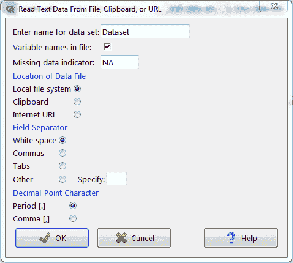
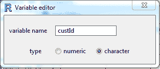

# 在 R Commander 中导入数据的教程

> 原文：<https://www.edureka.co/blog/tutorial-on-importing-data-in-r-commander/>

r 是一个统计软件包，允许数据操作，并用于统计建模和图形。它有 R Commander，这是一个图形用户界面，带有在 R 中使用的菜单。R Commander 由 McMaster 大学的 John Fox 开发，使学生更容易理解如何使用软件进行数据分析，而无需学习复杂的命令

要使用 R Commander，您的电脑上必须安装 R 软件。为了在 windows 系统中正常运行，R commander 必须作为 SDI(单文档界面)运行。

导入 R 的最简单的数据形式是一个简单的文本文件，这对于中小规模的问题来说是可以接受的。在这篇文章中，让我们讨论一下在 R commander 中导入测试数据的方法。在 R 中，可以通过两种方式输入数据:手工 ***和导入*** 。我们先来看看导入数据涉及的步骤。

## **在 R 指令器中导入数据的步骤:**

**第一步:**

单击 R 图标或程序中的 R 启动 R 程序。

**第二步:**

打开 R 指挥官程序。在提示符下，键入“Rcmdr”并按 return 键。R commander 窗口将会打开，如下所示:

**第三步:**

在 R 菜单中，点击数据–>导入数据–>从文本文件。上述步骤将导致如下所示的对话框:

*   为新数据集选择一个名称。
*   指定文本文件在*本地文件系统*中的位置，从剪贴板导入文本文件或通过网络从 URL 导入。
*   指定字符类型:逗号或句号。

## **其他方式导入数据:**

*   从 SPSS 数据集导入数据
*   从 SAS xport 文件导入数据
*   从 MiniTab 数据集中导入数据
*   从 Excel、access 或其他数据库导入数据。

r 提供了以这种可变格式导入数据的选项。一旦导入，您就可以开始基于它的分析。

## **在 Rcmdr 中手工输入数据:**

*   输入数据的一种方法是手工操作。我们需要记住，命名时，名称中不能有任何空格，并且区分大小写。
*   通过逐列输入值来手动输入数据，如下所示。
*   可以通过单击列标签来定义变量，然后在出现的对话框中输入名称和类型。这里，类型可以是数字或字符。点击右上角的 x 关闭该对话框。
*   点击对话框右上角的“X”保存输入的数据。

可以根据数据集更改列名。例如，在下面的图片中，我们将列名定制为“custId”

输入变量名后，在关闭“变量编辑器”窗口时设置列名。一旦保存，该数据集将成为“活动数据集”(活动数据集是当前正在 R commander 中处理的数据集。)

手动输入数据并不总是可能的，并且数据可能并不总是在手边可用。在数据存在于外部位置或数据量巨大的地方，这是正确的。考虑到这些数据需要分析的方面，从另一个地点导出数据的选择是切实可行和非常必要的。 