# UiPath 教程:UiPath 及其组件介绍

> 原文：<https://www.edureka.co/blog/uipath-tutorial/>

你知道到 2020 年底，大约 15%的工作岗位会增加吗？随着 RPA 采用率的增加，组织正在寻找拥有 ***[RPA 认证](https://www.edureka.co/robotic-process-automation-training)*** 的专业人员。 在之前的[博客](https://www.edureka.co/blog/what-is-robotic-process-automation/)中，您已经了解了 RPA。 现在，在本 UiPath 教程中，我将详细介绍 UiPath 工具，即项目类型、UiPath 组件、UiPath 安装等，它使您能够自动化重复任务，并将繁琐的任务转化为更简单的任务。

在这个 UiPath 教程博客中，你将经历以下主题:

1.  [什么是机器人过程自动化？](#WhatisRoboticProcessAutomation?)
2.  [什么是 UiPath？](#WhatisUiPath?)
3.  [如何安装 UiPath？](#HowtoInstallUiPath?)
4.  [ui path 中的项目类型](#TypesofProjectsinUiPath)
5.  [UiPath 组件](#UiPathComponents)
6.  [动手](#Hands-On)

**UiPath 初学者教程| Edureka**

[https://www.youtube.com/embed/kVtgA_PQ5R4?rel=0&showinfo=0](https://www.youtube.com/embed/kVtgA_PQ5R4?rel=0&showinfo=0)

在本视频中，您将了解领先的 RPA 工具——ui path。最后，我们还将使用 UiPath 进行实际操作。

## **什么是机器人过程自动化？**

**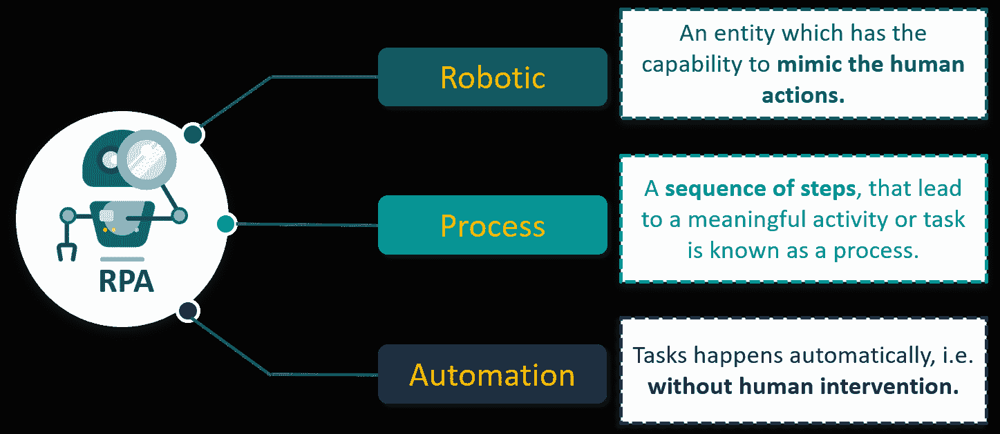**

Summarizing all these terms together:

现在，让我来谈谈自动化最流行的工具之一，即 **UiPath** 。那么，什么是 UiPath，为什么要用它呢？

## **UiPath 教程:什么是 UiPath，为什么要用 UiPath？**

*   **UiPath** 是一款[机器人流程自动化工具](https://www.edureka.co/blog/rpa-tools-list-and-comparison/)，用于 Windows 桌面自动化。
*   用于自动化重复/冗余任务，消除人为干预。【T2
*   该工具使用简单，具有**拖拽活动的功能**。
*   UiPath 有一个标准的 Studio 版本，试用期为 60 天。
*   最棒的是，UiPath 还附带了一个**社区版**，它是终身**免费的**，拥有工作室版的大部分功能。

现在你已经了解了什么是 UiPath，下面我来给你总结一下在你的系统上安装 UiPath studio 的方法。

## **UiPath 教程:如何安装 UiPath Studio？**

UiPath 是最容易安装的工具之一。在您的系统上安装 UiPath 之前，请确保您至少有 8 GB 的内存，并且安装了 Windows 7 或更高版本。具备基本要求后，选择您希望安装的版本。UiPath 提供社区云、Studio、企业云、企业服务器等多种版本。所有这些版本的功能和特性都有所不同。

所以，一旦你选择了版本，你可以参考这篇 ***[文章中提到的步骤来安装 UiPath](https://www.edureka.co/blog/uipath-installation) 。***

这是 UiPath Studio 的样子:

现在，在继续讨论 UiPath 中不同类型的项目之前，让我们讨论一下 UiPath 中的一些重要术语/概念，这将有助于您学习 UiPath。

### **如何学习 UiPath？**

要开始您的 UiPath 之旅，您必须学习**序列**和**活动。**

接下来，我们来看看 UiPath 中不同类型的项目。

## **UiPath 教程:UiPath** 中的项目和模板类型

**项目**

*   流程
*   图书馆

**模板**

*   编排流程
*   后台处理
*   机器人企业框架
*   基于触发器的有人值守自动化
*   交易过程

### **项目**

**流程**

这种类型的项目用于创建一个简单的空白项目来设计各种类型的自动化项目。参考下文。

**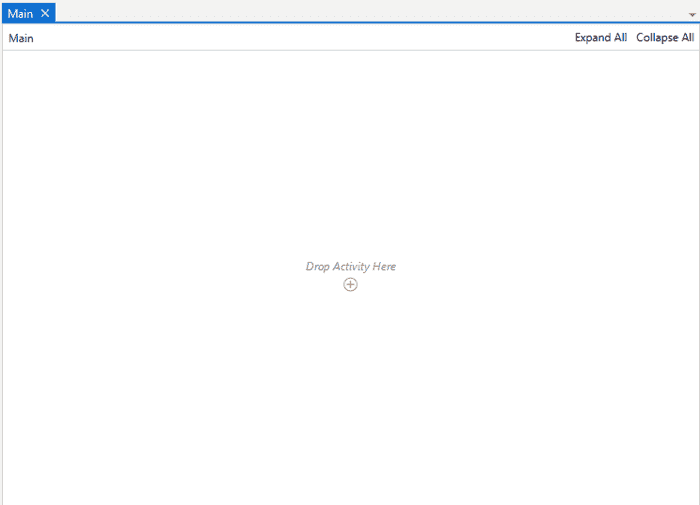**

**图书馆**

这种类型的项目用于创建可重用的组件，然后将它们作为库一起发布。创建的库可以作为自动化过程的依赖项进一步添加。参考下文。

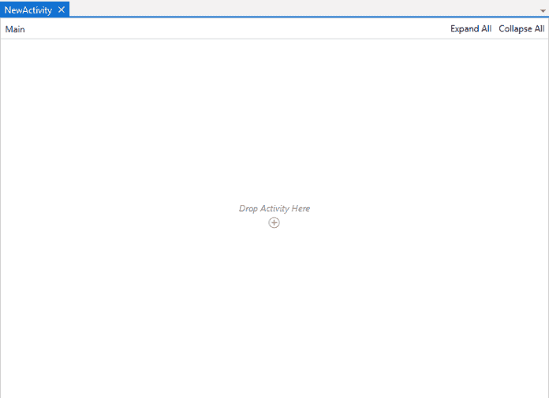

嗯，那是关于项目的。现在，让我们看看 UiPath 提供的各种模板。

### **模板**

**编排流程**

这种类型的模板用于通过服务编排和长事务来实现流程。参考下文。

**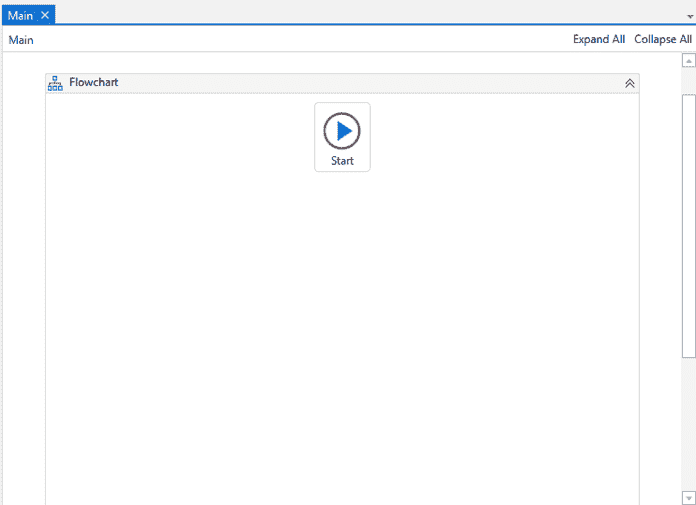**

**后台进程**

后台进程用于创建一个不需要用户交互的进程，可以作为后台进程运行。此外，多个后台进程可以在同一个机器人上同时运行。参考下文。

****

**机器人企业框架**

此类项目模板用于创建适合大规模部署的业务流程。

**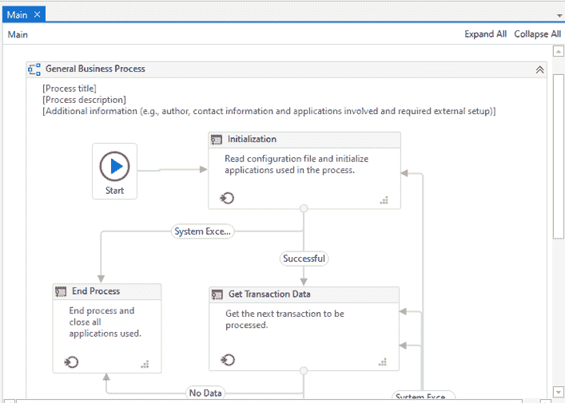**

**基于触发器的有人值守自动化**

顾名思义，这种类型的项目用于触发自动化以响应键盘或鼠标用户事件。

**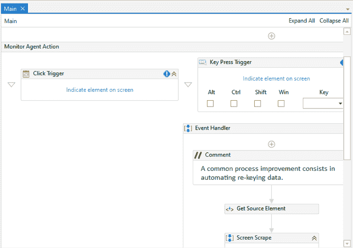**

**交易流程**

此模板用于将自动化工作流程建模为流程图。

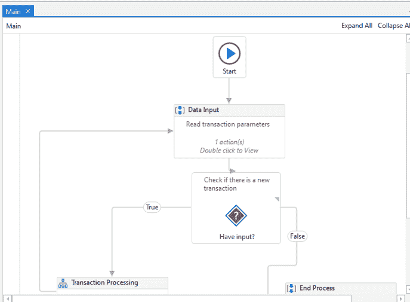 在创建自己的项目之前让我们了解一下 UiPath 平台的各个组件。

## **UiPath 教程:UiPath 组件**

UiPath 一般分为 2 个组件:

1.  UiPath 平台组件
2.  UiPath Studio 组件

### **1。UiPath 平台组件**

UiPath 平台由三个主要组件组成:

1.  [UiPath 工作室](https://www.edureka.co/blog/uipath-studio/)
2.  UiPath 机器人
3.  [UiPath 编制器](https://www.edureka.co/blog/uipath-orchestrator/)

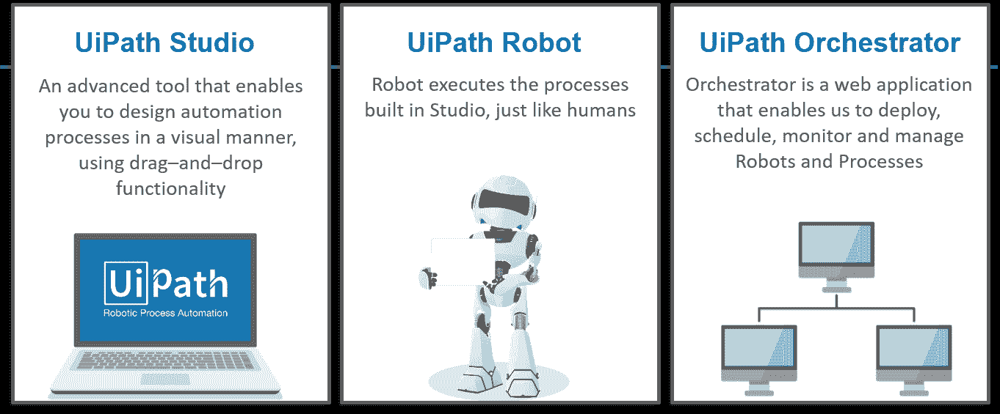

### **2。UiPath** **工作室组件**

**1。丝带:**

**色带组件:**

**记录:**这个 UiPath 的记录器允许用户记录 UI 鼠标移动和键盘活动，以生成自动化脚本。

**屏幕抓取和数据抓取:**通过屏幕抓取和数据抓取使抓取变得简单

**用户事件:**捕获用户事件。例如，鼠标点击、按键等。

**变量:**这帮助你创建和管理变量。

**2。活动窗格:**左侧是活动窗格，所有的小任务都在这里。您所要做的只是将它拖放到工作区中，并对其进行配置，以便它能够根据每个活动的需求工作。

**3。属性窗格:**可以在属性窗格中处理配置，比如设置特定活动或任务的输出。

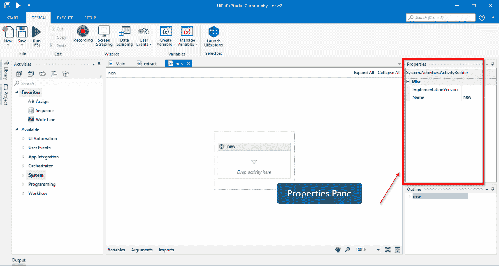

**4。控制栏/窗格:**如果你看到 UI 路径工具的底部，它有**变量**、**参数**和**导入。**这是您可以创建变量、删除变量以及处理参数的部分。

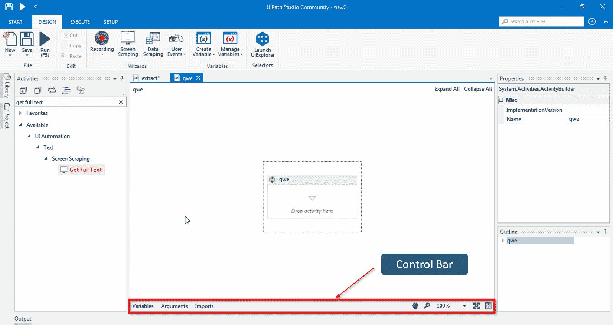

现在我们已经了解了 UiPath 的基本概念，让我们在 UiPath 中实现这些概念，并了解如何开始使用它。

## **UiPath 教程:** **动手**

让我们创建一个简单的项目，该项目将使用名称迎接您，即“**欢迎参加 Samar pit**”

**第一步:**打开你的 UiPath Studio，点击“过程项目”。

**第二步:**首先在工作区中拖拽序列。

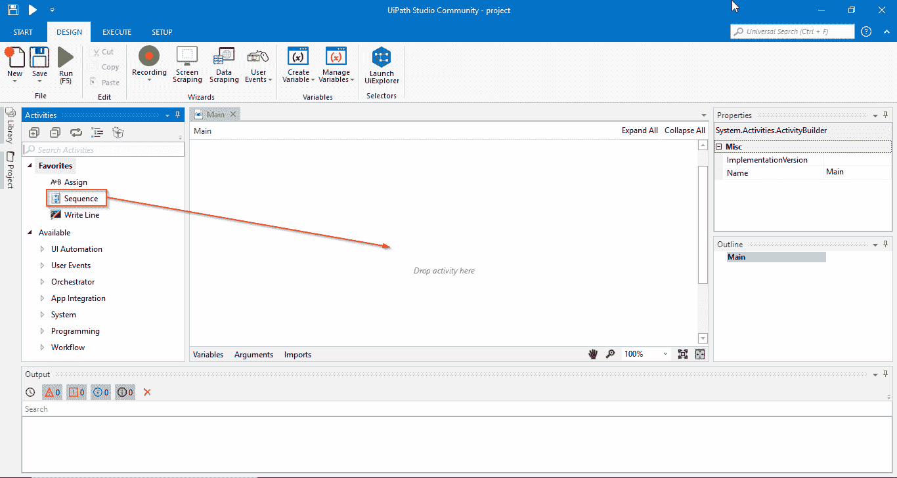

这是拖放后的样子。

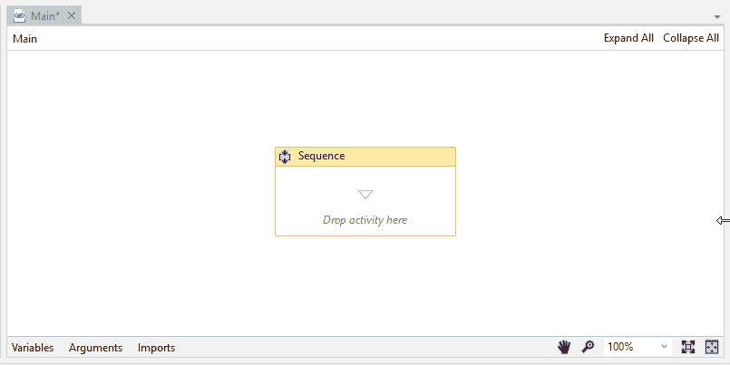

**第三步:**所以，我们希望我们的程序问我的名字。为此，我将搜索输入对话框，然后将其拖放到序列活动中。

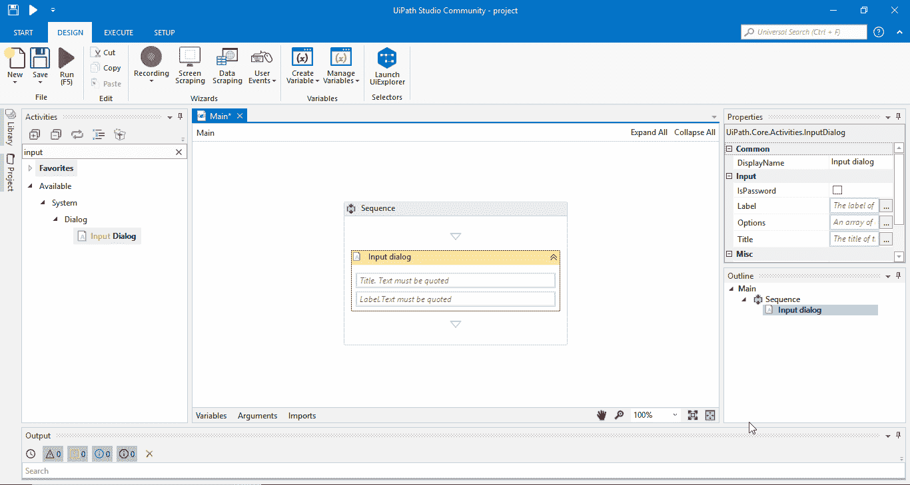

**第四步:**对于标题姑且说“输入你的名字”。然后填写标签，我们将输入“你叫什么名字”。

**注意:**您在 UiPath 中使用的每个文本都应该用双引号(" ")括起来。当您使用变量或数字时，您不会使用双引号(" ")。

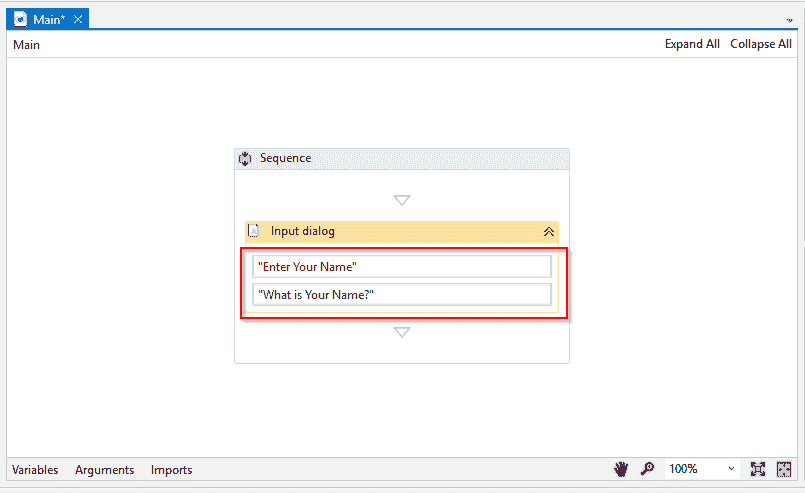

**第五步:**一旦它询问我/你的名字， 我们希望它显示一条消息，说 “欢迎参加会议”。将它拖放到输入对话框活动下。

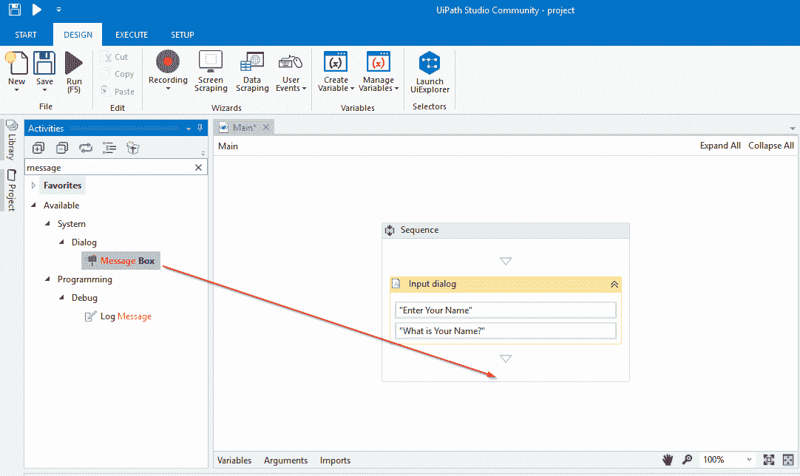

这是拖放后的样子。

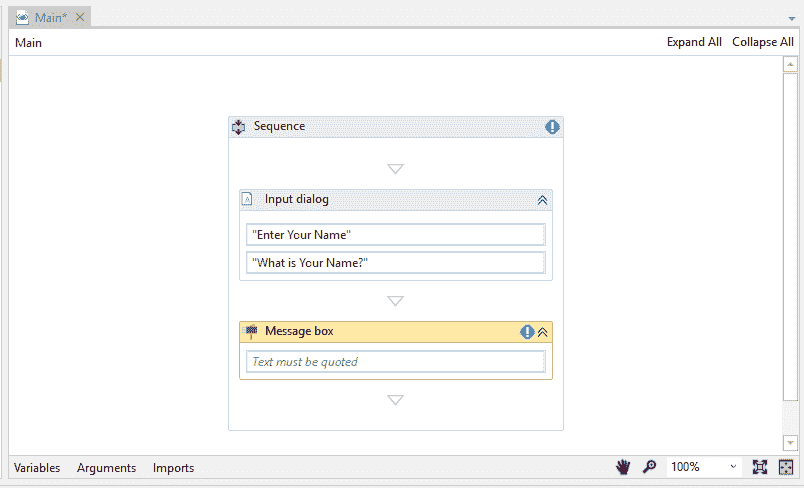

**第六步:**一旦以上步骤完成。在消息框中输入文本，这样会显示“欢迎参加本次会议”。然后运行程序。

**第七步:**当你运行这个程序的时候你会得到一个对话框，标题输入为“输入你的名字”。在对话框中输入您的姓名，然后单击确定。

Once you click on “OK”, you will observe that the name is not getting stored anywhere. For that,we would need variables.

**步骤 8:** 我们将创建一个字符串类型的变量“entername”。

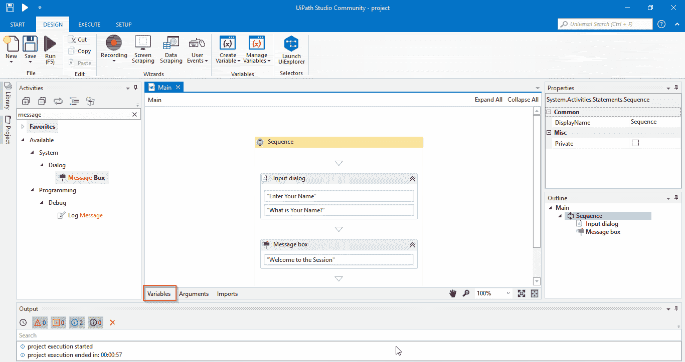

这是创建变量后的样子。

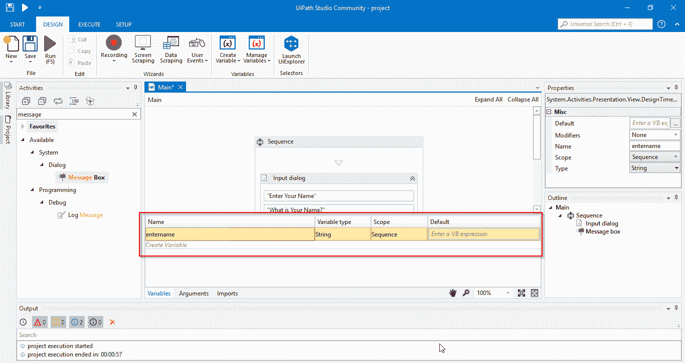

**步骤 9:** 转到输入对话框的属性部分，在结果中输入“entername”。

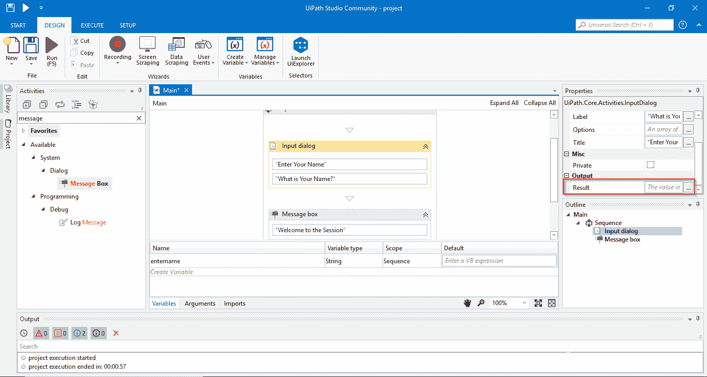

这是给结果赋值后的样子。

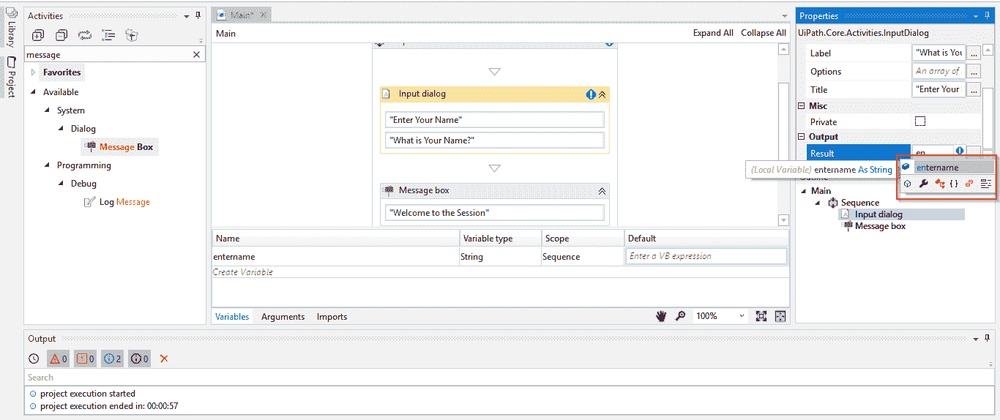

**第十步:**一旦完成。键入文本“欢迎参加会议”，并使用“+”运算符追加文本。然后添加变量并运行程序。

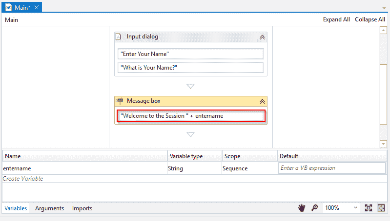

**第十一步:**在对话框中输入你的名字。

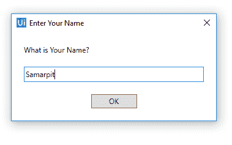

它将显示一条带有您名字的消息。

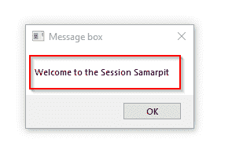

所以，这就是关于 UiPath 教程的全部内容。如果你对学习机器人过程自动化有进一步的兴趣，这个博客系列将会经常更新。

#### 订阅我们的 youtube 频道以获取新的更新..！