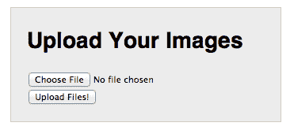
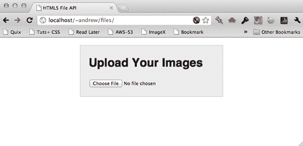

# 如何在 AJAX 中上传文件？逐步指南

> 原文：<https://www.edureka.co/blog/upload-file-in-ajax>

上传文件对开发者来说是一项具有挑战性的任务，但是用 Ajax 上传文件呢？这是难以置信的简单！Ajax 和浏览器支持的进步进一步减轻了文件上传的负担。HTML5 上传器提供了快速解决方案，但是它不安全，并且不能在所有的浏览器中工作。在本文中，我们将了解如何在 AJAX 中上传文件:

*   [AJAX 上传文件的重要步骤](#steps)
*   [文件上传中第三方出现问题](#problems)
*   [上传文件](#upload)

## **AJAX 上传文件的重要步骤**

通过 Ajax 上传文件时，有几个关键步骤需要注意。这看起来有点累人，但是如果方法正确，这是非常容易的。你需要小心一会儿:

1.  为 XMLHttpRequest 设置实例

2.  为各种 XMLHttpRequest 处理程序设置对象

3.  设置 Ajax 请求向后端发送数据

4.  验证表单

5.  为观众建立反馈

## **文件上传中第三方出现问题**

你是否考虑在你的 Ajax 文件上传中加入第三方？通过涉及第三方，您可能会遇到三个主要问题。首先，您将无法控制对存储背后的基础架构的访问。

其次，当文件包含敏感数据时，你会遇到隐私问题，尤其是如果你正在上传健康记录、财务记录或法律文件。第三，当涉及第三方时，存在不可避免的遗留系统。

## **代码**

我们将描述一种用 Ajax 上传文件的方法，只要 formdata 可用，它就能工作。在这种方法中，上传需要三个主要组件或重要文件:

1.  [HTML](https://www.edureka.co/blog/what-is-html/)/CSS File-文件输入 元素及其多个属性
2.  [PHP](https://www.edureka.co/blog/php-tutorial-for-beginners/) 文件——新的 API 文件和 FileReader 对象
3.  [JavaScript](https://www.edureka.co/blog/javascript-tutorial/)–xmlhttprequest 2 和 FormData 对象

**HTML/CSS 文件的标记和样式**

这是一个非常简单的涉及代码的步骤。任何新手都可以这样做，下面是上传的代码:

**HTML 代码**

`<!DOCTYPE html>``<html lang="en">``<head>``<meta charset="UTF-8" />``<title>HTML5 File API</title>``<link rel="stylesheet" href="style.css" />``</head>``<body>``
``<h1>Upload Your Images</h1>``<form method="post" enctype="multipart/form-data" action="upload.php">``<input type="file" name="images" id="images" multiple />``<button type="submit" id="btn">Upload Files!</button>``</form>``

``</ul>``````</body>`

**CSS 代码**

`body {` `font: 14px/1.5 helvetica-neue, helvetica, arial, san-serif;` `padding:10px;`

`h1 {``margin-top:0;`

`#main {``width: 300px;``margin:auto;``background: #ececec;``padding: 20px;``}`

`#image-list {``list-style:none;``margin:0;``padding:0;``}``#image-list li {``background: #fff;``border: 1px solid #ccc;``text-align:center;``padding:20px;``margin-bottom:19px;``}``#image-list li img {``width: 258px;``vertical-align: middle;`【`}`

看到这可以如此容易地实现，您是否感到震惊？现在，让我们继续创建 PHP 文件。看看这个[全栈开发者课程](https://www.edureka.co/masters-program/full-stack-developer-training)，了解更多关于 PHP 的知识。

**PHP:后端开发**

让我们看看如何在后端处理文件上传。随着 PHP 的进步，为了安全起见，我们需要增加几行代码。下面的代码给你一个无错误的文件上传。创建它是为了上传一个文件，然后将它移动到上传文件夹。你需要创建一个名为 upload.php 的文件

`<?php`

`foreach ($_FILES["images"]["error"] as $key => $error) {``if ($error == UPLOAD_ERR_OK) {``$name = $_FILES["images"]["name"][$key];``move_uploaded_file( $_FILES["images"]["tmp_name"][$key], "uploads/" . $_FILES['images']['name'][$key]);``}``echo "<h2>Successfully Uploaded Images</h2>";`

您需要链接一个 jQuery 和 upload.js 文件来弹出，如下图所示。

**JavaScript**

使用 Ajax，我们可以隐藏上传图像猫按钮。下面是上传的代码。

`(function () {``var input = document.getElementById("images"),`

`if (window.FormData) {``formdata = new FormData();``document.getElementById("btn").style.display = "none";``}``}`

下面给出的是隐藏的帮助函数，有助于文件上传。

浏览器阅读图像后显示图像:

`function showUploadedItem (source) {``var list = document.getElementById("image-list"),``li = document.createElement("li"),``img = document.createElement("img");``img.src = source;``li.appendChild(img);``list.appendChild(li);``}`

向用户显示图像后，您需要显示图像并上传文件。

onchange 事件被激发。

`if (input.addEventListener) {``input.addEventListener("change", function (evt) {`

`document.getElementById("response").innerHTML = "Uploading . . ."`

`for ( ; i < len; i++ ) {`

`if (!!file.type.match(/image.*/)) {`

`}` 

`}, false);`

图像上传后，我们需要确认文件是否是图像，以及它是否在指定的长度和大小。

检查以下代码:

`if ( window.FileReader ) {``reader = new FileReader();``reader.onloadend = function (e) {` `showUploadedItem(e.target.result);``};``reader.readAsDataURL(file);``}``if (formdata) {``formdata.append("images[]", file);``}`

我们需要将 file 对象传递给 reader.readAsDataURL，该操作为上传的图像创建一个数据 URL。这个数据 URL 不会从函数中传回，而是作为 even 对象的一部分使用。我们需要检查浏览器是否支持 formdata 和 FormData 对象。

它保存我们使用表单提交的值。在 images[]中添加方括号将追加另一个值，而不是覆盖。

现在，上传图像的最后一步将通过下面这段代码来完成。

`if (formdata) {``$.ajax({``url: "upload.php",``type: "POST",``data: formdata,``processData: false,``contentType: false,``success: function (res) {``document.getElementById("response").innerHTML = res;` `}``});`

一旦上传结束，我们需要看看它是否支持表单数据，因为我们是使用 Ajax 上传的，它应该可以避免所有的错误和特殊情况。当用户尝试上传图片时，会弹出如下图片:

选择图像后，屏幕上会显示:

一旦图像上传完成:

使用 Ajax 上传文件就像在公园散步一样简单。随着新技术的进步，这些任务应该变得尽可能简单。

至此，我们结束了这篇关于 AJAX 上传文件的文章。

*要深入了解 jQuery 及其各种应用程序，您可以 [**在此**](https://www.edureka.co/masters-program/full-stack-developer-training) 注册参加在线实时培训，24/7 全天候支持，终身访问。*

有问题要问我们吗？在“用 AJAX 上传文件”的评论部分提到它们，我们会回复您。