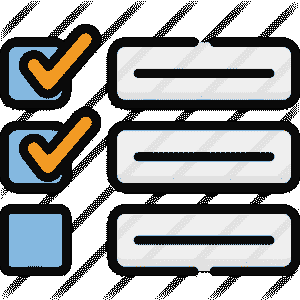
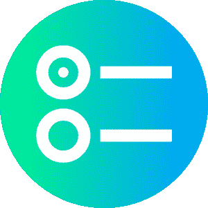
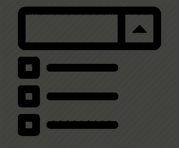
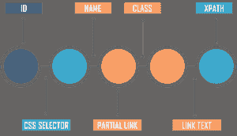

# 关于 Selenium 中的 WebElement，您需要了解的全部内容

> 原文：<https://www.edureka.co/blog/webelement-in-selenium/>

元素是抽象事物的重要组成部分，同样 [***硒认证***](https://www.edureka.co/selenium-certification-training) 封装了一个简单的表单元素 *WebElement* ，它代表一个 HTML 元素。因此，在本文中，我们将深入理解 WebElement 在 Selenium 中扮演的主要角色。

本博客将涵盖以下主题:

*   [硒中的 WebElements 有哪些](#WhatareWebElementsinSelenium)
*   [不同类型的网页元素](#Different_types_of_web_elements)
*   [在 WebElements 上执行的操作](#Operationsperformedonthewebelements)
*   [如何在网页上定位 web elements](#How_to_locate_the_web_elements_on_the_web_page)
*   [演示](#Demo)

那么，让我们从了解什么是 web 元素开始。

**Selenium 中的 WebElements 是什么？**

出现在网页上的任何东西都是 web 元素，如文本框、按钮等。WebElement 表示一个 HTML 元素。**[*Selenium web driver*](https://www.edureka.co/blog/what-is-selenium/)**封装一个简单的表单元素作为 WebElement **的对象。它基本上代表了一个 DOM 元素，所有的 HTML 文档都由这些 HTML 元素组成。**

```

html
	body
		 My First Heading;
		 My first paragraph;
	/body
/html

```

web 驱动程序使用各种技术来识别基于不同属性的 web 元素，如 ID、名称、类、XPath、标记名、CSS 选择器、链接文本等。

WebDriver 提供了两种方法来查找网页上的元素。

*   **find element()**–查找单个 WebElement 并将其作为 WebElement 对象返回。
*   **find elements()**–使用定位器在特定位置查找元素

**Selenium 中的 Web element:Web 元素类型**

Selenium 中的 WebElements 可以分为不同的类型，即:

1.  编辑框
2.  链接
3.  按钮
4.  图片，图片链接，图片按钮
5.  文本区
6.  复选框
7.  单选按钮
8.  下拉列表

*   **编辑框**:这是一个基本的文本控件，使用户能够键入少量文本。


*   **链接** : *链接*更恰当地称为*超链接*，将一个网页连接到另一个网页。它允许用户点击他们的方式从一页到另一页。


*   **按钮**:这是一个可点击的按钮，可以用在表单和文档中需要简单、标准按钮功能的地方。


*   **图像**:帮助对图像执行动作，如点击图像链接或图像按钮等。


*   **文本区**:是一个 inline 元素，用来指定一个包含多行的纯文本编辑控件。


*   **复选框**:这是一个选择框或勾选框，是一个小的交互式框，用户可以切换它来表示肯定或否定的选择。



*   **单选按钮**:这是一个选项按钮，是一个图形控制元素，允许用户只选择一组预定义的互斥选项。



*   **下拉列表**:图形控制元素，类似于*列表*框，允许用户从列表中选择一个值。当此*下拉列表*未激活时，它仅显示一个 va 值。



这是关于 Selenium 中不同类型的 WebElements。

现在让我们来了解要对它们执行的操作。

## **Selenium 中的 WebElement:对 WebElements 执行的操作**

In order to access WebElements, we need to perform a set of operations starting with browser actions until the operations are performed on  frames.

*   在浏览器上执行的操作
    1.  启动浏览器
    2.  导航至特定网页
    3.  关闭当前浏览器
    4.  在执行过程中关闭所有由 WebDriver 打开的浏览器
    5.  最大化浏览器
    6.  刷新浏览器
*   网页上的操作
    1.  获取页面标题
    2.  获取页面网址
*   编辑框上的操作
    1.  输入一个值
    2.  获取值
    3.  清除数值
*   链接上的操作
    1.  点击链接
    2.  返回链接名称
*   按钮上的操作
    1.  点击启用
    2.  显示状态
*   对图像的操作
    1.  普通图像(无功能)
    2.  图像按钮(点击)
    3.  图片链接(重定向到另一个页面)
*   对文本区的操作
    1.  返回或捕获网页上的消息
*   对复选框的操作
    1.  选择复选框
    2.  取消选择复选框
*   单选按钮的操作
    1.  选择单选按钮
    2.  检查是否显示单选按钮
*   下拉操作
    1.  选择列表中的一个项目
    2.  得到 i tem 计数
*   帧上的操作
    1.  从顶部窗口切换到网页上的特定框架
    2.  切换到顶部窗口的框架

这些是在 WebElement 上执行的操作。

现在，问题是如何定位这些 web 元素来执行上述操作。

**Selenium 中的 WebElement:如何在网页上定位 web 元素**

Selenium provides functionalities that help in locating the element on a web page. It makes use of ***[element locators](https://www.edureka.co/blog/locators-in-selenium/)***. Let’s take a look at how locators help in finding the WebElement. Locators are defined as an address that identifies a WebElement uniquely within a web page. It is a command that tells ***[Selenium](https://www.edureka.co/blog/what-is-selenium/)***IDE which GUI elements it needs to operate, like – Text Box, Buttons, Check Boxes, etc. Using the right locator ensures that the tests are faster, more reliable and has lower maintenance over releases.

**元素定位器的类型**

为了准确无误地识别 WebElements，Selenium 使用了不同类型的定位器，即:

*   Id 定位器
*   名称定位器
*   链接文本&部分链接文本
*   CSS 选择器
*   XPath



*   **ID 定位器:**识别 web 元素最流行的方法是使用 ID。ID 被认为是最安全和最快的定位器选项，应该始终是多个定位器中的第一优先选项。
*   **名称定位器:**这也是定位具有名称属性的元素的有效方法。使用这种策略，将返回具有 name 属性值的第一个元素。如果没有元素具有匹配的名称属性，那么将引发一个 **NoSuchElementException** 。
*   **linkText&ParialLinkText:**你可以用这个 *linkText* 来识别网页上的超链接。可以借助*锚定标签* ( < a >)来确定。要在网页上创建超链接，可以在链接文本后使用锚标记。在某些情况下，您可能需要通过 *linkText* 元素中的部分文本来查找链接。在这种情况下，您可以使用*部分链接文本*来定位元素。
*   **CSS 选择器:** CSS 主要用于为网页提供样式规则，你可以用它来标识网页中的一个或多个元素。 [***CSS 选择器***](https://www.edureka.co/blog/css-selectors-in-selenium/) 总是定位页面中复杂元素的最佳方式。我们将在下一个主题中更多地讨论 CSS 选择器。
*   **XPath:** XPath 是一种查询 XML 文档的语言。 ***[XPath](https://www.edureka.co/blog/xpath-in-selenium/)*** 是定位硒中元素的重要策略。它还包含一个路径表达式和一些条件。在这里，您可以轻松地编写 XPath 脚本/查询来定位网页中的任何元素。

此外，看看这个视频，我们的 Selenium 专家通过演示一个简单的演示来解释如何使用元素定位器来定位元素

## **Selenium web driver 中的定位器| Selenium 中的元素定位器| Selenium Training | edu reka**


[https://www.youtube.com/embed/jK_4nnEJVHQ?rel=0&controls=0&showinfo=0](https://www.youtube.com/embed/jK_4nnEJVHQ?rel=0&controls=0&showinfo=0)*This Edureka video on Locators in Selenium talks about different types of selenium locators and steps involved to locate a web element using locators along with examples.*

了解了如何定位 web 元素之后，让我们继续进行演示，展示在 web 元素上执行的操作。

## **Selenium 中的 web element:Demo**

To start with the demo, we require certain prerequisites to work on WebElements in Selenium.

*   Java 库
*   IDE。我们更喜欢在 *Eclipse* 上工作，因为在 Java 项目上工作效率更高

在这个演示中，我们将看到如何自动化一个最著名的电子商务网站 [*亚马逊*](http://www.amazon.in) ，在这里我们将了解 WebElement 接口。

*   首先，我们需要选择一个浏览器来执行操作。在这种情况下，我们将在 Chrome 上工作，因此选择 ChromeDriver 浏览器并指定它所在的路径
*   实例化 ChromeDriver 实例
*   获取网页的网址
*   最大化当前网页
*   使用 ID、名称、类等元素定位器找到 web 元素
*   将密钥发送到网页上的特定位置
*   点击搜索按钮
*   导航至新网站
*   使用操作导航回上一个网页

看看这个视频，我们的 Selenium 专家正在解释 WebElement 如何在应用测试中发挥重要作用

## **Web Element in Selenium | Web Elements&元素定位器| Selenium 认证| edu reka**


[https://www.youtube.com/embed/r149MTf4DfI?rel=0&controls=0&showinfo=0](https://www.youtube.com/embed/r149MTf4DfI?rel=0&controls=0&showinfo=0)*This Edureka ‘Web elements in Selenium’ video helps you understand how web element plays a major role in testing an application.*

```

package co.edureka;

import org.openqa.selenium.By;
import org.openqa.selenium.WebDriver;
import org.openqa.selenium.chrome.ChromeDriver;
import org.openqa.selenium.support.ui.Select;

public class SeleniumWebElement {

public static void main(String[] args) throws InterruptedException {
System.setProperty("webdriver.chrome.driver", "C:UsersVaishnaviDesktopChromechromedriver.exe");
WebDriver driver = new ChromeDriver();
driver.get("https://www.amazon.in/");
driver.manage().window().maximize();
Thread.sleep(4000);
driver.findElement(By.id("twotabsearchtextbox")).sendKeys("Poco F1");
Thread.sleep(4000);
driver.findElement(By.className("nav-input")).click();
driver.findElement(By.linkText("ACM")).click();
driver.navigate().to("http://edureka.co/blog");
Thread.sleep(4000);
driver.navigate().back();
driver.quit();

}

```

**了解我们在顶级城市的硒测试课程**

| 印度 | 美国 | 其他国家 |
| [印度硒培训](https://www.edureka.co/selenium-certification-training-india) | [芝加哥硒培训](https://www.edureka.co/selenium-certification-training-chicago) | [硒认证英国](https://www.edureka.co/selenium-certification-training-uk) |
| [加尔各答的硒培训](https://www.edureka.co/selenium-certification-training-kolkata) | [纽约硒培训](https://www.edureka.co/selenium-certification-training-new-york-city) | [新加坡硒培训](https://www.edureka.co/selenium-certification-training-singapore) |
| [浦那硒课程](https://www.edureka.co/selenium-certification-training-pune) | [美国硒培训](https://www.edureka.co/selenium-certification-training-us) | [硒训练悉尼](https://www.edureka.co/selenium-certification-training-australia) |

*With this, we come to an end to this “WebElement in Selenium” blog. I hope you guys enjoyed this article and understood how web elements play a major role while working on Selenium. Now that you have understood why web elements are important check out the Selenium Certification Course by Edureka, a trusted online learning company with a network of more than 650,000 satisfied learners spread across the globe. This course is designed to introduce you to the complete Selenium features and its importance in testing software.**Got a question for us? Please mention it in the comments section of “WebElement in Selenium,” and we will get back to you.*