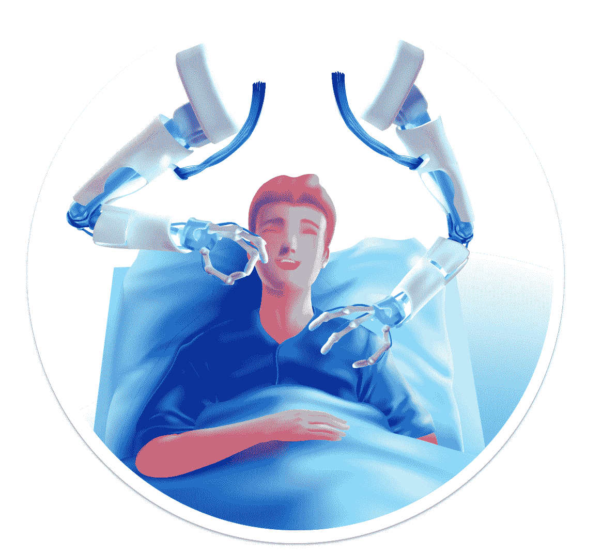

# 人工智能——它是什么，有什么用？

> 原文：<https://www.edureka.co/blog/what-is-artificial-intelligence>

在这篇关于什么是人工智能的博客中，我们将讨论什么是人工智能，以及它对我们有什么用。让我们从以下概念开始:

*   什么是人工智能？
*   人工智能是如何产生的？
*   概念层面的人工智能
*   人工智能的种类
*   用例

## **什么是人工智能？**

你认为人工智能的概念和存在是**新**吗？

嗯，在过去没有互联网的时候，人们通过**看书**或者查看**报纸上的文章**来研究人工智能。

“什么是人工智能？”–嗯，这个关键术语确实引起了**很多人的好奇**！

人们想知道 是否能让**教**电脑像**小孩**那样学习。这里的概念是基本上使用**试错**来开发形式推理。

看看这个由 Edureka 提供的 [**NLP 课程**](https://www.edureka.co/python-natural-language-processing-course) 将你的人工智能技能提升到一个新的水平

## **我们来说说人工智能是如何产生的**

“人工智能”一词实际上早在 1956 年就由达特茅斯大学的教授约翰·麦卡锡·T2 创造了。

多年来，人们认为计算机永远比不上人脑的能力，但事实证明并非如此。

嗯，当时我们没有足够的数据和计算能力，但现在随着大数据 T2 的出现和图形处理器 T4 的出现，人工智能成为可能。

**你知道吗，全球 90%的数据都是在过去两年内产生的。**计算机可以更快地理解所有这些信息。

很快，我们就能看到人工智能少了一点 T2 人工，多了一点 T4 智能。

## **概念层面上的人工智能**

人工智能——在我看来，是由我们编程的机器对人类智能的**模拟。这些机器需要学习如何**推理**，并在此过程中根据需要做一些**自我校正**。**

现在我们有了**详细的算法**，在[人工智能课程](https://www.edureka.co/executive-programs/machine-learning-and-ai)中教授，这有助于人们理解人工智能系统可以更快更有效地利用和执行巨大的任务。

**机器学习**和**深度学习**只是**实现** **人工智能**的途径。

## **一项关于人工智能的调查** 我看过 2012 年在专家中进行的一项调查，报告称人工智能有 **50%的几率**在 **2040 年到 2050 年**之间得到发展，到 2075 年上升到 **90%。**

相比之下，一些人工智能专家认为，鉴于我们对人脑的了解有限，这样的预测过于乐观，并且认为人工智能仍然需要**个世纪才能实现**。

在这篇关于“什么是人工智能”的博客中，我们现在来看看人工智能的一些**类型**。

## **人工智能的种类**

人工智能可以通俗地分为两类:

*   窄 AI
*   广艾

我们来说说**狭义 AI** :

狭义 AI 是一个为**一个特定任务**而设计和训练的人工智能系统。 亚马逊的 Alexa、苹果的 Siri 等虚拟助手 使用的是狭义 AI。

狭义 AI 有时也被称为**‘弱 AI’**。然而，这并不意味着狭隘的人工智能是低效的或诸如此类的。

相反，它是**非常擅长常规工作的**，无论是身体上还是认知上。正是狭义的人工智能有可能取代 T4 在全世界的许多工作。

然而，我对“什么是人工智能”的**好奇心**并没有就此打住。我深入调查了一下。

下面是我对**广艾** : 的更多了解

Wide AI 是一个具有**认知能力**的系统，因此当该系统面临一个**不熟悉的**任务时，它足够智能来找到解决方案。

在这里，该系统能够在各种任务中拥有智能行为——从驾驶汽车到讲笑话的**。**

这些技术旨在让**复制**并超越**人类智能**的许多(理想情况下是所有)能力，比如风险分析和其他认知过程。

View Upcoming Batches For The AI And Deep Learning Course Now! [<button>Learn Now</button>](https://www.edureka.co/ai-deep-learning-with-tensorflow)

## **人工智能的主要用例**

**如今，人工智能几乎无处不在**在诸如 垃圾邮件过滤、信用卡欺诈检测系统、虚拟援助等系统中。

我相信，为了让我们的**生活得更好**，我们拥有的人工智能应用程序的数量是没有止境的或有限的！

接下来，在这篇“什么是人工智能”的博客中，让我们来看看一些我认为很突出的**用例**。

## **体育领域的人工智能——打败一个世界冠军的计算机系统——深蓝**

嗯，在 90 年代后期，当普通人还在疑惑——什么是人工智能的时候。我们训练电脑玩游戏和解决基本问题。

**【深蓝】** 是 IBM 研发的一款。

它被认为是**第一个计算机国际象棋系统**，在常规时间控制下赢得了一场国际象棋比赛和一场与卫冕**世界冠军**的国际象棋比赛。

*   1996 年 2 月 10 日，深蓝在六场比赛的第一场中击败了 **【加里·卡斯帕罗夫】** ，赢得了在**的第一场**对世界冠军的比赛。
*   然而， 深蓝随后被**重磅升级**，并于 1997 年 5 月再次出战卡斯帕罗夫。
*   在标准国际象棋比赛时间控制下，深蓝 成为第一个在比赛中击败世界冠军的计算机系统。

今天，在你们手机上的免费国际象棋游戏中可用的人工智能比“深蓝”快得多，比“深蓝”好得多。

## **执行救援任务的人工智能**

我们最需要的是使用人工智能和技术来确保**帮助更快到达**。我们可以从开发帮助**急救人员**寻找地震、洪水和任何其他自然灾害受害者的系统开始。

通常情况下，救援人员需要检查**航拍镜头**来确定人们可能被困在哪里。然而，检查大量照片和无人机镜头非常耗时耗力。

这是一个**时间紧迫的**过程，对于受害者来说，这很可能是生与死的区别。

德克萨斯 A & M 大学开发的一个人工智能系统允许计算机程序员编写基本算法，这些算法可以在两小时内检查大量镜头并找到失踪人员。

## **人工智能用于防止野生动物偷猎**

猎杀野生物种和偷猎是一个全球性的问题，因为这将导致物种灭绝。

例如，最近的非洲人口普查显示，2007 年至 2014 年间，大象数量下降了 30%。野生动物保护区已经建立起来，以保护这些物种免受偷猎者的侵害，这些区域由公园管理员保护在 T4。然而，别动队并不总是有足够的资源来有效地巡逻广大地区。

乌干达的伊丽莎白女王国家公园使用**预测模型**来预测偷猎威胁程度。这样的模型可以用来为公园管理员生成**高效的**和**可行的巡逻路线**。

## **智能农业的人工智能**

在我看来，**神经网络**很好地提供了智能农业解决方案。

从对土壤和作物产量的全面监控到提供预测分析模型(T2)来跟踪和预测可能影响未来产量的各种因素和变量(T4)。

例如，总部位于柏林的农业科技初创公司 **PEAT** 开发了一种基于深度学习算法的应用程序，名为 **Plantix** ，可以识别土壤中的缺陷和养分缺乏。

他们的算法将特定的树叶模式与某些土壤缺陷、植物病虫害联系起来。

## **医疗保健中的人工智能——更好的手术和** **假肢**

嗯，有一天你在想——‘什么是人工智能’，后来的**机器人**已经准备好给你做**手术**？

今天的机器人是机器学习工具，为医生提供了扩展精度的 T2 和控制 T4。这些机器能够缩短患者的住院时间，积极影响手术体验，同时降低医疗成本。

类似地，**大脑控制的**机器人手臂和大脑芯片植入已经开始帮助瘫痪的病人恢复行动能力和触觉。

总体而言，机器学习和人工智能正在帮助**改善患者体验**。

## **人工智能追踪野生动物种群**

令人惊讶的是，像自然学家的**和**的 **eBirds 这样的应用程序收集所遇到物种的数据。这有助于跟踪物种数量、生态系统和迁移模式。**

因此，这些应用在更好地识别和保护海洋和淡水生态系统方面也发挥着**重要作用**。

**一定要看看这个[链接](https://www.edureka.co/blog/deep-learning-tutorial)了解更多关于深度学习人工智能的博客信息！**

我个人认为，人工智能将**彻底改变**我们日常生活的方方面面。 它将**足够微妙**并对我们周围的一切产生**大的影响**！

我希望你喜欢我关于什么是人工智能的帖子。如果你有任何问题，请在评论区提出来，我会尽快回复。

## **人工智能|什么是 AI？|爱德华卡**

[//www.youtube.com/embed/4jmsHaJ7xEA?rel=0&showinfo=0](//www.youtube.com/embed/4jmsHaJ7xEA?rel=0&showinfo=0)

这段关于人工智能的视频给大家简单介绍了 AI，以及 AI 如何改变世界。

Learn Artificial Intelligence And Deep Learning From Experts Now! [<button>Learn Now</button>](https://www.edureka.co/ai-deep-learning-with-tensorflow)