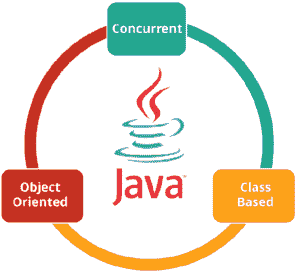
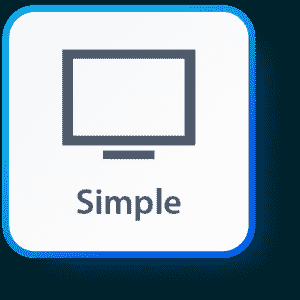
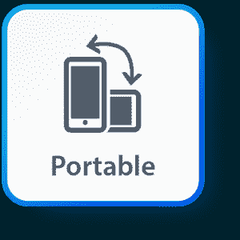
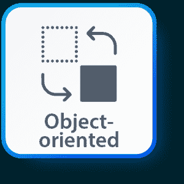
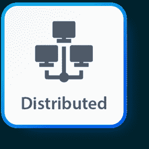
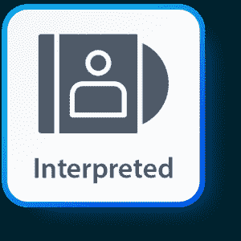

# Java 是什么？Java 及其发展的初学者指南

> 原文：<https://www.edureka.co/blog/what-is-java/>

**什么是 Java？** Java 是一种跨平台的面向对象编程语言，由 Sun Microsystems 公司于 1995 年发布。今天，需要 Java 来运行各种应用程序，例如游戏、社交媒体应用程序、音频和视频应用程序等。

在这篇博客中，我将涉及以下主题:

*   [Java 是用来做什么的？](#WhatisJavausedfor?)
*   [历史](#HistoryofJava)
*   [什么是 Java？](#WhatisJava?)
*   [特色](#FeaturesofJava)
*   [组件](#ComponentsinJava)

## **Java 是用来做什么的？**

在我继续之前，让我简要地告诉你为什么你应该选择 Java。 它非常受欢迎，从 2000 年初到 2018 年一直统治着这个领域。

下面列出了一些应用:

*   **银行**:处理交易管理。
*   **零售**:你在商店/餐厅看到的账单应用程序完全是用 Java 编写的。
*   **信息技术** : Java 是为了解决实现依赖而设计的。
*   **安卓**:应用要么用 Java 写，要么用 Java API。
*   **金融服务**:用于服务器端应用。
*   **【股票市场】**:编写他们应该投资哪家公司的算法。
*   **大数据** : Hadoop MapReduce 框架使用 Java 编写。
*   **科研界**:处理海量数据。

***等等！Java 能做的更多。***

让我们看看一些技术如何利用 Java 作为其功能的核心。

让我们看看一些技术如何利用 Java 作为其功能的核心。

在上图中你可以看到，Java 是一个充满机遇的。

让我们来看看 Java 的简史 。

## **历史**

Java 是由**詹姆士**高斯林和其他团队成员名为**迈克谢里丹**和**帕特里克诺顿**开发的编程语言，在 1995 年**时也被称为**绿色团队**为**太阳微系统**开发数字设备，如机顶盒、电视等。现在，让我们详细探讨一下这种语言。**

## **什么是 Java？**

它是一种面向对象的语言，类似于 C++，但是具有高级和简化的特性。这种语言**可以自由访问**并且**可以在**所有平台**上运行**。

Java 是:–

*   **并发**可以执行多条语句而不是顺序执行。
*   **基于类的**和一种**面向对象的**编程语言。
*   **独立的**编程语言，遵循“**一次编写，随处运行**的逻辑，即编译后的代码可以在所有支持 java 的平台上运行。

简单来说，它是一个计算平台，你可以在这里开发应用程序。

您可以参加本课程，在本课程中，我们的 [**认证培训**](https://www.edureka.co/java-j2ee-training-course) 专家已经通过示例详细解释了这些主题，这将有助于您更好地理解这些概念。

[https://www.youtube.com/embed/PxkM3rXqz6k?rel=0&showinfo=0](https://www.youtube.com/embed/PxkM3rXqz6k?rel=0&showinfo=0)

## **特征**

**简单:**   Java 去除了所有的复杂性，如 C++或任何其他编程语言中的指针、运算符重载，让生活变得更加简单。

****

**可移植:** 这是平台无关的，意味着在一个平台上编写的任何应用程序都可以很容易地移植到另一个平台上。

**面向对象:**

**安全:** A   ll 代码编译后转换成 **字节码** ，不可读人。并且 java 不使用显式指针，而是在沙箱内运行程序，以防止来自不可信来源的任何活动。它能够开发无病毒、无篡改的系统/应用程序。

**动态:**t 能够适应支持动态内存分配的不断发展的环境，从而减少内存浪费并提高应用程序的性能。

**分布式:**  该语言提供了一个有助于创建分布式应用的特性。使用远程方法调用(RMI)，一个程序可以通过网络调用另一个程序的方法并获得输出。您可以通过从 internet 上的任何计算机调用这些方法来访问文件。

**健壮:**Java 拥有强大的内存管理系统。它有助于消除错误，因为它在编译和运行时检查代码。

**高性能:**   Java 通过使用可以轻松翻译成本机代码的字节码来实现高性能。通过使用 JIT(实时)编译器，它实现了高性能。

**解释的** ** : ** Java 被编译成字节码，由运行时环境解释。

**多线程** ** : ** Java 支持执行的多线程(也就是轻量级进程)，包括一组同步原语。这使得用线程编程更加容易。

## **组件**

**【Java 虚拟机】**

这是一台抽象的机器。它是一个规范，提供了一个运行时环境，在这个环境中字节码可以被执行。它遵循三个符号:

*   **规范**:描述 JVM 实现的文档。它是由 Sun 和其他公司提供的。
*   **实现**:是符合 JVM 规范要求的程序。
*   **运行时实例**:每当您在命令提示符下编写命令并运行该类时，就会创建一个 JVM 实例。

**【JRE(Java 运行环境)**

JRE 指的是一个可以执行 字节码的运行时环境。它实现了 JVM，并提供了 JVM 在运行时使用的所有类库和其他支持文件。所以 JRE 是一个软件包，包含了运行一个程序所需要的东西。基本上，它是物理上存在的 JVM 的一个实现。

**【JDK(Java 开发工具包)**

这是必要的工具:-

*   编译
*   文件
*   打包 Java 程序。

JDK 完全包含了 JRE，其中包含了程序员工具。开发套件是免费提供的。除了 JRE，它还包括一个解释器/加载器、一个编译器(javac)、一个归档器(jar)、一个文档生成器 以及 Java 开发中需要的其他工具。简而言之，它包含了 JRE +开发工具。

     *既然您已经了解了这种非常强大的语言的基础知识，请查看 Edureka 提供的* [ ** * Java 认证培训***](https://www.edureka.co/java-j2ee-training-course)*，edu reka 是一家值得信赖的在线学习公司，在全球拥有超过 250，000 名满意的学习者。Edureka 的 Java J2EE 和 SOA 培训和认证课程是为想成为开发人员的学生和专业人士设计的。该课程旨在让你在编程方面有一个良好的开端，并训练你掌握核心和高级概念以及各种框架，如 Hibernate & Spring。*

*有问题吗？请在本博客的评论区提出来，我们会尽快回复你，或者你也可以参加我们在万隆的 [Java 培训。](https://www.edureka.co/java-j2ee-training-course-bandung)*