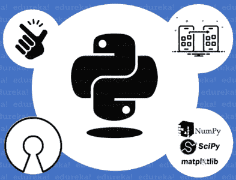

# Python 语言是什么？好学吗？

> 原文：<https://www.edureka.co/blog/what-is-python/>

**Python 是什么？** 嗯，好奇心把你带到了这里。阅读这篇博客的大多数人要么对[编程](https://www.edureka.co/blog/videos/python-programming/)完全陌生，要么只是想知道它在世界各地引起的轰动。因此，让我们继续深入了解什么是 Python。


这篇文章包括:

*   [Python 是什么？](#whatispython)
*   [为什么是 Python？](#whypython)
*   [Python 是怎么用的？](#howpython)
*   [Python 特性](#features)
*   [Python 基础知识](#basics)

## **Python 是什么？**

因此，让我通过正式向您介绍什么是 Python 来消除误会。Python 是一种**高级**、**解释的**语言，具有**简单**语法和**动态**语义。Python 比其他编程语言容易得多，可以帮助你用更少的努力和更容易的方式创建漂亮的应用程序。

## **为什么是 Python？**

你可能想知道为什么要使用 Python？让我帮助你理解在 Python 的正式定义中使用关键字。

*   ### **高等级**

    Python 从我们人类用来相互交流的自然语言中派生出组件。这使得任何人都可以更容易地尝试和联系到底会发生什么，而不用承担查看大量**机器代码**的负担。

*   ### **解读**

    Python 代码被逐行编译，这使得调试错误变得更加容易和高效。但是这是有代价的，因为它比其他编程语言慢得多。

*   ### **简单语法**

    Python 使用**缩进**而不是大括号来区分哪些代码块属于哪个类或函数。这使得代码看起来很好**分布**并且让任何人都容易阅读。

*   ### **动态语义**

    如果你是一个老程序员，你会知道在使用任何东西之前，你需要初始化 T2。它动态地完成所有这些。

## **Python 是怎么用的？**

了解了什么是 Python 以及为什么要使用它，你就会想，当你掌握了它，你能做什么。名单出奇的长。例如，

*   使用 Python 框架创建 web 应用，如 [**Django**](https://www.edureka.co/blog/django-tutorial/) 和 [**Flask**](https://www.youtube.com/watch?v=lj4I_CvBnt0&t=51s)
*   您可以为正在使用的软件创建工作流程
*   使用 Python 修改存储在 [**数据库**](https://www.edureka.co/blog/python-database-connection/) 中的文件和数据
*   [**科学**](https://www.edureka.co/blog/system-exit-in-java/) ，**解析**和复杂的计算都能轻松搞定
*   你可以用 Python 更快地创建软件，它已经可以部署了

这个清单还在继续。使用 Python 作为解决问题的首选语言，你会有一个非常好的职业生涯。让我列举几个你可以追求的头衔。

*   ### [**数据科学家**](https://www.edureka.co/blog/data-scientist-skills/)

    数据科学家是破解与数学、统计领域相关的复杂的 T2 问题，并以合理的方式提出这些问题的解决方案的人。

*   ### [**软件工程师**](https://www.edureka.co/blog/how-to-become-a-python-developer/)

    软件工程师根据需求设计、开发、测试和维护他们为客户创建的软件应用程序。

*   ### [**网络开发者**](https://www.edureka.co/blog/django-tutorial/)

    web 开发人员使用**客户端-服务器**模式创建 Web 应用程序来服务他们的用户。存在诸如信息共享、社交网络平台、娱乐之类的应用，这只是其中的几个例子。

##  ** Python 特性**

Python 是**慢**。然而，它的受欢迎程度并没有停止增长，因为它可以用**更少的代码**实现**更高的生产率**，使 [Python](https://www.edureka.co/blog/learn-python-3/) 成为最受欢迎的语言之一。Python 有一系列吸引几乎任何人开始用它编码的特性。

*   ### **简单**

    Python 本身就是一种简单的。你所需要知道的就是如何使用**缩进**，你就可以用更少的代码行编写出最复杂的问题。

*   ### **开源**

    Python 是免费的 T2，任何人都可以使用。你甚至可以自由地修改 Python 的代码来更好地满足你自己的需求，而不用面对任何后果。

*   ### **便携性**

    代码编写可以一次完成，**跨不同系统运行****不做任何改动**。当一个团队在一个项目中工作时，这非常有用。

*   ### **嵌入属性**

    Python 允许嵌入 [C](https://www.edureka.co/blog/c-programming-tutorial/) 、 [C++](https://www.edureka.co/blog/object-oriented-programming-in-cpp/) 等其他语言的**代码**，这让它的功能强大了很多，用途也多了很多。

*   ### **解读**

    如你所知，Python 是逐行编译的，这使得**调试**更加容易，而**内存管理**更加高效

*   ### **库支持**

    Python 支持 [**库**](https://www.edureka.co/blog/python-libraries/) ，你可以使用这些库，更快更容易地开始获得你的**解决方案**。这些库的社区非常活跃，非常有用

*   ### **哎呀**

    [面向对象的概念](https://www.edureka.co/blog/object-oriented-programming-python/)帮助你**在你的代码中复制**真实世界的场景，并为它们提供**安全性**，这样你就可以获得一个制作精良的应用

研究和统计数据已经证明，Python 是有史以来发展最快的语言。使用跟踪受欢迎程度增长的 TIOBE 的包，我们获得了以下数据。

| 【2018 年 3 月排名 | 【2019 年 3 月排名 | 语言 | 评级 |
| 1 | 1 | Java | 14.8% |
| 2 | 2 | C | 13.3% |
| 4 | 3 | Python | 8.2% |
| 3 | 4 | C++ | 8.1% |
| 6 | 5 | Visual Basic。网络 | 6.4% |

## **Python 基础知识**

总之，让我们写一个小程序。你可以按照这个[分步指南](https://www.edureka.co/blog/install-python-on-windows/)来设置自己。

```
print('Hello world. Welcome to Edureka!')
```

**输出:**你好世界。欢迎来到 Edureka！

如果你对它的工作原理感兴趣，让我给你一些你需要的基础知识。你有不同的[数据类型](https://www.edureka.co/blog/variables-and-data-types-in-python/)，比如[列表](https://www.edureka.co/blog/lists-in-python/)、[字典](https://www.edureka.co/blog/dictionary-in-python/)等等。[运算符](https://www.edureka.co/blog/operators-in-python/)如算术、逻辑等。

你也可以从文件中读取和写入数据，在文件中包含函数，还可以使用[循环和条件](https://www.edureka.co/blog/loops-in-python/)来控制程序的流程。如果你对它们感兴趣，请继续阅读下面的内容。

*   [Python 基础知识](https://www.edureka.co/blog/python-basics/#Basics)
    *   [评论](https://www.edureka.co/blog/python-basics/#Comments)
    *   [变量](https://www.edureka.co/blog/python-basics/#Variables)
    *   [数据类型](https://www.edureka.co/blog/python-basics/#DataTypes)
    *   [类型转换](https://www.edureka.co/blog/python-basics/#TypeConversion)
    *   [操作员](https://www.edureka.co/blog/python-basics/#Operators)
    *   [命名空间和范围](https://www.edureka.co/blog/python-basics/#Namespacing)
    *   [Python 构造函数](https://www.edureka.co/blog/python-constructors/)
*   [Python 中的数组](https://www.edureka.co/blog/arrays-in-python/)
*   [Python 中的方法](https://www.edureka.co/blog/python-method-overloading/)
*   [流量控制](https://www.edureka.co/blog/python-basics/#Flow)
    *   [if，elif，else](https://www.edureka.co/blog/python-basics/#ifelse)
    *   [for，while，嵌套循环](https://www.edureka.co/blog/python-basics/#loops)
*   [文件处理](https://www.edureka.co/blog/python-basics/#Files)
*   [哎呀用 Python](https://www.edureka.co/blog/python-basics/#OOPS)
*   [Python 程序](https://www.edureka.co/blog/python-program-to-check-palindrome/)
*   [Python 数据库连接](https://www.edureka.co/blog/python-database-connection/)

你可以看到用 Python 写任何东西是多么简单。我希望您现在已经清楚什么是 Python 了。它所拥有的特性，以及你如何用它来做几乎任何你想做的事情。总而言之，你所追求的事业在不断上升，也是有回报的。

*既然你已经了解了什么是 Python，那就来看看 Edureka 的 [Python 认证](https://www.edureka.co/python-programming-certification-training)* *吧，edu reka 是一家值得信赖的在线学习公司，拥有遍布全球的 25 万多名满意的学习者。*

*Edureka 的 Python 编程认证培训课程是为希望成为 Python 程序员的学生和专业人士设计的。该课程旨在为您提供 Python 编程的开端，并训练您掌握核心和高级概念。*

*有问题吗？请在这篇《什么是 Python？好学吗？”博客，我们会尽快回复你。*