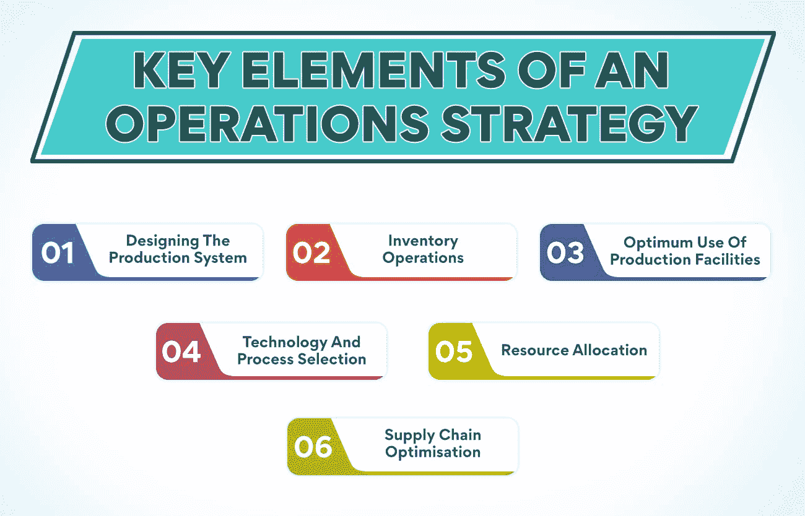
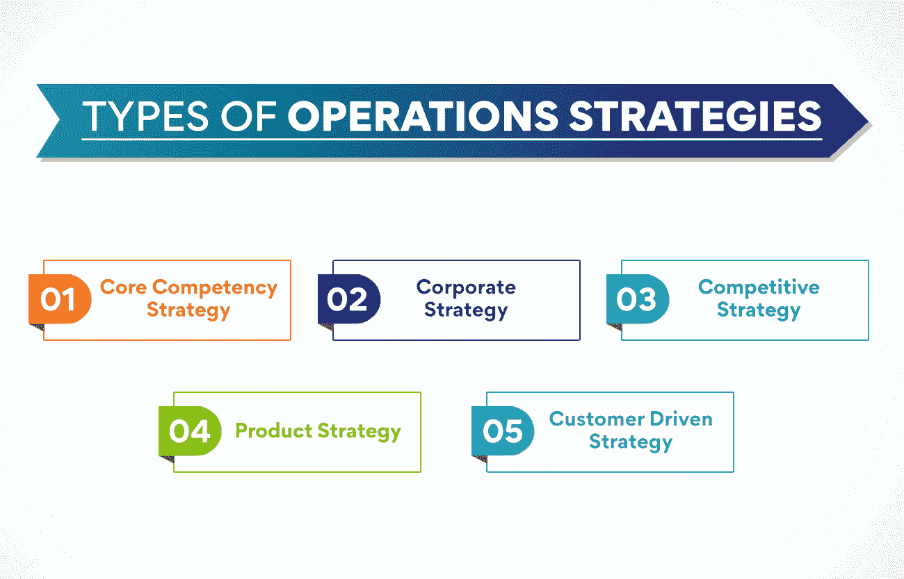
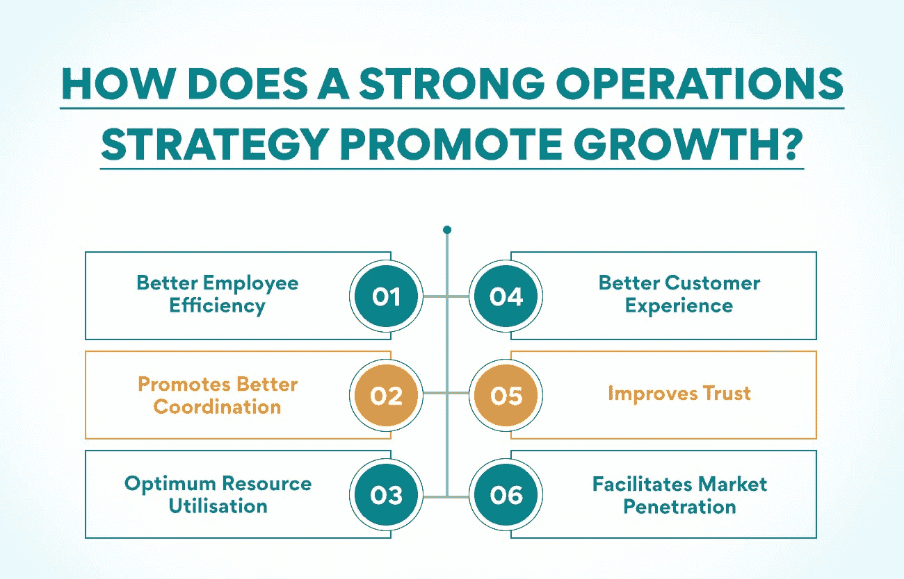

# 为什么企业需要运营战略？

> 原文：<https://www.edureka.co/blog/why-do-businesses-need-an-operations-strategy/>

所有的企业都依赖于一个能够最佳利用现有资源、人员和流程的系统。公司必须确保所有的流程都是高效的，并努力实现公司的目标。尽管不同公司的具体目标可能有所不同，但还是有一些共同点。所有组织都想降低成本，提高盈利能力。他们想占领他们经营的市场的主要份额。适当的运营战略对于确保所有流程高效并符合共同目标是必要的。

什么是运营战略？

在我们研究运营战略之前，有必要了解运营这个术语的含义。运营是那些帮助公司制造产品或服务并将其销售给客户的步骤或过程。运营经理的主要职责是确保这些流程有效运行，并努力实现公司的目标。需要针对不同的操作做出不同的决定。所有这些结合起来形成了企业的经营战略。它必须使公司盈利并在市场上保持竞争力。

你将在这篇文章中看到的运营战略只是冰山一角。如果你想成为这方面的专家，加入我们的 [运营、供应链和项目管理](https://www.edureka.co/highered/advanced-program-in-operations-supply-chain-project-management-iitg) 高级证书课程。访问我们的网站会让你看到更多关于这门课程的信息。

**对运营战略的需求**

为什么公司需要运营战略？虽然这只是商业战略的一部分，但公司需要在市场中保持竞争力。它不仅仅包括公司现有的流程和技术。一个好的战略还会考虑供应链、客户需求、组织的优势和劣势、竞争对手以及可用的设施。分析这些因素将有助于理解每个因素是如何支持或阻碍商业战略的。公司可以了解需要做些什么来优化他们的运营。

有了好的战略，[运营管理](https://www.edureka.co/blog/beginners-guide-to-operations-management/) 就能确保制造流程与销售需求保持一致。它有助于确保在整个过程中成本保持在最佳水平。一个好的操作计划也将有助于防止它意外运行。定期更新战略将确保公司不会失去竞争优势。公司可以用新功能更新产品或创造新产品，以保持在市场上的强势。定期从竞争对手那里收集信息有助于识别组织的优势和劣势。

**运营战略的关键要素**

1.  **设计生产系统**

这个要素包括策划产品设计和方法。产品设计主要有两种类型。

**定制产品设计**——这种类型的产品是根据个别客户的具体要求制作的。这种产品设计的一些例子是锅炉、空气压缩机和涡轮机。这些产品具有已经存在或内置的特殊功能。这些产品的销量很低，而且只针对特定的客户群。

**标准产品设计**——顾名思义，这些产品有一个标准的设计，是根据大部分市场的需求而制作的。没有适合个人客户的特殊功能。这样的设计有利于大量生产以满足稳定的需求。风扇、电视和空调是标准产品设计的例子。这些产品销量很高。

当计划生产系统时，公司必须决定它将针对哪一部分顾客。还必须考虑满足客户要求的可用设施。

2.  **库存操作**

库存是每个公司运营中的一个重要因素。储存最佳数量的原材料和成品对于确保客户满意度和盈利能力至关重要。当制定库存的运营策略时，必须确保订购、维护和处理材料的清晰系统。我们必须建立有助于降低成本和减少浪费的系统。一个好的战略将有助于组织保持最佳库存水平，并充分利用可用的存储空间。

3.  **生产设施的最佳利用**

这是运营战略的另一个要素，帮助公司在提高利润的同时满足客户需求。在制定战略时，必须关注可用的生产设施，以及公司如何最好地利用它们为客户提供特殊利益。某些生产线可以专门以较低的成本生产产品，以迎合特定的客户群。组织也可以通过这种方式实现更快的交付或更高的产品质量。

仅仅规划现有的设施是不够的。公司在制定运营战略时必须牢记未来需求。预测未来的销售是必要的，以评估增加生产设施的需求。必须定期更新战略，以包括不断变化的市场需求。

4.  **技术和工艺选择**

选择技术是计划操作的一个重要部分。设计好产品后，就该决定它的制造技术了。这将取决于公司计划提供给顾客的利益。受委托负责运营管理的官员们必须了解什么样的技术可以用来生产给客户带来具体利益的产品。如果公司专注于提供价格优势，它必须选择购买和维护成本更低的机器。

你不能将技术选择局限于生产。专家必须对每个操作都这样做，包括存储、交付等。一家热衷于为客户提供更快交货的公司必须投资于有助于加快货物运输的技术。生产和包装技术有许多替代品。在制定运营战略时，最重要的是关注公司的目标是向客户交付什么，并决定有助于实现这一目标的机械类型。

5.  **资源分配**

大多数组织都面临资源短缺的问题。对于生产来说尤其如此。因此，必须进行适当的资源分配。它将包括现金、人员、机器、材料、服务等。必须有一个关于如何和何时分配可用资源的明确计划。不同的生产团队必须能够访问这些资源，以获得最佳的生产能力。分配的时机对于帮助降低成本和提高效率也非常重要。一个好的运营战略有助于充分利用现有资源，最大限度地减少浪费。

6.  **供应链优化**

[供应链是商业运作的关键部分](https://www.edureka.co/blog/what-is-operations-and-supply-chain-management-oscm/)。商品从原材料供应商到客户的流动取决于你的供应链有多好。它包括各种要素，如采购、运输、储存和文件。必须对其中的每一项进行适当的规划，以便降低成本并改善客户体验。有效的运营战略将描述供应链的结构。它还将详细讨论产品必须在哪里生产和储存，以便快速、经济地交付给客户。

您可以在[运营、供应链和项目管理](https://www.edureka.co/highered/advanced-program-in-operations-supply-chain-project-management-iitg)的高级证书课程中了解更多这些要素。请访问该网站，了解运营专业人员和渴望加入该部门的人员将如何从该计划中受益。

**运营策略类型**

****

**核心竞争力战略**

在这种类型的运营战略中，公司专注于其现有的优势。目标是利用组织的优势来最大化盈利能力。细分市场和产品类型将根据可用的设施和技术来决定。

**公司战略**

公司的整体经营战略被用来创建这种类型的经营战略。它将坚持该机构的使命和目标。这些公司将根据领导者和利益相关者确定的目标，制定生产计划、关键绩效指标和决策过程。

**竞争战略**

在这种情况下，公司利用竞争对手的信息来计划行动。这些公司将会看到如何在竞争中获得优势。他们要么提供更经济的产品，要么比竞争对手交货更快。

**产品策略**

运营战略是根据他们能提供的产品或服务而形成的。当开发新产品时，公司经常会改变策略。他们依靠产品经理来制定计划。

**客户驱动战略**

顾名思义，在这种类型中，重点是客户需求。他们的目标是满足客户的期望，给他们更好的体验。他们的运营策略将基于从销售和营销团队获得的信息制定。

**强大的运营战略如何促进增长？**

强有力的运营战略有助于公司所有部门实施整体业务战略。让我们看看它是如何为组织带来增长的。

1.  **更高的员工效率**

不同业务单位和部门的目标由运营战略明确定义。各个部门的员工都知道他们应该做什么。他们还将知道自己如何为实现公司目标做出贡献。这有助于他们更有效地利用时间。管理人员还可以发现哪些团队表现良好，哪些团队需要改进。

2.  **促进更好的协调**

公司的各个部门必须通力合作，以实现整体的商业目标。一个运营战略清晰地定义了不同部门必须如何合作。它增强了业务单位之间的协调。每个部门都知道如何与他人合作，为公司的发展做出贡献。这也使工作人员感到他们都是同一个团队的一部分。

3.  **最佳资源利用**

公司必须明智地使用他们的资源来获得最大的利润。运营战略概述了不同部门之间必须如何共享资源。它导致更少的浪费和更高的效率。公司的领导可以了解哪些部门正在有效地利用资源。这也有助于他们评估每个部门的运营成本，看看他们是否盈利。

4.  **更好的客户体验**

所有公司的最终目标都是尽可能给顾客最好的体验。运营战略通过专注于满足客户的需求来帮助实现这一目标。这种策略将所有资源导向给客户他们所需要的。这也规范了他们的经验，让他们知道对公司有什么期望。快乐的顾客会带来更多的销售额，这也为公司带来了更好的增长。

5.  **提高信任度**

为每个流程创建标准是良好运营战略的一部分。这意味着一个过程的结果每次都是一样的。这提高了产品的可靠性。战略中规定了测试方法。这导致了稳定的产品和服务。顾客会开始信任这些品牌，因为他们知道会发生什么。

6.  **促进市场渗透**

一个拥有专注于占领细分市场的运营战略的组织将对如何实现这一目标有清晰的计划。将会有关于如何使用不同的资源来获得更好的市场渗透和更高的销售额的指导方针。所有的营销活动也将以此为目标。

运营管理团队意识到这对一家公司有多重要。对每个流程必须如何工作有一个清晰的计划有助于实现预期的目标。你可以成为制定这个策略的人之一。访问我们的网站，了解我们的[运营、供应链和项目管理](https://www.edureka.co/highered/advanced-program-in-operations-supply-chain-project-management-iitg)高级证书课程。

**总结**

显而易见，一个强有力的运营战略对所有组织都至关重要，无论其规模大小。它有助于优化利用所有资源来实现公司的目标。使用这种方法，公司可以在市场上保持竞争力。该组织的客户仍然很满意。它还提高了员工的效率，帮助他们充分发挥潜力。