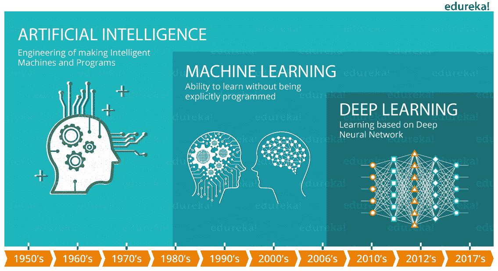
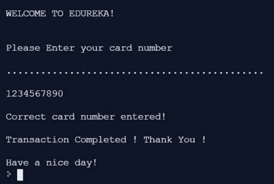
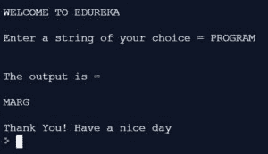

# 为什么 Python 编程语言是一项必须具备的技能？

> 原文：<https://www.edureka.co/blog/why-python/>

无论人们多么想忽略它，我们都必须明白，我们生活在一个快速变化的科技世界里，我们周围的事物瞬息万变。导致这种技术大爆发的关键因素归功于软件业的崛起。几年前，软件与购买的硬件捆绑在一起。它从未被认为有很大的价值。然而，今天的情况完全不同。在这篇文章中，为什么要使用 [Python](https://www.edureka.co/blog/python-tutorial/) 语言，以及它是如何成为当今 it 界的新“时尚”的。

本文将涉及以下几点:

*   [人工智能中的 Python](#PythonInArtificialIntelligence)
*   [Python 中的深度学习](#DeepLearningInPython)
*   [Python 开发者工资](#PythonDeveloperSalary)
*   [Python 编程语言](#PythonProgrammingLanguage)

那么让我们开始吧，

## **人工智能中的 Python**

python 语言的一个重要特点是代码编写简单。与其他面向对象的程序相比，它只使用了 1/5 的 T2 代码。这一因素使它成为继人工智能等趋势领域使用的语言之后最受欢迎的语言。人工智能有一个广阔的视野，在这个视野下处理机器学习和深度学习。

Python 有各种各样的库，可以满足任何程序员的需求。它有一些预建的库，如 [Numpy](https://www.edureka.co/blog/python-numpy-tutorial/) 、 [SciPy](https://www.edureka.co/blog/scipy-tutorial/) 、Pybrain 等。，用于高级和科学计算。Python 是独立于平台的，这使得它在其他技术之间的接口非常灵活。此外，该语言的当前用户群非常多样化。大多数 python 开发人员在门户上共享查询和解决方案，这也使它成为一个全面的知识资源。



该语言不仅应用了 OOPs 概念，还结合了一种脚本方法。像 [PyCharm](https://www.edureka.co/blog/pycharm-tutorial) 这样的 ide(集成开发环境)数不胜数，可以让用户进行 AI 相关项目的复杂代码和算法。在人工智能的 SDLC(软件开发生命周期)阶段，如测试、调试和开发，与其他当代编程语言如 Java、Javascript 和 Pearl 相比，它变得轻而易举。

这些语言肯定会产生预期的结果，但会使任务变得繁琐。因此，考虑到 python 的众多优势，毫无疑问，它在当今的人工智能技术中扮演着至关重要的角色。

产生这个问题的原因之一是“为什么是 Python？”下面是应用程序

## **Python 中的深度学习**

深度学习是当今人工智能世界的另一个趋势领域。深度学习技术非常强大，因为它们代表并学习如何以最佳方式解决问题。这被称为“表征学习”。深度学习程序通过大量例子进行训练，使其预测准确。深度学习模型广泛用于彩色图像和视频。它用于识别照片中的物体，通常称为“人脸识别”。

Python 是入门深度学习模型的最佳平台。Python 快速且易于理解。它有大量的功能，可以使深度学习项目更快地运行和开发。任何深度学习专家使用的最通用的两个库是“Theano”和“ [Tensorflow](https://www.edureka.co/blog/tensorflow-tutorial/) ”。这些都是非常技术性的，被研究小组广泛使用。“Keras”库是用纯 python 编写的，它为上述两个库提供了一个接口。

继续这篇关于“为什么选择 Python？”的文章让我们看看作为一名 python 开发者你能挣多少钱，

## **Python 开发者工资**

如果你目前是一名 python 开发者，这一部分可能对你来说是美妙的音乐。我们已经讨论了 python 在当今技术领域的价值，没有理由不相信开发人员的收入丰厚。根据“Googroo”和“Indeed”网站，平均工资约为 123，743 美元。Python 成为了这一代 IT 专业人员所拥有的最热门的技能。下图显示了与其他语言相比，Python 开发人员的峰值。

****

本文的下一个主题是“为什么选择 Python？”我们将会看到 Python 作为一种编程语言的表现

## **Python 作为编程语言**

现在我们知道了 Python 对世界和我们有多重要。让我们深入学习编程语言的一些技术方面。下面举例说明的主题是基本的，很容易掌握。

## **破开巨蟒**

python 中的 break 命令通常用于突然终止程序的正常流程。它非常类似于 C 编程中使用的 break 语句。为了清楚起见，让我们考虑下图。这个程序检查用户输入的数字的因子数。while 循环作为一个无限循环，永远不会终止程序。基于用户输入，计算因子的数量，或者在用户输入为零的情况下，呈现适当的语句。整个程序执行后，无限迭代被 **break 命令阻止。**没有它，程序将无限期运行。

```
while(1):
print("nnHey ! Welcome to EDUREKA n")
print("How are you today ?")
a=int(input("nPlease enter the number = "))
count =0
if (a==0):
print ("nnPlease enter non zero numbern")
print ("This program is now terminatedn")
print ("Thank You")
else:
for x in range (1,a+1):
if (x%2==0)
count = count+1
print ("n The number of factors of 2 is", count)
print ("n thank you for using this programn")
break;
```

**输出**

 本文接下来将讨论“为什么选择 Python？”我们将讲述一些 Python 编程的基础知识

#### **Python 变量**

[Python](https://www.edureka.co/blog/variables-and-data-types-in-python/)中的变量就像容器一样存储某些数据值。Python 在使用变量之前没有任何特殊的声明变量的方法。这种变量的数据类型可以在程序流中的任何地方更改。但是，在声明变量时有一些规则要遵循:

*   变量必须以字母或下划线字符开头
*   变量不能以数字开始
*   变量不能有特殊字符。它只能是字母数字。
*   变量区分大小写。数，数，数是三个不同的变量，虽然看起来很像。

在 Python 中，我们可以对变量进行不同的赋值。

*   X，Y，Z =“Car”，“Bus”，“Bike”(这里，三个变量可以在一行中声明为三个不同的值)
*   X=Y=Z= 1000(这里所有三个变量都与一个语句中的同一个值相关联)

使用“+”符号，我们可以添加变量。如果字符串存储在这些变量中，我们称之为串联。如果它们存储算术值，那么我们认为它是通常的数学计算。

*   A="EDUREKA 是 A"
*   B= "伟大的方式"
*   C= "学习 PYTHON"
*   打印(A+B+C)。这将导致“EDUREKA 是学习 PYTHON 的好方法”

必须注意，在进行此类操作时，应确保同质性。携带不同数据类型的变量不应组合在一起。如果 X=1000，Y=“数据科学”。X+Y 会抛出一个错误。

让我们明白什么是切片？

#### **切片中的巨蟒**

python 中的切片就是从主字符串派生出子字符串。考虑下面的代码示例。

```
print("nWelcome to Edurekan")
pyString=input("Enter a string of your choice = " )
print("nn The output is = n")
print(pyString[slice(0,3)])
print("nThank you! have a nice day ") 
```

**输出**

在下面的例子中，“ICCWORLDCUP”是一个字符串，是用户输入的。从程序派生的子字符串是“ICC”。这是怎么发生的？负责此功能的主要语句是第 24 行。slice 函数的索引从索引 0(起始索引)开始挑选字符，一直到索引 2。在 0，3 的范围内，字母 ICC 成为一个新字符串，这是输出。【T2

另一种切片方式是关于负指数。这也是子串反转的好方法。字符串切片函数的参数增加到 3。第一个是从字符串末尾开始的起始索引，第二个是结束索引，第三个是间隔。让我们看一看。

```
print("nWELCOME TO EDUREKA n")
pyString=input("Enter a string of your choice =")
print("n nThe output is = n")
print(pyString[slice(-1,-5,-1)])
print("nThank You ! Have a nice day")
```

**输出**

在'切片'函数中，第-1 点在字符串的最后一个字母" M "处。光标以 1 为间隔向后计数，并在 4 次计数后停止，这导致输出“MARG ”,即最后 4 个字母“GRAM”被反转。

这就把我们带到了本文的结尾。

*要深入了解 Python 及其各种应用，您可以 [**在此**](https://www.edureka.co/python/) 注册参加在线直播培训，全天候支持，终身访问。* *有问题吗？在“为什么选择 Python？”的评论部分提到它们文章，我们会回来找你。*