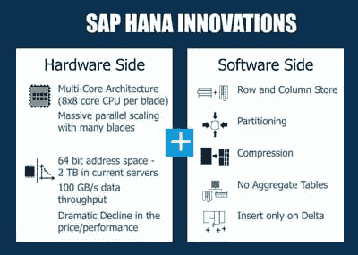

# 为什么 SAP HANA 是游戏改变者？

> 原文：<https://www.edureka.co/blog/why-use-sap-hana/>

想象一下，你拥有一家零售店，它想通过为忠诚的顾客下次购物提供折扣来对待他们。一位顾客刚刚买了东西，并把她的信用卡交给了零售主管。就在这位零售主管刷信用卡的时候，内部系统立即给他提供了她上次在你的商店购买黑色鞋子的信息。你立刻给了她一条她可能感兴趣的黑色裙子的折扣，这条裙子和她的黑色鞋子很配！

这就是实时数据分析和决策的力量，可以提高业务绩效。

让我们深入了解 SAP HANA 的见解，以及 SAP HANA 如此受欢迎的原因:

SAP HANA 是用于实时分析和应用的下一代平台或数据库。帮助各种企业和组织以闪电般的速度，甚至亚秒级的速度，实时分析基于大数据(海量数据)的业务运营！

## **为什么要用 SAP HANA？**

SAP HANA 有几个令人难以置信的功能，使其有别于传统数据库。让我们深入研究这些问题，找出 SAP HANA 如此受欢迎的原因:

**1。柱状数据存储:**

数据在传统数据库中是如何显示的？以表格的形式显示行和列！但是，SAP HANA 提出了一个独特的功能，即…列数据存储。与按行和列组织的二维数据结构相比，该特征允许计算机存储器的线性结构。因此，在 SAP HANA 中，表格可以按行顺序或列顺序显示。行顺序取向将表存储为一系列记录，而列顺序取向将条目存储在相邻的内存位置。

这种方法有什么了不起的？柱状数据存储使得游程编码、聚类编码和字典编码成为可能，这些都是非常有效的压缩技术。这种方法还消除了对额外索引结构的需要，因为一旦我们将数据存储在列中，就像为每一列创建一个内置索引一样。一旦我们消除了额外的索引，操作就变得简单了，不需要定义和维护元数据。这进一步加快了列扫描速度，并允许高效的读取操作。

**2。内存数据库系统:**

内存数据库系统(IMDS)将数据完全存储在主内存中，不像传统的或磁盘上的数据库管理系统将数据存储在磁盘存储机制中。如今，内存数据库系统越来越受欢迎，因为在内存中处理数据比在文件系统中读写数据要快得多。内存系统是处理实时数据未来的唯一方式，实时数据未来由新的数据类型组成，如社交媒体监控和网络自动化传感器和仪表读数。SAP HANA 赋予程序员开发在数据库层整合业务控制逻辑的应用程序的创造力。它消除了数据模型更改的等待时间，也消除了传统业务仓库解决方案加载冗余数据存储所需的时间。

**3。并行处理:**

SAP HANA 支持并行处理，这是高效数据分析的核心。这就是它的工作原理…我们知道 SAP HANA 促进了列数据存储，在列数据存储中，搜索特定数据或聚合数据等操作是在相邻内存位置的阵列上循环完成的。与此相反，在传统的面向行的方法中，这种操作往往非常慢，因为属于同一列的数据分布在整个内存中。基于列的存储还有助于将数据快速加载到 CPU 缓存中。由于数据已经在基于列的方法中被垂直划分，因此可以使用多个处理核心进行并行处理。此外，如果需要搜索或聚合一个以上的列，这些任务中的每一个都可以分配给不同的处理器内核。此外，为了加速该过程，可以通过将一列划分成各个部分来并行化对该列的操作，每个部分可以由不同的处理器核心来处理。这有利于并行处理！

**4。SAP HANA 提供实时分析:**

实时分析意味着生成报告不需要 BW(业务仓库)阶段。它利用诸如 Business Objects Explorer 或 excel 中的数据透视表等工具进行数据分析。SAP HANA 将在线分析和事务处理融合到一个数据库中。借助实时内存分析，过去几天可能实现的事情现在几秒钟就能实现！在快速变化的市场环境中，决策变得更快、更智能、更准确。SAP HANA 通过集成和模拟来自各种数据源的数据，提供了一个 360 度的业务运营视图。SAP HANA 能够近乎实时地聚合和更新庞大的数据集！例如，借助 SAP HANA，一家保险公司现在可以在几秒钟内发现西南地区是否比中部地区更有利可图！

**5。高效处理聚合:**

为了提高性能，传统的数据库和应用程序经常使用物化聚集。这些物化聚合在预先决定的时间或者在对聚合数据的每个写操作之后被计算和存储。这些物化聚集通过读取操作读取，而不是在每次需要时计算它们。与此形成对比的是，SAP HANA 能够以每毫秒数千兆字节的扫描速度高效地实时计算海量数据的聚合。在许多情况下，这自动消除了对物化集合的需求。此外，传统数据库中使用的物化聚合通常只在预定的时间更新，但动态聚合总是显示最新的信息。

**6。SAP HANA 提供集成开发环境(IDE):**

集成开发环境(IDE)是一种软件应用程序，它为计算机程序员提供了广泛的软件开发工具。IDE 通常由源代码编辑器、构建自动化工具、调试器和图形用户界面(GUI)生成器组成。甚至 SAP HANA 也为开发和交付 SAP HANA 应用程序提供了集成开发环境(IDE ),使它们变得简单且易于开发。SAP HANA IDE 基于基于 Eclipse 的 SAP HANA studio，它提供了一些有用的功能，如集成和集体开发、用于控制、调试和部署基于本机数据库程序的应用程序的服务器端 JavaScript，以及用于开发用户界面的 HTML5 SDK。有一个 SAP HANA 存储库，用于存储和处理 SAP HANA 的所有设计时对象。

**7。SAP HANA 让创新成为可能:**

一些 SAP HANA 开发人员在 IT 和业务模式方面进行了重大创新。由于其内存方法，SAP HANA 实现了无与伦比的硬件和软件创新，在商业世界的许多领域取代了传统数据库！在硬件方面，SAP HANA 支持多核架构(每个刀片式服务器 8×8 核 CPU)、多个刀片式服务器的大规模并行扩展、64 位地址空间–当前服务器中的 2 TB、高达 100 GB/s 的数据吞吐量、成本效益等。在软件方面，SAP HANA 支持列数据存储、分区、压缩、消除聚合表等等。

SAP NetWeaver Business Warehouse(SAP NetWeaver BW)组件是一种已知的企业数据仓库解决方案，率先将现有数据库迁移到 SAP HANA 数据库中。此外，SAP HANA 数据库可以以辅助数据库的形式连接到 SAP ERP 应用程序。因此，SAP HANA 可以带来无尽的创新，我们需要的是深入了解 HANA 世界！

**8。SAP HANA 设备软件:**

SAP HANA 设备软件是一款非常灵活、多功能的内存设备，它能够很好地融合在知名 SAP 技术合作伙伴(如惠普、IBM、富士通、戴尔和思科)提供和交付的硬件上优化的 SAP 软件组件。SAP HANA 设备由几个集成的 SAP 软件组件组成，例如 SAP HANA studio(一个易于使用的数据建模和管理工具)、SAP HANA 数据库、对基于行业标准的多个接口的支持以及生命周期管理应用程序。SAP HANA 软件设备的优点在于，它可以连接到您的环境中，以加快数据仓库和运营报告的速度，而不会影响现有的 it 环境。此外，SAP HANA 管理当今不断增长的大数据、计算速度、信息延迟和数据集市中的额外数据聚合。

**9。改进现有的 SAP 应用程序:**

传统的数据库管理系统在有限的主存上工作，以最大化硬件的性能。他们专注于优化磁盘访问，而磁盘 I/O 本身就是主要的限制因素。它们旨在减少处理时要读入主存的磁盘页数。与此相反，SAP HANA 背后的主要思想是在大量内存上工作！因此，SAP HANA 不是优化 I/O 硬盘访问，而是优化 CPU 缓存和主内存之间的内存访问。SAP HANA 在开发未来的内存分析和事务应用程序方面有很大的空间。利用更大的可能性，使用 Open SQL 的现有 SAP 应用程序可以在 SAP HANA 上运行，无需改动。这可以极大地帮助使用 SAP HANA 改进现有的 SAP 应用程序。

此外，动态且强大的 SAP HANA 应用程序在提高业务绩效和分析多样性方面具有巨大潜力。随着这些应用程序针对并行内存处理进行开发和优化，企业可以充分利用先进的硬件技术和新的企业数据管理。

因此，无论是保险公司想要计算各种保单的保费金额，还是医院需要上一季度发生的所有心脏手术的数据，或者房地产公司想要快速访问其数据库以跟进客户，SAP HANA 都可以利用其特有的功能完成所有这些工作！无聚合表、内置多租户功能的强大计算能力、灵活的建模、大内存占用、无数据重复和快速数据加载等特性可让您立即访问海量数据，进而快速高效地做出决策。

有问题要问我们吗？请在评论区提及它们，我们将会回复您。

**相关帖子:**

[商业分析与 R 培训](https://www.edureka.co/r-for-analytics)