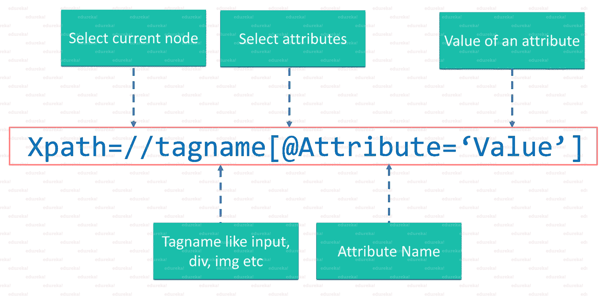
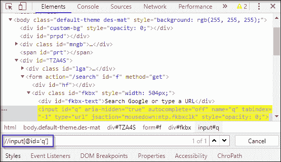
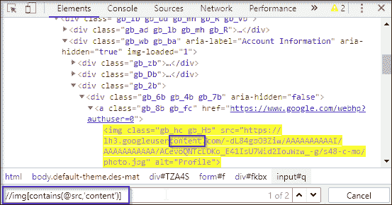
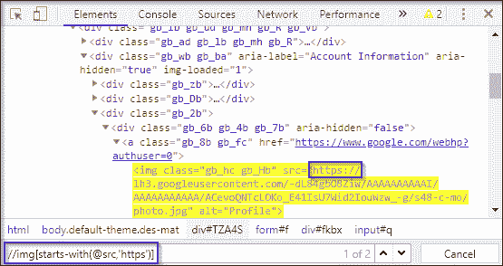
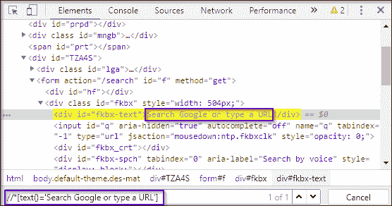
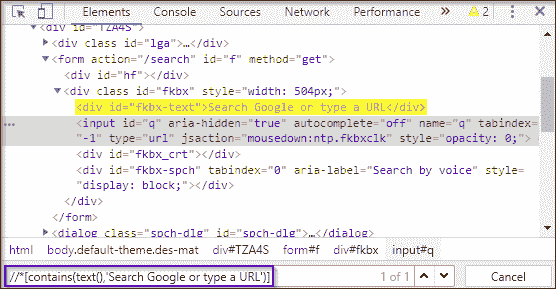

# 如何开始使用 Selenium 中的 XPath——XPath 教程

> 原文：<https://www.edureka.co/blog/xpath-in-selenium/>

如果你想知道在网页上定位元素的最简单方法，那就去看看[硒认证](https://www.edureka.co/selenium-certification-training)。在 selenium 中定位元素的最佳方式是使用 XPath。在这篇关于[Selenium](https://www.edureka.co/blog/selenium-tutorial)中 XPath 的文章中，我将简要介绍如何创建正确有效的 XPath 及其各种类型。

以下是本文将涉及的主题

*   [XPath 是什么？](#WhatisXPath?)
*   [XML 文档](#XMLDocument)
*   [XPath 的语法](#SyntaxofXPath)
*   [XPath 的类型](#TypesofXPath)
*   [XPath 函数](#XPathFunctions)
*   [元素使用 Eclipse 搜索](#ElementSearchusingEclipse)

*您还可以在 Selenium 中浏览这段 XPath 记录，在这里您可以通过示例以详细的方式理解主题。*

**硒中 Xpath |硒 Xpath 教程|爱德华卡**


[https://www.youtube.com/embed/9-iVt0MIqNY?rel=0&showinfo=0](https://www.youtube.com/embed/9-iVt0MIqNY?rel=0&showinfo=0)

这个关于 Xpath 教程的视频讲述了 Xpath 基础知识和编写 Xpath 脚本的步骤。

## **XPath 是什么？**

 XPath 又称 XML Path，是一种查询 XML 文档的语言。在硒中定位元素是一个重要的策略。它由一个路径表达式和一些条件组成。在这里，您可以轻松地编写 XPath 脚本/查询来定位网页中的任何元素。  它被设计成允许 XML 文档的导航，目的是选择单个元素、属性或 XML 文档的一些其他部分进行特定处理。它还生产可靠的定位器。

现在，让我们了解如何为 XML 文档编写 XPath。

## **XML 文档**

XML 文档具有树状结构。下图是一个 XML 文档的例子，其中有不同的标签和属性。它从一个名为 bookstore 的标签开始，这个标签也是一个元素或节点。

这里可以看到，*书店*节点有一个子节点*图书*。接下来是一个名为 category 的属性，其值为 Cooking。而这个图书节点又有两个子节点，即标题和作者。现在，让我们以树状结构来可视化这个 XML 文档。这里，书店是一个根节点，它有两个 book 类型的子节点。第一类书是烹饪，第二类书是儿童。如下图所示，两者都有两个标签，即标题和作者。

 在这里，我将从根节点开始，即书店，然后我将定位一本书，其类别是儿童。一旦我到达正确的节点，下一步将选择一个带有作者标签的节点。所以 XPath 可以写成:

```
bookstore/book[@category='children']/author

```

这是一个 XPath 查询，用于查找类别为儿童的书籍的作者。现在让我们理解 XPath 查询的语法。

## **Xpath 的语法**

下图描述了 XPath 语法及其术语。



*   **//** :用于选择当前节点。
*   ***标记名*** :是特定节点的标记名。
*   ***@*** :用于选择属性。
*   ***属性*** :是节点的属性名称。
*   ***值*** :是属性的值

在下一篇关于 XPath 的文章中，我将借助一些实例来讨论不同类型的 XPath。

## **Xpath 的类型**

XPath 有两种类型，它们是:

1.  绝对 XPath
2.  相对 XPath

首先，让我们了解一下绝对 XPath。

*   #### 绝对 XPath

这是找到元素的直接方法，但是绝对 XPath 的缺点是，如果元素的路径有任何改变，那么 **XPath** 就会失败。*例如*:**/html/body/div[1]/section/div[1]/div**/

*   #### 相对 XPath

对于**相对 XPath，**路径从 HTML DOM 结构的中间开始。它以双正斜杠(//)开始，这意味着它可以在网页**的任何地方搜索该元素。** *例如*:**//输入[@id='ap_email']**

现在，让我们借助一个例子来理解这一点。我将启动谷歌浏览器，导航到 google.com。这里，我将尝试使用 XPath 定位搜索栏。在检查 web 元素时，您可以看到它有一个输入标记和属性，如 class 和 id。现在，我将使用标记名和这些属性来构造 XPath，XPath 反过来将定位搜索栏。

在这里，你只需要点击 Elements 标签页，按 Ctrl + F 就可以在 chromes 开发者工具中打开一个搜索框。接下来，您可以编写 XPath、字符串选择器，它将尝试基于该标准进行搜索。如上图所示，它有一个输入标签。

现在我将从//输入开始。这里//input 意味着 tagname。现在，我将使用*名称*属性，并传递单引号中的“q”作为它的值。这给出了如下 XPath 表达式:

```
//input[@name=’q’]

```

正如您在上面的图片中看到的，在编写 XPath 时，它突出显示了元素，这意味着这个特定的元素是使用 XPath 定位的。

现在，让我们继续阅读 [Selenium](https://www.edureka.co/blog/what-is-selenium/) 文章中的 XPath，并理解 Selenium 中使用的不同函数。

## **XPath 函数**

使用 Selenium 的自动化无疑是一项伟大的技术，它提供了许多方法来识别 web 页面上的对象或元素。但是有时我们在识别页面上具有相同属性的对象时确实会遇到问题。一些这样的情况可能是:元素具有相同的属性和名称，或者有多个按钮具有相同的名称和 id。在这种情况下，很难指示 selenium 识别网页上的特定对象，这就是 XPath 函数的用处。

### **XPath 函数的类型**

[硒](https://www.edureka.co/blog/selenium-tutorial)由多种功能组成。下面，我列出了三个最常用的函数:

1.  包含()
2.  以()开头
3.  文本()

首先，我将告诉您如何在 XPath 查询中使用 contains()函数。

*   #### 包含():

它是 XPath 表达式中使用的方法。当任何属性的值动态改变时，例如登录信息，这种方法开始使用。它可以用可用的部分文本定位 web 元素。让我向您展示如何使用 contains()方法。

我将再次打开 google.com 并选择一个< img >标签来检查它的元素选项卡。那么下一步是什么？

正如你在上面的源代码片段中看到的，它有一个< img >标签，后面跟着它的属性。现在假设，我想使用 XPath 定位它的 *src* 属性。为了做到这一点，我将从//开始，后面跟着*输入标签*，然后我将使用*选择属性，*后面跟着它的属性名 *src。*最后，我将复制粘贴 *src* 的值。但是这样做，我们的 XPath 会变得太长。

并且，这是构造一个*部分 XPath 查询*的最大原因之一。由于一个 *src* 属性在其值中包含 URL，当你重新加载页面时，它的值或 URL 的某个部分可能会改变。所以这里的底线是，属性值的一部分是静态的，而其余部分是动态的，在这种情况下，我们通常更喜欢使用部分 XPath。

XPath 查询看起来像:

```
 //img[contains(@src,’content’)]

```

现在，让我们进一步了解一些 XPath 函数。

*   #### **starts with ():**

该函数用于查找一个 web 元素，该元素的属性值在刷新或网页上的任何其他动态操作时发生变化。在这种情况下，我们匹配属性的起始文本来定位属性已经动态改变的元素。 例如:在网页上，某个特定元素的 ID 是动态变化的，如‘id1’、‘id2’、‘ID3’等。，但其余文本将保持不变。

现在让我们试着用同一个物体来演示一下。在这里，您必须将 contains()改为 starts-with()。

如图所示 *src* 属性以 *** https *** 开头。它将定位以 *** https *** 开头的元素。因此，这就是如何使用 starts-with 函数来定位网页上的特定元素。

XPath 查询看起来像:

```
//img[starts-with(@src,'https')]

```

现在我们再来了解一个函数文本()。

*   #### 正文():

该表达式与 text 函数一起使用，定位具有精确文本的元素。让我们看一个使用 text()的小例子。

这里我的条件是——

*“go anywhere inside this document, irrespective of the tag, but, it must contain a text whose value is Search Google or type a URL”*

***星号(*)* 暗示任何具有相同值的标签。这给了我一个类似于的 XPath 查询**

```
 **//*[text()='Search Google or type a URL']** 
```

**这就是你如何使用 text()函数。现在让我们尝试在一个 XPath 查询中一起使用两个函数，即 *contains()* 和 *text()* 。**

**在上面的代码片段中可以看到，首先我使用了 contains()，并将第一个参数作为 text()传递。现在，text()应该包含一个值*搜索 Google 或者输入一个 URL* 。您可能注意到了，我没有使用@因为 **text()** 是一个函数而不是一个属性。这就是如何一起使用两个 XPath 函数。**

**在本文的下一部分，我们将看到如何注册 chrome 的驱动程序，以及如何使用 Eclipse 向搜索元素发送关键字。**

## ****元素使用 Eclipse 搜索****

**对于谷歌 chrome，你需要在你的系统中安装一个 [chrome 驱动程序](http://chromedriver.chromium.org/downloads)。现在让我们仔细看看代码。如你所见，我已经用 *System.setproperty()* 设置了 chrome 驱动的路径。然后我使用 *driver.get()* 导航到**ebay.com**。此外，我使用 XPath 定位网页的搜索框。现在，使用 *sendkeys()，*我将发送搜索值作为**吉他**重定向到特定的搜索页面。**

```
**package Edureka;
import java.util.concurrent.TimeUnit;
import org.openqa.selenium.By;
import org.openqa.selenium.WebDriver;
import org.openqa.selenium.WebElement;
import org.openqa.selenium.chrome.ChromeDriver;
public class CustomXpath {
public static void main(String[] args) {
System.setProperty("webdriver.chrome.driver", "C:Selenium-java-edurekachromedriver_win32chromedriver.exe");
WebDriver driver = new ChromeDriver();
driver.manage().window().maximize();
driver.manage().deleteAllCookies();
driver.manage().timeouts().pageLoadTimeout(40, TimeUnit.SECONDS);
driver.manage().timeouts().implicitlyWait(30, TimeUnit.SECONDS);
driver.get("https://www.ebay.com/");
driver.findElement(By.xpath("//input[@id='gh-ac']")).sendKeys("Guitar"); //xpath for search box
WebElement searchIcon = driver.findElement(By.xpath("//input[@id='gh-btn']"));//xpath for search button
searchIcon.click();
}
}** 
```

**当你运行上述 [Java](https://www.edureka.co/blog/java-tutorial/) 程序时，chrome 驱动会启动谷歌 Chrome 并重定向到 ebay.com，自动为你提供首选搜索。输出可以参考下图:**

****

**我希望这能让您清楚地了解 Selenium 中 XPath 的工作原理。因此，它把我们带到了本文的结尾。**

***如果您希望学习 Selenium 并在测试领域建立自己的事业，那么请查看我们的交互式在线直播 **[Selenium 认证](https://www.edureka.co/selenium-certification-training)** ，它提供 24*7 支持，在整个学习期间为您提供指导。***

***有问题吗？请在 Selenium 博客的 XPath 评论部分提到它，我们将会回复您。***